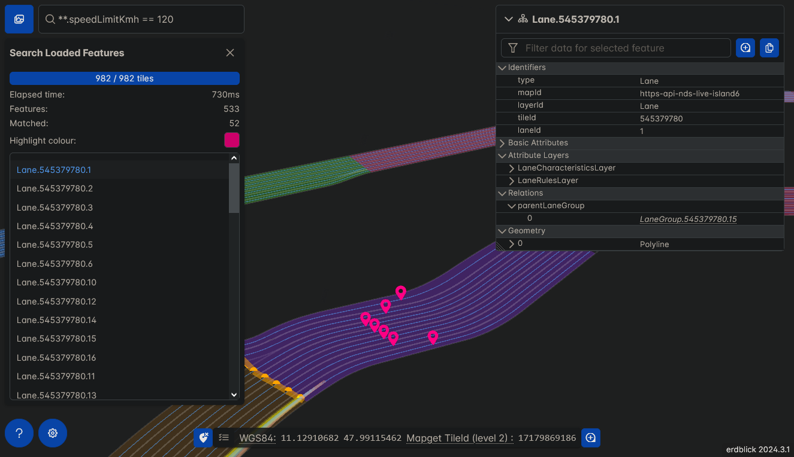

# erdblick 🌍

`erdblick` is a dynamic mapviewer built on the `mapget` feature service.

**Capabilities:** 🛠️

* 🗺️ View map layers from a specific [`mapget`](https://github.com/ndsev/mapget) server.
* 🎨 Define visual styles for map layers through style-sheets, translating specific features into visual elements in both 2D and 3D.
* 🏔️ Experience 3D features and terrains with a flexible 3D camera powered by [CesiumJS](https://github.com/CesiumGS/cesium/).
* ✍️ Edit map layer style sheets in real-time directly from the front-end.
* 🔍 Select multiple features at once using filter or lasso selection tools **(Planned)**.
* 🖼️ Utilize split-screen panes for optional overlay or synchronized navigation with an adjustable splitter **(Planned)**.
* 🔎 View multiple map layer tile zoom levels all at once **(Planned)**.



## Setup

Ready to try out the latest version?
While the Desktop app is still work-in-progress, swing by the [Release Page](https://github.com/ndsev/erdblick/releases) to grab the newest build.
Currently, `erdblick` is made to be served by a [`mapget`](https://github.com/ndsev/mapget) server,
so make sure to serve it up with the `mapget serve` command.
Not sure how to do that? Start off with a simple `pip install mapget` and then fire away with
```bash
mapget serve -w <path-to-unpacked-erdblick>
```

## Styling System

Erdblick styles are defined as *YAML*-files, which must have a `rules` key that contains an array of
feature visualisation rule objects. During runtime, a feature will be visualised according to each
rule that matches it.

### Custom Style Declarations

It is possible to apply own custom styles easily. 
On build, Erdblick automatically picks up `.yaml` style files from `config/styles` directory (where you can drop your custom files) 
and bundles them in `static/bundle/styles` (in case you are using a pre-built Erdblick distribution, 
you can directly put your styles in `static/bundle/styles`).

For Erdblick to apply custom styles, it expects the following declarations for the styles in `config/config.json` 
(in case you are using a pre-built Erdblick distribution, you can directly create your configuration in `static/config.json`):
```json
{
   "styles": [
       { "id": "Your Style ID", "url": "style.yaml" },
       { "id": "Your Style ID2", "url": "style_2.yaml" }
   ]
}
```
where `url` field must be a path relative to `config/styles` and `id` is used to identify the particular style in GUI.

It is also possible to export and import styles in GUI. Styles imported this way will persist in the local storage of the browser.

### Editing Styles via Erdblick

Both bundled and imported styles can be modified directly via a GUI editor included in Erdblick.
If a style was modified this way, it will persist in the `local storage` of the browser 
(if the `local storage` is cleared or reset, all of the modifications will be reset as well; 
in case you would like to clear the styles yourself, you can do that via the preferences panel.

The style editor automatically verifies YAML for syntax parsing errors and provides basic autocomplete. 

### Style Definitions

Each rule within the YAML `rules` array can have the following fields:

| Field                         | Description                                                                                                                                                                                                 | Type                                                       | Example Value                                      |
|-------------------------------|-------------------------------------------------------------------------------------------------------------------------------------------------------------------------------------------------------------|------------------------------------------------------------|----------------------------------------------------|
| `geometry`                    | List of geometry type(s) or single type the rule applies to.                                                                                                                                                | At least one of `"point"`,`"mesh"`, `"line"`, `"polygon"`. | `["point", "mesh"]`, `line`                        |
| `aspect`                      | Specifies the aspect to which the rule applies: `"feature"`, `"relation"`, or `"attribute"`.                                                                                                                | String                                                     | `"feature"`, `"relation"`                          |
| `mode`                        | Specifies the highlight mode: `"none"` or `"hover"` or `"selection"`.                                                                                                                                       | String                                                     | `"none"`, `"hover"`                                |
| `type`                        | A regular expression to match against a feature type.                                                                                                                                                       | String                                                     | `"Lane\|Boundary"`                                 |
| `filter`                      | A [simfil](https://github.com/klebert-engineering/simfil) filter expression over the feature's JSON representation.                                                                                         | String                                                     | `*roadClass == 4`                                  |
| `selectable`                  | Indicates if the feature is selectable.                                                                                                                                                                     | Boolean                                                    | `true`, `false`                                    |
| `color`                       | A hexadecimal color code or [CSS color name](https://www.w3.org/wiki/CSS/Properties/color/keywords).                                                                                                        | String                                                     | `"#FF5733"`, `red`                                 |
| `color-expression`            | A [simfil](https://github.com/klebert-engineering/simfil) expression which may return an RGBA integer or color string (see above). The expression is evaluated over the current feature/relation/attribute. | String                                                     | `isBridge and "#FF5733" or "black"`                |
| `opacity`                     | A float value between 0 and 1 indicating the opacity.                                                                                                                                                       | Float                                                      | `0.8`                                              |
| `width`                       | Specifies the line width or point diameter (default in pixels).                                                                                                                                             | Float                                                      | `4.5`                                              |
| `flat`                        | Clamps the feature to the ground (Does not work for meshes).                                                                                                                                                | Boolean                                                    | `true`, `false`                                    |
| `outline-color`               | Point outline color.                                                                                                                                                                                        | String                                                     | `green`, `#fff`                                    |
| `outline-width`               | Point outline width in px.                                                                                                                                                                                  | Float                                                      | `3.6`                                              |
| `point-merge-grid-cell`       | WGS84/altutide meter tolerance for merging point visualizations.                                                                                                                                            | Array of three Floats.                                     | `[0.000000084, 0.000000084, 0.01]`                 |
| `near-far-scale`              | For points, indicate (`near-alt-meters`, `near-scale`, `far-alt-meters`, `far-scale`).                                                                                                                      | Array of four Floats.                                      | `[1.5e2,10,8.0e6,0]`                               |
| `icon-url-expression`         | A [simfil](https://github.com/klebert-engineering/simfil) expression to evaluate on the point feature the icon belongs to.                                                                                  | String                                                     | `category == 5 and "/icons/ev-charging.png" or ""` |
| `icon-url`                    | A placeholder in case the simfil expression either isn't necessary or won't produce a result.                                                                                                               | String                                                     | `/icons/unknown.png`                               |
| `offset`                      | Apply a fixed offset to each shape-point in meters. Can be used for z-ordering.                                                                                                                             | Array of three Floats.                                     | `[0, 0, 5]`                                        |
| `arrow`                       | For arrow-heads: One of `none`, `forward`, `backward`, `double`. Not compatible with `dashed`.                                                                                                              | String                                                     | `single`                                           |
| `arrow-expression`            | A [simfil](https://github.com/klebert-engineering/simfil) expression which may return `none`, `forward`, `backward`, or `double`.                                                                           | String                                                     | `select(arr("single", "double"), 1)`               |
| `dashed`                      | Indicate that a line has dashes.                                                                                                                                                                            | Boolean.                                                   | `true`                                             |
| `gap-color`                   | If a gap between dashes has a color.                                                                                                                                                                        | String                                                     | `blue`, `#aaa`                                     |
| `dash-length`                 | Size of a dash in pixels.                                                                                                                                                                                   | Integer.                                                   | `16`                                               |
| `dash-pattern`                | A 16-bit pattern for the dash.                                                                                                                                                                              | Integer.                                                   | `255`                                              |
| `relation-type`               | A regular expression to match against a relation type, e.g., `"connectedFrom"`.                                                                                                                             | String                                                     | `"connectedFrom\|connectedTo"`                     |
| `relation-line-height-offset` | Vertical offset for relation line in meters.                                                                                                                                                                | Float                                                      | `0.5`                                              |
| `relation-line-end-markers`   | Style for the relation line end-markers.                                                                                                                                                                    | Sub-rule object                                            | `relation-line-end-markers: { color: "black", width: 4 }`                                 |
| `relation-source-style`       | Style for the relation source geometry.                                                                                                                                                                     | Sub-rule object                                            | `relation-source-style: { color: "orange", width: 2 }` visualize by using geometry only |
| `relation-target-style`       | Style for the relation target geometry.                                                                                                                                                                     | Sub-rule object                                            | `relation-target-style: { opacity: 0, label-text-expression: "$target.id" }` visualize by using a label only |
| `relation-recursive`          | Specifies whether relations should be resolved recursively. Only done if `mode=="Highlight"`, and only works for relations within the same layer.                                                           | Boolean                                                    | `true`, `false`                                    |
| `relation-merge-twoway`       | Specifies whether bidirectional relations should be followed and merged.                                                                                                                                    | Boolean                                                    | `true`, `false`                                    |
| `attribute-type`              | A regular expression to match against an attribute type.                                                                                                                                                    | String                                                     | `SPEED_LIMIT_.*`                                   |
| `attribute-layer-type`        | A regular expression to match against the attribute layer type name.                                                                                                                                        | String                                                     | `Road.*Layer`                                      |
| `attribute-validity-geom`     | Set to `required`, `none` or `any` to control whether matching attributes must have a validity geometry.                                                                                                    | String                                                     | `Road.*Layer`                                      |
| `label-color`                 | Text color of the label.                                                                                                                                                                                    | String                                                     | `#00ccdd`                                          |
| `label-outline-color`         | Text outline color of the label.                                                                                                                                                                            | String                                                     | `#111111`                                          |
| `label-outline-width`         | Text outline width of the label.                                                                                                                                                                            | Float                                                      | `1.0`                                              |
| `label-font`                  | The font used to draw the label (using the same syntax as the CSS 'font' property).                                                                                                                         | String                                                     | `24px Helvetica`                                   |
| `label-background-color`      | Background color of the label.                                                                                                                                                                              | String                                                     | `#000000`                                          |
| `label-background-padding`    | Background padding in pixels.                                                                                                                                                                               | Pair of Integers.                                          | `[7, 5]`                                           |
| `label-horizontal-origin`     | Determines if the label is drawn to `LEFT`, `CENTER`, or `RIGHT` of its anchor position.                                                                                                                    | String                                                     | `LEFT`                                             |
| `label-vertical-origin`       | Determines if the label is to `ABOVE`, `BELOW`, at `CENTER` or at `BASELINE` of its anchor position.                                                                                                        | String                                                     | `BASELINE`                                         |
| `label-text-expression`       | A [simfil](https://github.com/klebert-engineering/simfil) expression to evaluate on the feature/relation the label belongs to.                                                                              | String                                                     | `**.speedLimitKmh`                                 |
| `label-text`                  | A placeholder in case the simfil expression either isn't necessary or won't produce a result.                                                                                                               | String                                                     | `No speed limit`                                   |
| `label-style`                 | Describes how to draw a label using `FILL`, `OUTLINE` or `FILL_AND_OUTLINE`.                                                                                                                                | String                                                     | `FILL`                                             |
| `label-scale`                 | The uniform scale that is multiplied with the label's size in pixels.                                                                                                                                       | Float                                                      | `1.0`                                              |
| `label-pixel-offset`          | The offset in screen space from the origin of this label (the screen space origin is the top, left corner of the canvas).                                                                                   | Pair of Floats.                                            | `[5.0, 30.0]`                                      |
| `label-eye-offset`            | Gets and sets the 3D Cartesian offset applied to this label in eye coordinates.                                                                                                                             | Tuple of three Floats.                                     | `[5.0, 10.0, 15.0]`                                |
| `translucency-by-distance`    | Near and far translucency properties of a Label based on the Label's distance from the camera.                                                                                                              | Array of four Floats.                                      | `[1.5e2, 3, 8.0e6, 0.0]`                           |
| `scale-by-distance`           | Near and far scaling properties of a Label based on the label's distance from the camera.                                                                                                                   | Array of four Floats.                                      | `[1.5e2, 3, 8.0e6, 0.0]`                           |
| `offset-scale-by-distance`    | Near and far pixel offset scaling properties of a Label based on the Label's distance from the camera.                                                                                                      | Array of four Floats.                                      | `[1.5e2, 3, 8.0e6, 0.0]`                           |
| `first-of`                    | Mark a rule as a parent of a fallback rule list. See description below.                                                                                                                                     | Array of Rule objects.                                     | See example below.                                 |

### Expression Evaluation Context

Erdblick utilizes Simfil expressions to dynamically determine styling properties based on feature attributes and contextual variables.

How It Works:

* Evaluation Context: Each expression is evaluated within a context that includes variables related to the current feature, relation, or attribute being styled.
* Context Variables: Depending on the aspect of the rule (feature, relation, or attribute), different variables are available for expression evaluation.

Available Context Variables:

For aspect `feature`:

* `$feature`: Represents the current feature.
* `$mergeCount`: (If point-merge-grid-cell is set) Indicates the number of merged points.
* Any top-level field of the feature

For aspect `relation`:

* `$source`: The source feature of the relation.
* `$target`: The target feature of the relation.
* `$twoway`: Indicates if the relation is bidirectional.
* `name`: The name/type of the relation.
* `sourceValidity`: The validity geometry of the source feature, if available.
* `targetValidity`: The validity geometry of the target feature, if available.

For aspect `attribute`:

* `$name`: The name of the attribute.
* `$layer`: The layer name of the attribute.
* `$feature`: The feature to which the attribute belongs.
* `direction`: The direction of the attribute, if set.
* `validity`: The validity geometry of the attribute, if set.
* Any nested fields within the attribute
### Labels in Erdblick

In Erdblick, labels are used to add textual information to the visualized geometries.
Labels are always visualized in addition to the geometry itself and are positioned at
the visual center of the geometry. For a label to be displayed, the `label-text` or
`label-text-expression` property must be set in the style definition.
When set, Erdblick renders the label according to the defined style properties,
such as `label-color`, `label-font`, `label-scale`, etc.

Labels can be applied to any geometry type and are particularly useful for providing contextual information,
such as names, identifiers, or any other relevant data associated with the feature.

**Label Example:**

```yaml
rules:
  - geometry:
      - point
      - line
    type: "City|Road"
    color: "#FF5733"
    label-text-expression: "**.name"
    label-color: "white"
    label-outline-color: "black"
    label-font: "14px Arial"
    label-style: "FILL"
    label-scale: 1.2
```

In this example, labels are applied to both point and line geometries representing
cities and roads. The label text is dynamically generated from the feature's name
attribute. The labels are styled with a white fill color, a black outline, and are
scaled up by a factor of 1.2 for better visibility.

### Style Options

In addition to the `rules` section, a style sheet may have a top-level `options` key.
Under this key, variables may be defined for the style sheet which can be controlled
by the user. Each `option` entry may have the following fields:

* `label`: UI label for the control to change the option value.
* `id`: Simfil variable name, under which the current option value will be available in
   different style rule expressions, e.g. `filter` or `color-expression` etc.
* `type`: Data type for the option variable. Both the default and currently the only allowed value is `bool`, which will be shown to the user as a checkbox.
* `default`: Default value for the option.

### Relation Styling

In Erdblick, relation styling is used to visualize relationships between different features.
This is especially useful for illustrating connections, flows, or hierarchies between elements in the map.
A rule is run for all relations of a matching feature by setting `aspect: relation`.
The geometric primitive that is used to visualize the relation is a line from the center
of the source validity geometry (the default validity is first source feature geometry) to the center
of the target validity geometry. The visualized relations may be filtered by type name
using the `relation-type` regular expression.

For relations, style expressions (e.g. `color-expression`) are evaluated in a context which has the following variables:

* `$source`: Source feature.
* `$target`: Target feature.
* `$twoway`: Variable indicating whether the relation is bidirectional.
* `name`: Name of the relation type.
* `sourceValidity`: Source validity geometry if set.
* `targetValidity`: Target validity geometry if set.

When visualizing relations recursively using a rule that has
the `highlight` mode, the recursion will be performed
until the selected feature tile's border is reached. Any
relations across the border are then resolved once using
a mapget `locate`-call.

**Relation Styling Example:**

```yaml
rules:
  - type: LaneGroup
    aspect: relation
    mode: highlight
    color: red
    width: 20
    arrow: double
    opacity: 0.9
    relation-type: "nextLaneGroup|prevLaneGroup"
    relation-recursive: true
    relation-merge-twoway: true
    relation-line-height-offset: 10
    relation-line-end-markers:
      color: black
      width: 4
```

### Attribute Styling

Using `aspect: attribute`, a styling rule can be used to visualize feature attributes
that are stored in attribute layers. The rule will then be used to visualize the validity
geometry of the attribute, or the attribute's feature's first geometry as a fallback.
The visualized attributes may be filtered using the `attribute-type` and `attribute-layer-type`
regular expressions. You may also select specifically for attributes which do or do not have
their own validity geometry, by setting the `attribute-validity-geom` field.

For attributes, style expressions (e.g. `color-expression`) are evaluated in a context which has the following variables:

* `$name`: The attribute name.
* `$layer`: The layer name of the attribute.
* `$feature`: The feature of the attribute.
* `direction`: Attribute direction if set.
* `validity`: Attribute validity geometry if set.
* Top-level fields of the attribute with their nested members, e.g. `attributeValue.speedLimitKmh`.

**Note:** To avoid colliding geometries when multiple attributes are visualized for the same feature,
set the `offset` field. The spatial `offset` will be multiplied, so it is possible to "stack" attributes
over a feature.

### About Merged Point Visualizations

By setting `point-merge-grid-cell`, a tolerance may be defined which allows merging the visual representations
of point features which share the same 3D spatial cell, map, layer, and style rule. This has two advantages:

* **Multi-Selection**: When selecting the merged representation, a multi-selection of all merged features happens.
* **Logical Evaluation using `$mergeCount`**: In some map formats, it may be desirable to apply a style based on the number of merged points.
  This may be done to display a warning, or to check a matching requirement.
  To this end, the `$mergeCount` variable is injected into each simfil evaluation context of a merged-point style rule.
  Check out the default style for an example.

### About `first-of`

Normally, all style rules from a style sheet are naively applied to all matching features.
However, usually, it will be sufficient if only the first matching rule from a list


is applied. This allows a simple fallback rule at the bottom of the list. For this purpose,
the `first-of` style rule field exists. It may be applied as follows:

**How `first-of` Works:**

* When a rule contains the `first-of` field, Erdblick will evaluate each sub-rule in the order they are listed.
* Once a sub-rule matches a feature, Erdblick applies that sub-rule exclusively and skips the remaining sub-rules within the `first-of` group.
* This mechanism prevents multiple styles from being applied to the same feature, ensuring that the most specific applicable style is used.

**Inherited Properties:**

* All attributes except for `type`, `filter`, and `first-of` are propagated from the parent rule to the sub-rules.
* For example, if the parent rule defines a `color`, sub-rules inherit this color unless they explicitly override it.

**Example Usage:**

```yaml
rules:
  - type: Road
    first-of:
      - filter: "speedLimit > 100"
        color: "red"
      - filter: "speedLimit > 60"
        color: "orange"
      - filter: "speedLimit <= 60"
        color: "green"
```

In this example:

* Roads with a speedLimit greater than 100 are colored red.
* If the speedLimit is not greater than 100 but is greater than 60, they are colored orange.
* All other roads are colored green

## Build instructions (Linux-only)

<details>
<summary>Show instructions</summary>

Make sure that these prerequisite dependencies are installed:

| Dependency | Version |
|------------|---------|
| `node`     | 21.3.0+ |
| `npm`      | 10.2.4+ |
| `cmake`    | 3.24+   |

Run the setup script once to pull Emscripten SDK:

```bash
./ci/00_linux_setup.bash
```

To build the project, run:

```bash
./ci/10_linux_build.bash
```

To rebuild the project (skipping checkouts and CMake initialization), run:

```bash
./ci/20_linux_rebuild.bash
```

You will find the resulting built web app under the directory `./static`.

You can also build the `erdblick-core` library with a standard C++ compiler
in an IDE of your choice. This is also useful to run the unit-tests.

</details>

## Concepts

As the project is still very much under development, we've gathered
some resources that should give you a clearer picture of what we're aiming
for with the mature product. Feel free to take a look.

<details>
<summary>UI Mocks</summary>

You'll find a series of mockups showcasing our proposed user interface in various scenarios.
Keep an eye out for notes within the images - they provide extra insight into specific features.

#### Overview


#### Search Bar


#### Selection View


#### Split View


</details>

<details>
<summary>Initial Architecture UML</summary>

### Architecture

Second is a UML diagram giving you an overview of our emerging architecture.
Look out for comments within the diagram - they're there to give you a bit more
context on how the parts fit together.


Keep in mind, that these concepts are always up for changing.

</details>
