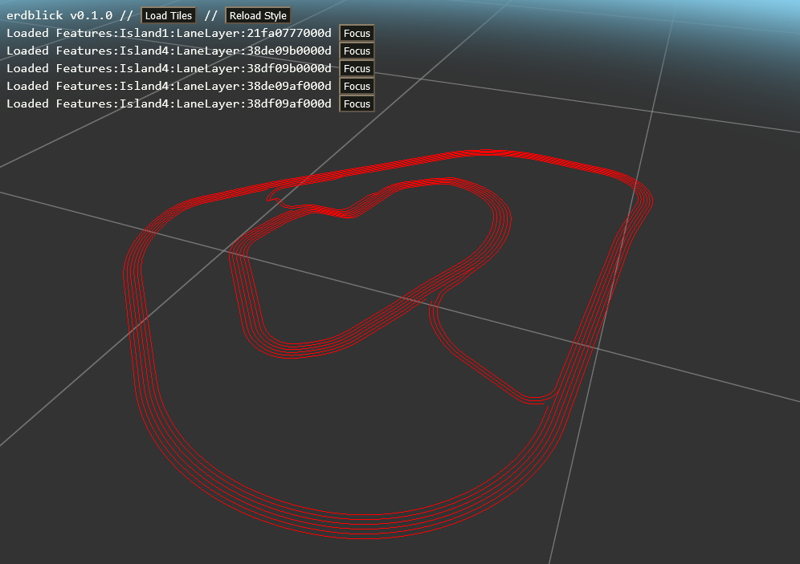
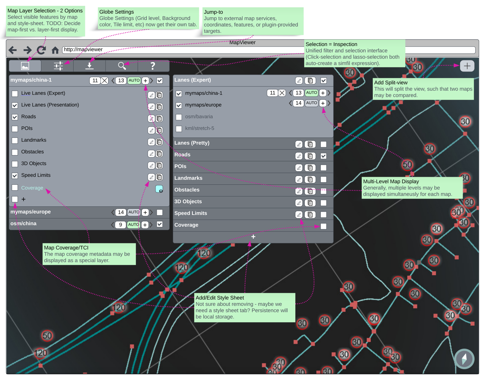
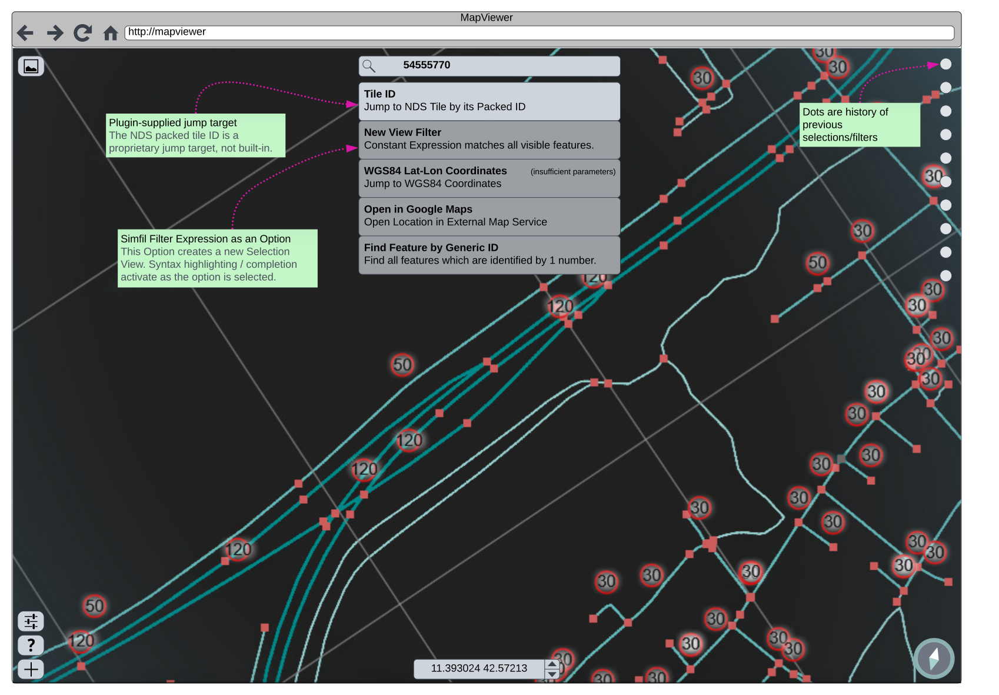
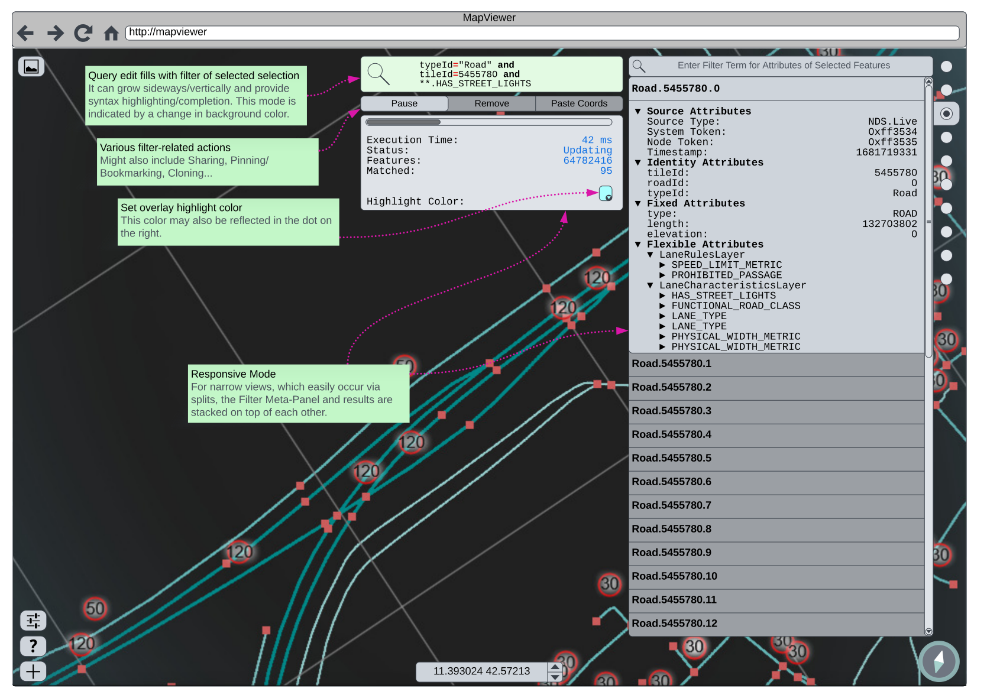
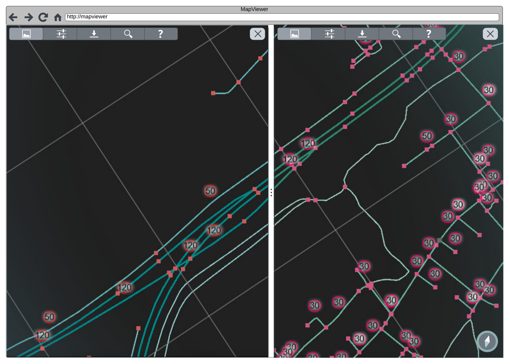
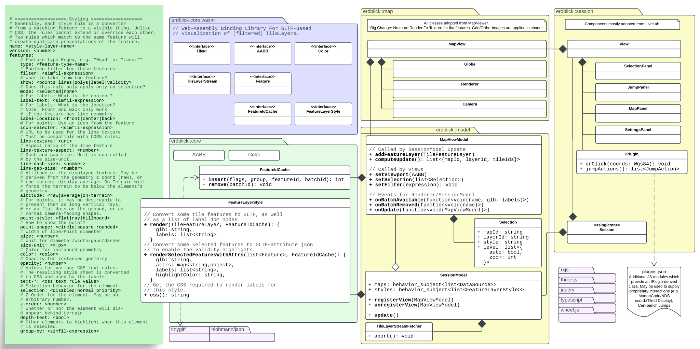

# erdblick 🌍

`erdblick` is a dynamic mapviewer built on the `mapget` feature service.

> **Warning ⚠️**: Erdblick is still under active development and hasn't reached its final form. However, we'd love to hear your feedback during this phase. Our goal is to launch a fully functional Desktop app by the end of 2023. Stay tuned! 🚀

**Capabilities:** 🛠️

* 🗺️ View map layers from a specific [`mapget`](https://github.com/klebert-engineering/mapget) server.
* 🎨 Define visual styles for map layers through style-sheets, translating specific features into visual elements in both 2D and 3D.
* 🏔️ Experience 3D features and terrains with a flexible 3D camera powered by [CesiumJS](https://github.com/CesiumGS/cesium/).
* ✍️ Edit map layer style sheets in real-time directly from the front-end **(Planned)**.
* 🔍 Select multiple features at once using filter or lasso selection tools **(Planned)**.
* 🖼️ Utilize split-screen panes for optional overlay or synchronized navigation with an adjustable splitter **(Planned)**.
* 🔎 View multiple map layer tile zoom levels all at once **(Planned)**.

## Setup

Ready to try out the latest version? While the Desktop app is still work-in-progress, swing by the [Release Page](https://github.com/Klebert-Engineering/erdblick/releases) to grab the newest build. Currently, `erdblick` is made to be served by a [`mapget`](https://github.com/klebert-engineering/mapget) server, so make sure to serve it up with the `mapget serve` command. Not sure how to do that? Start off with a simple `pip install mapget` and then fire away with `mapget serve -w path-to-unpacked-erdblick`.



## Styling System

Erdblick styles are defined as *YAML*-files, which must have a `rules` key that contains an array of
feature visualisation rule objects. During runtime, a feature will be visualised according to each
rule that matches it.

<details>
<summary>Show details</summary>

> **Note ⚠️:** While the mature product envisions a rich UI with the ability
> to edit and toggle multiple style sheets, the current alpha version loads
> its style sheet from the hard-coded path [static/styles/demo-style.yaml](static/styles/demo-style.yaml).

Each rule within the YAML `rules` array can have the following fields:

| Field      | Description                                                                                          | Type                                         | Optional? | Example Value                         |
|------------|------------------------------------------------------------------------------------------------------|----------------------------------------------|-----------|---------------------------------------|
| `geometry` | List of feature geometry type(s) the rule applies to.                                                | [`"point"`\|`"mesh"`\|`"line"`\|`"polygon"`] | No        | `["point", "mesh"]`                   |
| `type`     | A regular expression to match against a feature type.                                                | String                                       | Yes       | `"Lane\|Boundary"`                    |
| `filter`   | A [simfil](https://github.com/klebert-engineering/simfil) filter expression.                         | String                                       | Yes       | `properties.functionalRoadClass == 4` |
| `color`    | A hexadecimal color code or [CSS color name](https://www.w3.org/wiki/CSS/Properties/color/keywords). | String                                       | Yes       | `"#FF5733"`, `red`                    |
| `opacity`  | A float value between 0 and 1 indicating the opacity.                                                | Float                                        | Yes       | `0.8`                                 |
| `width`    | Specifies the line width or point diameter (default in pixels).                                      | Float                                        | Yes       | `4.5`                                 |

**A brief example:**

```yaml
rules:
  - geometry:
      - point
      - mesh
    type: "Landmark"
    filter: "properties.someProperty == someValue"
    color: "#FF5733"
    opacity: 0.8
    width: 4.5
  - geometry:
      - line
      - polygon
    type: "Boundary"
    color: "#33FF57"
```

</details>

## Build instructions (Linux-only)

<details>
<summary>Show instructions</summary>

Run the setup script once to pull Emscripten SDK:

```bash
./ci/00_linux_setup.bash
```

To build the project, run:

```bash
./ci/10_linux_build.bash
```

To rebuild the project (skipping checkouts and CMake initialization), run:

```bash
./ci/20_linux_rebuild.bash
```

You can also build the `erdblick-core` library with a standard C++ compiler
in an IDE of your choice. This is also useful to run the unit-tests.

</details>

## Concepts

As the project is still very much under development, we've gathered
some resources that should give you a clearer picture of what we're aiming
for with the mature product. Feel free to take a look.

<details>
<summary>UI Mocks</summary>

You'll find a series of mockups showcasing our proposed user interface in various scenarios.
Keep an eye out for notes within the images - they provide extra insight into specific features.

#### Overview



#### Search Bar



#### Selection View



#### Split View



</details>

<details>
<summary>Initial Architecture UML</summary>

### Architecture

Second is a UML diagram giving you an overview of our emerging architecture.
Look out for comments within the diagram - they're there to give you a bit more
context on how the parts fit together.



Keep in mind, that these concepts are always up for changing.

</details>