# Erdblick Development Guide

Erdblick is a Cesium-based Angular application backed by a WebAssembly core for tile decoding, styling, and feature search. This guide explains the internal architecture and the main data flows for contributors working on the UI or the C++ core. If you need usage instructions instead of implementation details, start with the [Erdblick User Guide](erdblick-user-guide.md).

We begin with a component overview to show how the Angular app, the WASM core, Cesium, and a mapget-compatible backend fit together. Afterwards, we zoom into the tile streaming and rendering pipelines, error handling, feature search, selection, and debugging strategies.

## Development Setup

For frontend work, you mainly interact with the Angular app under `app/`; for core changes, you also rebuild the C++ library under `libs/core`. A typical setup looks like this:

- Install Node.js LTS and npm (or pnpm).
- Install a C++ toolchain and CMake if you plan to touch the WASM core.
- Use an IDE that can handle both C++ and TypeScript (CLion and VS Code both work well).

To rebuild the Angular UI, run:

```bash
./build-ui.bash .
```

Set `NG_DEVELOP=true` in your environment before running the build if you want source maps and verbose stack traces instead of a fully minified bundle. For tight development loops you can also start the Angular dev server:

```bash
npm install
npm start
```

This serves the UI with hot reload and uses whatever core artifacts are already present under `build/libs/core`.

When you change the C++ core (`libs/core`), rebuild the WASM module with the CI helper scripts:

```bash
cd ci
./00_linux_setup.bash     # one-time Emscripten bootstrap
./10_linux_build.bash     # initial configure
./20_linux_rebuild.bash   # incremental rebuild (debug/release via presets)
```

These scripts compile `erdblick-core` to a single-file WASM/JS bundle consumed by `app/integrations/wasm.ts`. The Angular `AppModule` wires everything together via the `initializeServices` app initializer.

Chrome usually offers the best WebGL performance, but Firefox, Edge, and Safari are all supported. For serious profiling or debugging, it is worth checking problematic scenarios in Chrome once to rule out renderer-specific issues.

## Component Overview

At a high level, erdblick consists of an Angular shell, a Cesium-based map view, and a WebAssembly core that understands map tiles and evaluates styles and search queries:

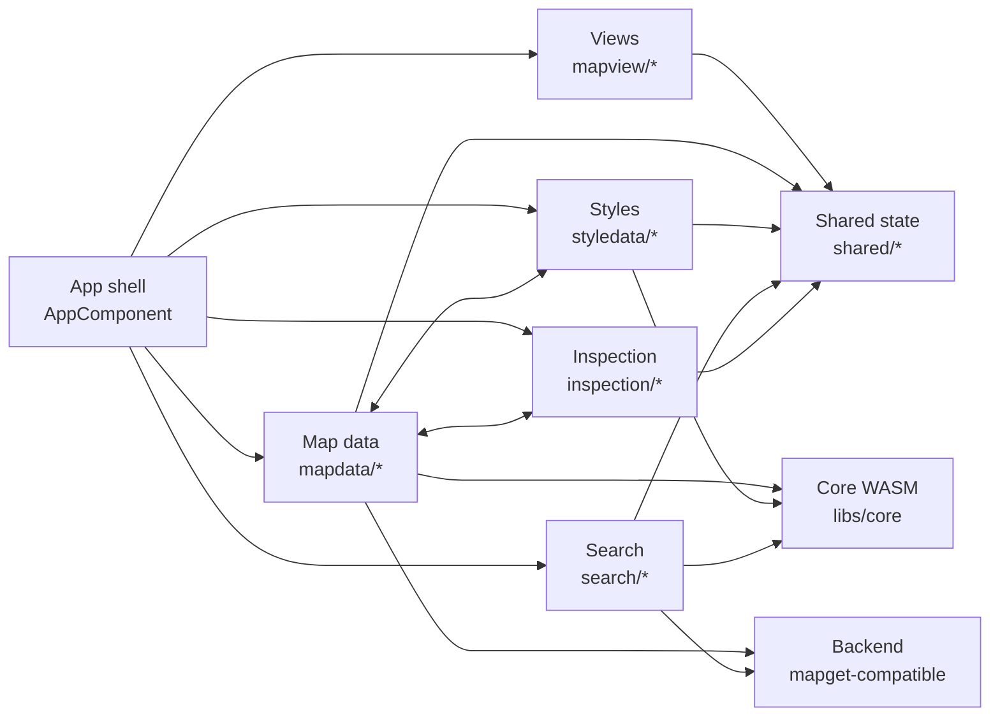

In code, the main responsibilities are:

- `AppComponent` and the PrimeNG-based panels present the UI (maps and layers, styles, search, inspection, preferences, statistics, DataSource editor).
- `MapViewComponent` and `MapView` encapsulate the Cesium viewer per pane (two or more views), read camera changes, and forward interaction events to services.
- `AppStateService` centralizes state that must be shared between components (viewports, active maps and layers, split view configuration, inspections, URL encoding).
- `MapDataService` manages available maps, tile streaming and caching, tile-to-style visualization queues, and hover or selection highlights.
- `StyleService` loads YAML style sheets from `config/styles`, exposes style options, and anchors the runtime view of styles used by both the map view and the style editor.
- `erdblick-core` (WASM) exposes tile parsing (`TileLayerParser`), style evaluation (`FeatureLayerStyle`, `FeatureLayerVisualization`), feature search (`FeatureLayerSearch`), and geometry helpers via Emscripten bindings.
- A mapget-compatible backend provides tiles and metadata over HTTP. Erdblick assumes `/sources`, `/tiles`, `/locate`, and optionally `/config` for the DataSource editor.

The overview diagram above shows how these pieces line up at a coarse level. The following sub-diagrams zoom into individual component groups; later sections then walk from the backend up through the tile cache, renderer, search workers, and inspection tools.

### Map Data (mapdata/*)

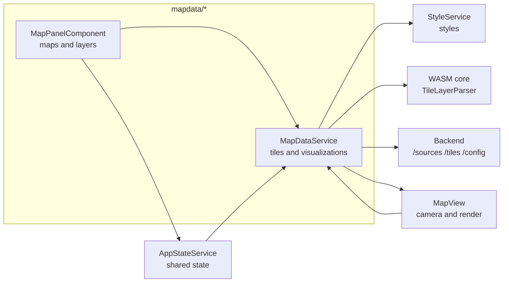

This view focuses on the tile pipeline and the map tree:

- `MapPanelComponent` provides the UI for map and layer configuration and notifies both `MapDataService` and `AppStateService`.
- `MapDataService` keeps track of maps, tiles, and tile visualizations per view and per style.
- `AppStateService` contributes viewport and selection information that influences which tiles are requested and kept.
- `StyleService` provides style definitions when tiles are converted into Cesium primitives.
- The WASM core (`TileLayerParser` and related types) turns tile streams into feature-layer objects.
- The backend responds to `/sources`, `/tiles`, and `/config` calls initiated from this group.

### Map Views (mapview/*)

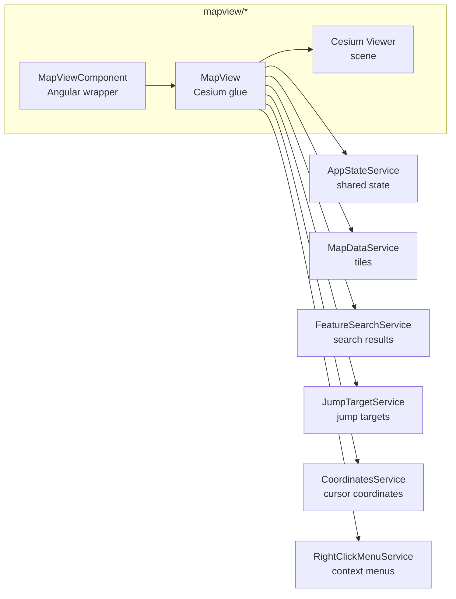

Here the emphasis is on user interaction and camera control:

- `MapViewComponent` owns one Cesium canvas per view and passes the view index and configuration into `MapView`.
- `MapView` configures the Cesium `Viewer`, translates mouse and keyboard events into navigation or selection actions, and listens to tile visualizations and search results.
- `AppStateService` persists and restores per-view camera state and split-view options.
- `MapDataService` supplies tile visualizations and receives camera-related updates (for example focus or zoom-to-feature).
- `FeatureSearchService` and `JumpTargetService` deliver search markers and jump targets that the view renders or focuses.
- `CoordinatesService` and `RightClickMenuService` use the same events to drive coordinates panels and context menus.

### Styles (styledata/*)

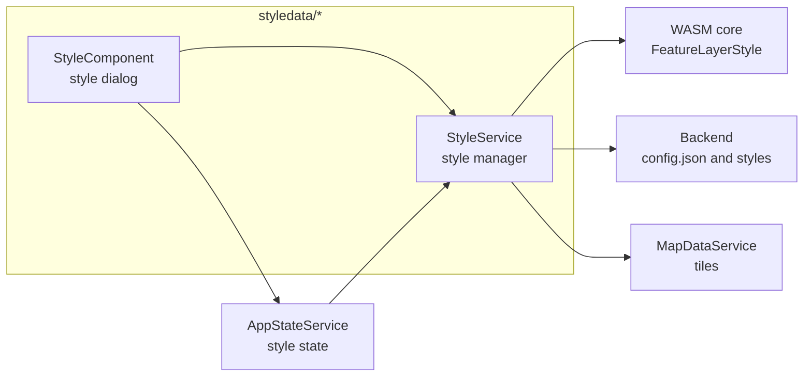

This group is responsible for turning YAML style sheets into runtime style objects:

- `StyleService` loads style metadata from `config/config.json`, fetches YAML files, constructs `FeatureLayerStyle` instances, and exposes style options.
- `StyleComponent` lets users enable or disable styles, tweak options, import or export definitions, and open the embedded editor.
- `AppStateService` tracks which styles and options are enabled so they can be restored across reloads or encoded in URLs.
- `MapDataService` listens for style add and remove events and re-renders tiles when styles change.
- The WASM core parses style YAML into executable style programs.
- The backend serves `config.json` and the YAML files referenced within it.

### Search (search/*)

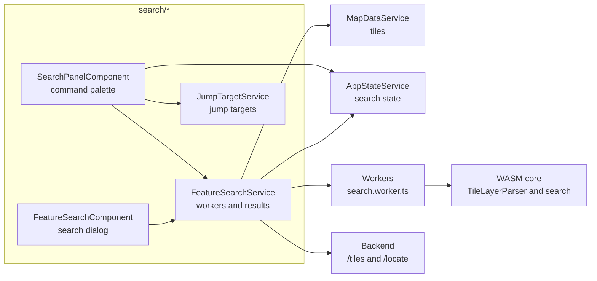

From the perspective of this group:

- `SearchPanelComponent` implements the command palette UX and hands off parsing and execution to `FeatureSearchService` and `JumpTargetService`.
- `FeatureSearchComponent` provides the dedicated search dialog including diagnostics and tracing.
- `FeatureSearchService` orchestrates search jobs and completion requests across tiles and workers, and publishes aggregated results.
- `JumpTargetService` offers additional jump targets (tile IDs, feature IDs, SourceData) on top of the palette.
- `MapDataService` supplies tile blobs and field dictionaries to search workers.
- `AppStateService` records the currently active search and keeps history in sync with URLs.
- `search.worker.ts` drives the WASM `TileLayerParser` and `FeatureLayerSearch` functions in isolation.
- The backend is used both as a tile source for search and as the `/locate` endpoint when resolving external references.

### Inspection and SourceData (inspection/*)

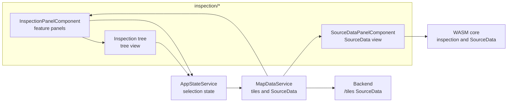

Here the focus is on selection and inspection:

- `InspectionPanelComponent` manages inspection panels, including pinning, sizes, highlight colors, and SourceData panels.
- The inspection tree UI renders feature attributes, relations, and links to related features or SourceData.
- `AppStateService` encodes inspection panels (features and SourceData) so they can be restored from URLs and local storage.
- `MapDataService` translates `TileFeatureId` selections into `FeatureWrapper`s, drives selection and hover highlights, and fetches SourceData tiles.
- The WASM core builds inspection-friendly representations for features and SourceData layers.
- The backend serves SourceData over `/tiles` for layers of type SourceData.

## Tile Cache and Loading Sequence

The tile pipeline starts with the camera position, computes which tiles should be visible, streams those tiles from the backend, and converts them into Cesium primitives once the data arrives:

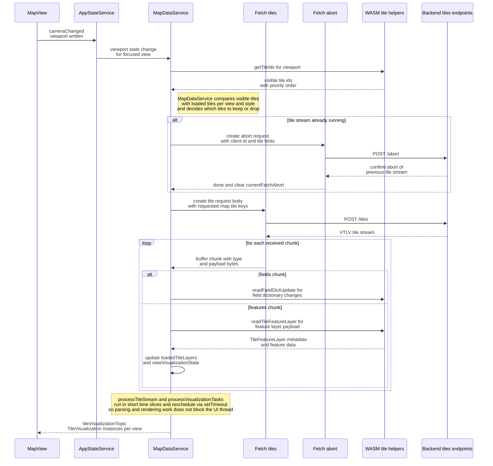

In `MapDataService` this flow is implemented roughly as follows:

- `update()` computes the current viewport, calls `coreLib.getTileIds` to determine which tile IDs should be present, and compares this against `loadedTileLayers` to decide which tiles to request or drop per view.
- For tile data, `MapDataService` uses `Fetch` with `withChunkProcessing()` to POST a list of requested tiles to `/tiles`. The backend replies with a tile-layer stream encoded as version–type–length–value frames, which `Fetch.handleChunkedResponse` decodes.
- `CHUNK_TYPE_FIELDS` frames carry dictionary updates and are passed directly to `TileLayerParser.readFieldDictUpdate`.
- `CHUNK_TYPE_FEATURES` frames hold compressed tile payloads. `MapDataService.addTileFeatureLayer` uses the parser to construct `FeatureTile` objects, updates `loadedTileLayers`, and marks affected `TileVisualization` instances as dirty.
- For each view, `viewVisualizationState[viewIndex].visualizationQueue` is rebuilt so that tiles which changed detail level, border flags, or styles are processed first. `processVisualizationTasks()` then schedules work in small time slices to keep the UI responsive.

Tile metadata such as legal notices and scalar fields is also extracted through the parser and stored alongside `MapLayerTree` so it can be surfaced in the Maps & Layers panel and legal information dialogs.

## Rendering

Once tiles and styles are available, erdblick turns them into Cesium primitives through a compact rendering pipeline. The diagram in `erdblick-rendering-sequence.svg` shows the full detail; the following mermaid sequence diagram mirrors the central part and highlights the role of the WASM renderer and the point merge service:

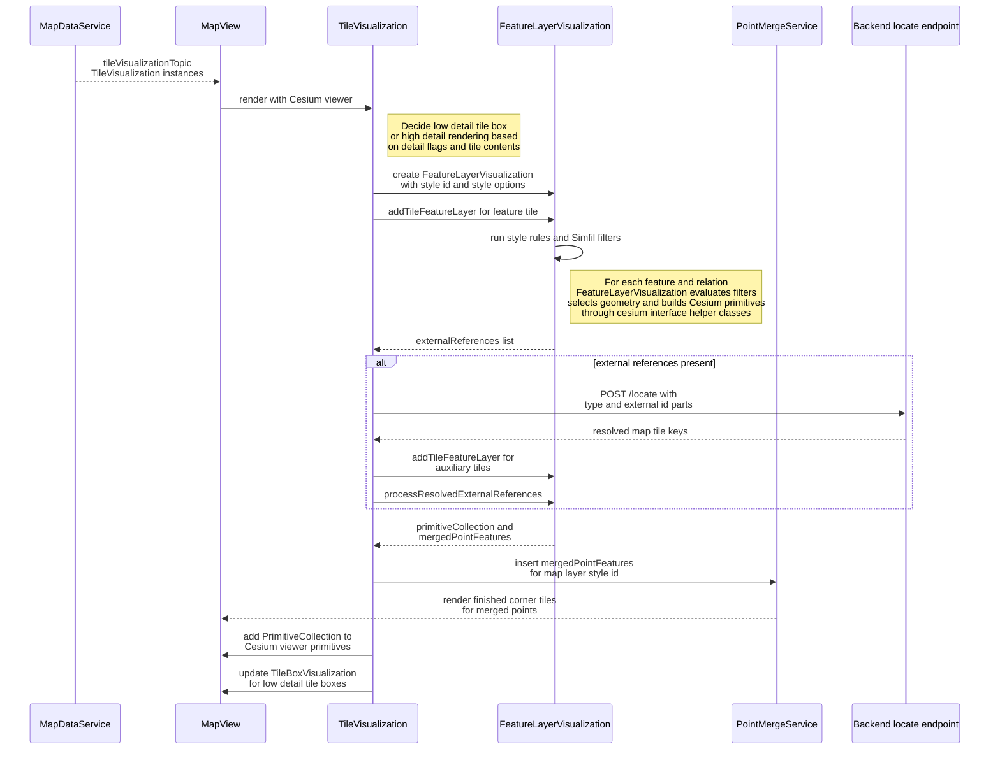

In `visualization.model.ts` and the bindings in `libs/core`, the key pieces are:

- `TileVisualization` wraps one `FeatureTile` and one style (`ErdblickStyle`) for a given view. It decides whether a tile should render in low detail (bounding box via `TileBoxVisualization`) or full detail (calling into the WASM core) and tracks whether borders or highlight modes changed.
- `coreLib.FeatureLayerVisualization` turns tile feature layers into Cesium primitives by evaluating style rules (`FeatureLayerStyle`) for each feature, relation, or attribute. The style sheets and their options are configured via the YAML files in `config/styles` and managed at runtime by `StyleService`.
- For recursive relation visualization and merged point features, the WASM core builds intermediate structures that it returns via `mergedPointFeatures()`. `PointMergeService` takes these results, clusters repeated points, and turns them into Cesium primitives held by `MergedPointsTile`.
- When styles or view sync options change, `MapDataService.addTileFeatureLayer` clears and rebuilds `visualizationQueue` so that tiles are re-rendered with the new configuration.

Cesium itself remains a pure rendering dependency: it receives `PrimitiveCollection` instances and billboards, plus camera instructions, but it is unaware of map-specific concepts such as features, tiles, or Simfil expressions.

## Exceptions and Error Handling

Error handling is intentionally conservative so that failures in tiles or styles cannot easily crash the UI, but the architecture has some rough edges and gaps and currently leans heavily on console logging.

### JavaScript Errors

Most errors you will hit while developing are plain TypeScript/Angular exceptions, for example in components, services, or PrimeNG integration. For those:

- Enable development builds by setting `NG_DEVELOP=true` before running the Angular build or dev server. This keeps stack traces readable and preserves source maps.
- Use the browser’s developer tools console for stack traces. For unhandled promise rejections from services, adding explicit `catch` blocks often makes the origin much easier to track.
- Keep an eye on `InfoMessageService` toast notifications: some recoverable errors (e.g. missing features during selection) surface there rather than as hard exceptions.

### WASM Exceptions

The erdblick core is compiled to WASM without C++ exception support. Enabling native C++ exceptions tends to drop the browser out of JIT and severely hurts performance, so error propagation is handled explicitly:

- In `bindings.cpp`, `simfil::ThrowHandler` is wired up via `setExceptionHandler`, which forwards exception type and message into JavaScript. The browser-side handler installed in `integrations/wasm.ts` (`coreLib.setExceptionHandler`) wraps these in JavaScript `Error` objects.
- Most calls into the core either go through helpers like `uint8ArrayToWasm` (which catch and log exceptions before returning) or are wrapped in explicit try/catch blocks (for example around `FeatureLayerVisualization.run` in `TileVisualization.render`).
- Search workers wrap their calls to `FeatureLayerSearch` in defensive try/catch blocks and convert failures into `SearchResultForTile` entries with an `error` string. These errors show up alongside search results; structured diagnostics still come from the dedicated diagnostics tasks.

### IO and Streaming Errors

Aside from in-process exceptions, a few error classes originate from IO or backend behavior:

- **TileLayerStream parsing errors** - malformed chunk headers or frames result in console errors from the `Fetch` helper or during the WASM calls it drives. Enabling the statistics dialog helps correlate parse failures with empty tiles or missing features.
- **Style sheet parsing errors** - YAML or Simfil issues in style sheets are caught by `StyleService.parseWasmStyle`, which logs the problem and records an error marker for the affected style. Execution-time errors inside rules generally surface as WASM exceptions while rendering and appear in the browser console.
- **Tile and style performance anomalies** - tiles collect statistics such as parse time, size, and render times per style. The statistics dialog aggregates these so you can spot cases where a particular map layer or style slows rendering or produces suspiciously empty tiles.
- **Backend or connection loss** - network errors from `fetch` (for `/sources`, `/tiles`, `/locate`, or `/config`) are logged by `Fetch.handleError`. Some specific operations (for example selection limits or illegal style renames) additionally surface user-facing messages via `InfoMessageService`, but transport failures themselves are primarily visible in the console today.

In general, treat the browser console and the statistics dialog as complementary tools: the console tells you what failed, the stats dialog tells you which tiles and styles were affected or unusually slow.

## Feature Search/Query completion

Feature search combines a main-thread service with a pool of web workers:

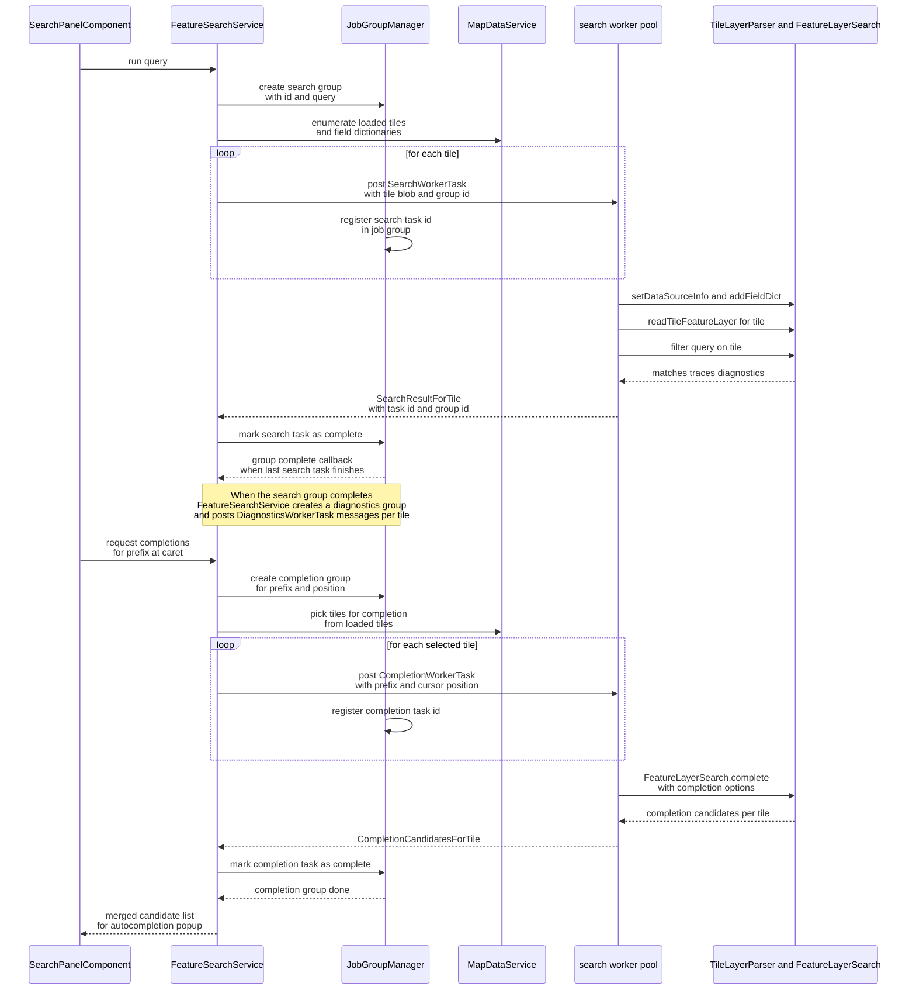

A few implementation details matter for contributors:

- `FeatureSearchService` owns the worker pool, work queue, and result aggregation logic. It creates up to `navigator.hardwareConcurrency` workers and keeps them hot across searches.
- Tasks posted to workers carry the serialized tile blob, the current field dictionary blob, and `dataSourceInfo` so that each worker can build a local `TileLayerParser` and `TileFeatureLayer` instance.
- The quad tree inside `FeatureSearchService` clusters search results into per-tile buckets and computes billboard positions, which are then rendered via Cesium in `MapView`.
- Completion and diagnostics follow the same structure with `CompletionWorkerTask` and `DiagnosticsWorkerTask` messages; the worker invokes `FeatureLayerSearch.complete` and `FeatureLayerSearch.diagnostics` respectively.

When touching this area, keep web worker pitfalls in mind:

- Avoid heavy `console.log` usage in workers; logging from tight loops can dominate runtime and flood the console.
- Minimize data passed between main thread and workers; prefer compact binary blobs over large JSON structures.
- Batch result messages where possible: posting many tiny messages is more expensive than a few aggregated ones.

## Feature and SourceData Layer Selection

Selection in erdblick is driven entirely by tiles and the current style configuration; both feature panels and SourceData panels are different views on the same backing data.

On the UI and service side, the interaction looks as follows:

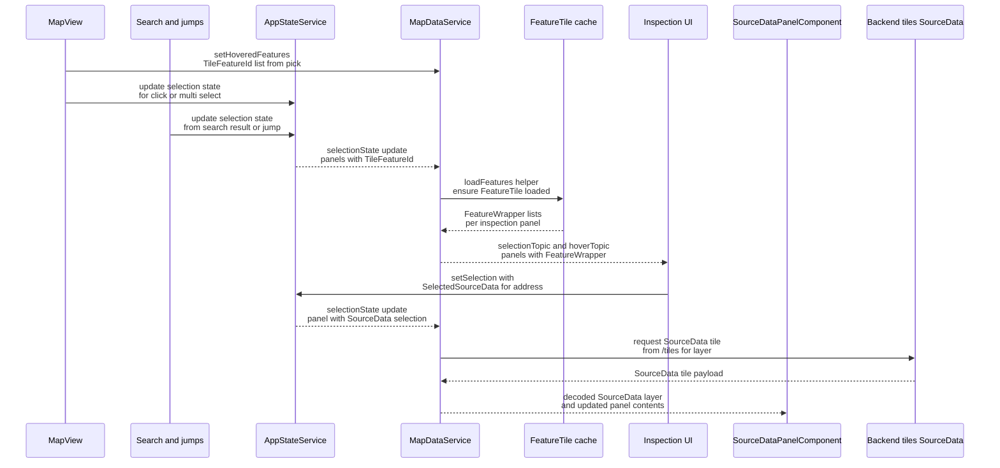

Key points to understand:

- `MapView` translates Cesium pick events into `TileFeatureId` structures (map/layer/tile/feature identifiers) and forwards them to `MapDataService.setHoveredFeatures` or into the selection machinery via `AppStateService`. Jumps and search results use the same identifiers.
- `MapDataService.loadFeatures` ensures that the relevant tiles are present in `loadedTileLayers`, fetching them if necessary, and wraps them in `FeatureWrapper` objects that expose inspection helpers like `inspectionModel()`.
- `selectionTopic` and `hoverTopic` hold the current panel models, including pinned state, color, and size. `InspectionContainerComponent` subscribes to them and re-renders the inspection tree and SourceData view accordingly.
- SourceData is driven by the same tile streaming code but uses `CHUNK_TYPE_SOURCEDATA` and `TileLayerParser.readTileSourceDataLayer` instead of feature-layer parsing. SourceData selection reuses the same map and layer identifiers, so you can jump back and forth between features and their underlying blobs.

If you change how selection is encoded or how tiles are keyed, make sure to keep `AppStateService`, `MapDataService`, and the inspection components in sync; otherwise, URL-based sharing and multi-panel inspection will drift out of alignment.

## Debugging Strategies

When working on erdblick, it pays to combine browser tooling, WASM helpers, and the built-in statistics overlays. A few patterns tend to work well:

- **Browser JS debugger** - use breakpoints in Angular components and services, and enable “Pause on exceptions” for tricky cases. Workspace mappings (for example in Chrome) let you debug TypeScript instead of bundled JS.
- **Network debugger** - inspect `/sources`, `/tiles`, `/locate`, and `/config` requests and responses. This is often the quickest way to decide whether a bug lives in the backend, the parser, or the renderer.
- **Statistics dialog and overlays** - the statistics dialog aggregates per-tile metrics (tile counts, parse times, render times per style) and combined with tile borders makes it straightforward to spot missing tiles or expensive styles.
- **WASM diagnostics** - in a debug build of `erdblick-core`, you can enable leak checks and inspect memory usage via the functions bound in `bindings.cpp` (`getTotalMemory`, `getFreeMemory`, `enableLeakCheck`, `reportMemoryLeaks`). These are available through `coreLib` once the WASM module is loaded.
- **Unit tests** - the C++ core ships with tests under `libs/core`, and the Angular application has Vitest tests configured via `vitest.config.ts`. For changes that affect tile parsing, styling, or search semantics, extending the C++ tests often provides clearer feedback than reproducing issues through the UI alone.
- **C++ Debugging in the browser:**
  For reading DWARF debug information from a WASM source, install the following
  [plug-in](https://chrome.google.com/webstore/detail/cc%20%20-devtools-support-dwa/pdcpmagijalfljmkmjngeonclgbbannb) to your browser.
  After installation, make sure the browser can access your source files (i.e a sandbox like flatpak may prevent access). Make sure you are using a _debug-build_ of erdblick!
  The build scripts `./ci/10_linux_build.sh` and `./ci/20_linux_rebuild.sh` accept an optional cmake-preset ("release" or "debug") argument for setting the build type.
  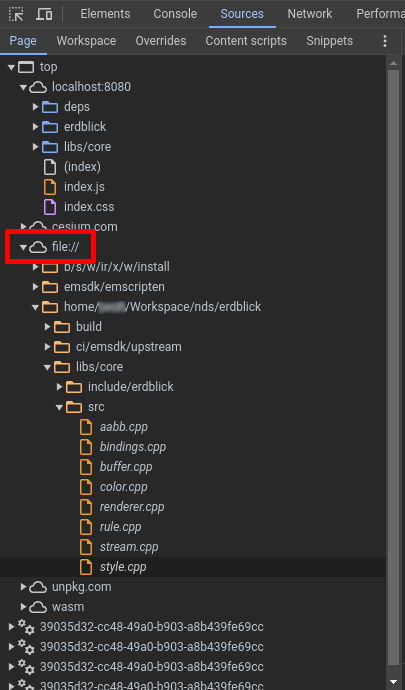

C++ sources are available under the root node `file://` in the inspector view.
Debugging in Firefox is currently unsupported.

When debugging complex scenarios (for example, rendering issues that involve both styling and tiles), it is usually helpful to:

1. Confirm that the backend returns the expected tile and layer payloads.
2. Verify that the tile appears in `loadedTileLayers` via `MapDataService` debug logging.
3. Check whether the style applies (`hasLayerAffinity` and visibility).
4. Use the statistics dialog to see whether primitives are being generated and rendered.

## Coding Conventions

Erdblick follows the surrounding repositories’ conventions while adding a few project-specific preferences.

For C++ code:

- Use the style defined in `.clang-format` in the erdblick tree.
- Keep bindings in `libs/core/src/bindings.cpp` minimal and focused: push complexity into the core, not into the JavaScript boundary layer.

For TypeScript and JavaScript:

- Use braces (`{}`) even for single-line `if` statements.
- Prefer early returns over deeply nested conditionals.
- Use `const` instead of `let` wherever possible and avoid `var`.
- Keep services cohesive and UI components thin; cross-cutting concerns (keyboard handling, app state, shared dialogs) belong in the `shared/` or `auxiliaries/` services.

These conventions are not exhaustive, but they reflect how the existing code is structured. When in doubt, align with nearby code before introducing a new pattern.
