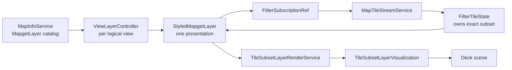
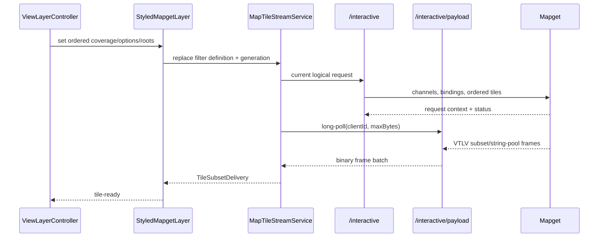

# Erdblick Developer Guide

Erdblick is MapViewer's Angular/Deck.gl browser client plus a C++ core compiled
to WebAssembly. This guide describes the S4E2 architecture introduced with
mapget protocol 3.

## Design boundary

Mapget owns data semantics and server evaluation:

- complete source feature tiles and their cache;
- schema-aware filtering/projection;
- point-grid groups and `$mergeCount`;
- stored relation traversal and one-hop cross-tile endpoint resolution;
- immutable `TileSubsetLayer` transport values;
- named attachments.

Erdblick owns presentation:

- stylesheet parsing/planning;
- view/catalog/presentation lifecycle;
- render scheduling and Deck buffers;
- interaction, search UI, inspection, and diagnostics;
- high/low fidelity style selection.

Complete source feature tiles are not the default browser rendering substrate.
They cross into Erdblick only through the explicit feature-restricted
inspection path.

## Build and test

Native core:

```bash
cmake -S . -B build-native -G Ninja
cmake --build build-native
ctest --test-dir build-native
```

WebAssembly and application:

```bash
source ci/emsdk/emsdk_env.sh
export EMSCRIPTEN="$PWD/ci/emsdk/upstream/emscripten"
emcmake cmake --preset release
cmake --build --preset release
npm ci
npx tsc -p tsconfig.app.json --noEmit
npm run test:vitest
npm run build
```

For a clean CI-equivalent core and UI build, run
`./ci/10_linux_build.bash`. The exact top-level build commands used by
MapViewer are also encoded in its CMake configuration and CI workflows.

## Core model and WASM surface

The C++ core wraps mapget models and exposes:

- `TileLayerParser`: datasource metadata, string pools, tile/subset parsing,
  style filter planning, and restricted feature-layer parsing;
- `FeatureLayerStyle` / `FeatureStyleRule`: version-2 stylesheet model;
- `TileSubsetLayer`: immutable WASM wrapper around the mapget result;
- `TileSubsetLayerRenderer`: converts one subset and style into logical Deck
  buffers plus exact typed pick references;
- inspection conversion and source-data helpers.

The retired full-feature visualizers and `TileSearchResultLayer` wrappers do
not coexist with this path.

## Ownership model


```mermaid
flowchart LR
  Catalog["MapInfoService<br/>MapgetLayer catalog"]
  Controller["ViewLayerController<br/>per logical view"]
  Styled["StyledMapgetLayer<br/>one presentation"]
  Ref["FilterSubscriptionRef"]
  Stream["MapTileStreamService"]
  State["FilterTileState<br/>owns exact subset"]
  Render["TileSubsetLayerRenderService"]
  Vis["TileSubsetLayerVisualization"]
  Deck["Deck scene"]

  Catalog --> Controller --> Styled
  Styled --> Ref --> Stream
  Stream --> State --> Styled
  Styled --> Render --> Vis --> Deck
```

### `MapgetLayer`

`MapgetLayer` is immutable catalog metadata:

- `sourceId` and `stringPoolId`;
- map/layer identity and `LayerInfo`;
- no view, style, transport, subset, or renderer state.

### `StyledMapgetLayer`

One `StyledMapgetLayer` represents one view-scoped presentation:

- regular stylesheet;
- search;
- hover;
- selection.

It owns exactly one `FilterSubscriptionRef`, its current generation/coverage,
and every delivered `FilterTileState`. It directly owns those subsets. There
is no shared `TileSubsetLayer` product cache and no hydration API between
styled layers. This intentional duplication keeps presentation definitions,
projected fields, and lifetime boundaries explicit.

`FilterTileState` atomically replaces an immutable subset, retains dependency
counts, inherited source `info()`, issues, render measurements, attachment
name, and pending/ready/error state.

### `ViewLayerController`

Each logical map view owns one controller. It reconciles:

- visible catalog layers and active styles;
- style options and high/low fidelity;
- ordered viewport coverage;
- search presentations;
- hover and selection presentations with exact roots;
- `TileSubsetLayerVisualization` instances;
- scene/device reattachment;
- grid source occupancy;
- diagnostic registration.

A Deck/device recreation replaces only the scene handle. Logical styled
layers, filter refs, subsets, and visualizations survive until the logical
view/controller disposes them.

### Transport refs

`MapTileStreamService` owns protocol APIs, not presentation policy:

- filter subscription refs;
- attachment refs;
- `/sources`/string-pool parser integration;
- one-shot feature-restricted inspection fetches.

`FilterSubscriptionRef` has explicit replace, refresh, suspend/resume, and
release operations. Replacement increments generation. A delivered frame is
accepted only when `filterId`, generation, map/layer, and output tile match the
active subscription.

`TileAttachmentRef` coalesces simultaneous requests and retains immutable bytes
while referenced. Last release aborts/drops the value. There is no unpinned
warm attachment cache in the initial implementation.

## Style planning

Every active stylesheet is planned in WASM against concrete `LayerInfo`.
There is exactly one filter channel per top-level style rule. Channels are not
conflated for compression.

For a nested `first-of` or `all-of` tree, planner eligibility is:

```text
own filter AND (child-1 eligibility OR child-2 eligibility OR ...)
```

recursively. Both branch modes use the union for server admission; the
renderer still preserves their different presentation semantics (`first-of`
selects the first matching branch, `all-of` emits every matching branch).

Rule expressions are partitioned:

- feature-root expressions become `featureFields`;
- attribute/relation terminal expressions become `entryFields`;
- feature gates become `featureFilter`;
- attribute/relation gates become `entryFilter`.

All expressions are schema-compiled by mapget. Styles use `rewrite: false`;
that disables search-query normalization only.

If every relevant leaf selects the same `geometry-name`, the channel requests
that name. Disagreement becomes wildcard. Point groups are stricter: all
leaves must be grouped, point-only, use one cell size, and use one compatible
name selector. `$mergeCount` in render expressions is rewritten to
`count($features.*)` in group projections, and may not influence pre-group
membership.

Invalid plans fail visibly with rule-indexed issues; they do not render a
semantically approximate result.

## Interactive transport


```mermaid
sequenceDiagram
  participant Controller as ViewLayerController
  participant Styled as StyledMapgetLayer
  participant Stream as MapTileStreamService
  participant WS as /interactive
  participant Pull as /interactive/payload
  participant Mapget

  Controller->>Styled: set ordered coverage/options/roots
  Styled->>Stream: replace filter definition + generation
  Stream->>WS: current logical request
  WS->>Mapget: channels, bindings, ordered tiles
  Mapget-->>WS: request context + status
  Stream->>Pull: long-poll(clientId, maxBytes)
  Mapget-->>Pull: VTLV subset/string-pool frames
  Pull-->>Stream: binary frame batch
  Stream-->>Styled: TileSubsetDelivery
  Styled-->>Controller: tile-ready
```

Processing order follows request tile order; stream arrival order may differ.
The transport supports bounded outgoing queues and adaptive payload batches.
`/tiles` and `/tiles/next` remain fallback aliases for stale proxy
deployments; new clients use `/interactive` and `/interactive/payload`.

## Render pipeline

`TileSubsetLayerRenderService` is a global finite worker service. It schedules
one immutable pre-render Morton block of subset blobs plus style/pass inputs.
Newer render signatures replace queued work and stale completions are
rejected.

`ViewLayerController` assembles canonical half-level Morton-prefix rectangles:
`1x1`, `2x1`, `2x2`, `4x2`, and `4x4`. It chooses the largest ready block
whose subsets share fidelity and string-pool identity and whose combined
stored geometry contains at most 16,384 vertices. The 4x4 limit remains the
hard spatial ceiling; an individual oversized tile is still rendered as a
singleton.

Workers:

1. parse every subset in the block;
2. run `TileSubsetLayerRenderer`;
3. return logical point/path/surface/label/arrow buffers;
4. return exact `(channel ordinal, typed-entry ordinal)` pick refs;
5. report attachment demand, issues, and timing.

`TileSubsetLayerVisualization` coordinates atomic installation of two
tile-scoped presenters. `TileSubsetVectorPresentation` owns arena and direct
Deck contributions for surfaces, paths, points, labels, and arrows.
`TileSubsetGltfPresentation` owns attachment transfer, a
`DeckTileGltfAssetRef`, visible nodes, pick proxies, and GLTF interaction
contributions. `DeckTileGltfAssetStore` coalesces parsing into an immutable
CPU-side document without a luma-device key. `DeckGltfNodeLayer` alone creates
and destroys the per-device scenegraph models and texture resources. The
visualization keeps the exact immutable subset bytes which produced those
presentations until every contribution and pick reference is removed. A block
remains alive while any constituent tile overlaps current demand.
Primitive-level information such as relation endpoint role or nested
render-rule index stays renderer-local.

Large GLBs are requested only after renderer output reports demand. The
GLTF presenter combines attachment bytes with subset GLTF-node/AABB entries.
It owns independently releasable `TileAttachmentRef` and
`DeckTileGltfAssetRef` values per presentation and releases both pending and
installed state on replacement or teardown;
`MapTileStreamService` still coalesces identical underlying requests.

Deck creates its luma device asynchronously even when supplied an existing
WebGL context. `DeckMapView` therefore publishes its immutable scene handle
only after `onDeviceInitialized`; otherwise attachment-backed presentation
would permanently observe a null device and never request its GLB.

`FrameBudgetLoop<T>` is the shared main-thread time-slice utility. It services
bounded work such as search-result ingestion without creating a global
"schedule anything" ownership service.

## Search

Search is an ordinary styled presentation:

- the editor/session service owns query and result-list state;
- `feature-search-style.ts` creates a synthetic version-2 style;
- one `StyledMapgetLayer` runs that style through `/filter`;
- subset rows feed both map rendering and frame-budgeted list ingestion;
- category/gradient choices become `color-scale` with typed list-pair stops.

There is no search-specific tile model or renderer. See
[Search Architecture](erdblick-search-architecture.md).

## Hover, selection, and relations

The controller first resolves hover and selection against typed pick entries
retained by regular/search `TileSubsetLayerVisualization`s. A view-owned
interaction overlay feeds only matching paths, points, polygons, or mapget
mesh triangles into hidden GPU mask layers and applies the active stylesheet's
top-level `interaction-effects` material. `DeckInteractionOutlineService`
renders stable semantic-feature IDs to a lazy offscreen texture, builds a
full-resolution coverage field plus independently scaled semantic edge and
halo fields, and derives adaptive edge, halo, and hatch output in one
fullscreen shader. The edge scale depends only on `edge-width`; changing
`halo.radius` therefore cannot alter the outer or nested outline. The shader
emits only material deltas over the authored map, so translucent area fill is
never drawn twice. Selection suppresses the same hover target (including a
feature/attribute/validity parent-child pair) both before feature resolution
and again during final view reconciliation. Hatch phase is anchored to the
projected world origin of its interaction group, while spacing and width stay
screen-pixel based, so ordinary viewport pans do not make the pattern swim.
Visible
thickness—not a primitive tag—decides whether a shape is solid-tinted or keeps
an area-like interior. Equal IDs cross triangles and render-block boundaries,
so internal seams disappear without CPU edge reconstruction. Feature identity
is already local. GLTF attachments remain a separate flat-tint contribution.

The same mask service also owns persistent, rule-level vector `glow`
materials. `TileSubsetLayerRenderer` emits one literal RGBA/radius tuple per
path, generated arrow, point, or surface row;
`TileSubsetLayerVisualization` groups identical materials and registers one
union, exterior-only halo below the authored geometry. The union removes
overlap seams, while the exterior-only contract prevents a halo from replacing
thin path or arrow fill. This keeps glow out of the render-buffer vertex layout
and gives ordinary style rules the same screen-space shadow as interaction
highlights. Labels, arbitrary icons, and GLTF nodes remain outside that path
initially.

Generated transition paths whose road-side stack distance changes through the
junction use `DeckVariablePathOffsetExtension`. Its source buffer stores one
local-map XY pixel vector per path vertex; the Deck adapter packs each
segment's exact left/start/end/right neighbourhood into one instanced `uvec4`.
Every word holds one signed 12-bit fixed-point XY pair and a logarithmically
quantized metres-per-pixel scale threshold, retaining one attribute location
under the WebGL attribute budget.
`DeckVariableOffsetPathLayer` applies those vectors to the projected
previous/current/next centerline positions before PathLayer computes its
extrusion and join. Adjacent instances consequently present byte-identical
neighbourhoods at their shared joint. One host/rule-wide threshold uniformly
contracts the complete road-leg and bridge displacement before a fixed pixel
inside offset can exceed the projected bend radius. This preserves stack
ratios and converges smoothly toward the stable undisplaced geometry instead
of modifying individual joints.
The visible PathLayer and every mask pass instantiate the same extension, so
glow and picking cannot inherit a wider or differently clipped silhouette.
Arrow icons carry the exact terminal XY vector and the same quantized scale,
then apply both through `DeckLocalPixelOffsetExtension` before their
pixel/common-space projection. The extension transforms local directions
directly, avoiding precision loss from subtracting projected positions.

Only semantic objects absent from all active subsets use an exact-root
highlight `StyledMapgetLayer`. Its `mode: hover|selection` output is already an
interaction visualization and stays exactly as authored instead of entering
the generic mask compositor again. Attribute-panel validities and recursive
topology are the main fallback cases. Selection relation rules send exact
canonical roots and use mapget's one-hop stored relation traversal.

Generic `mergeTwoway` display uses permanent south-west tile ownership. A
pair whose permanent owner is outside current requested coverage is omitted;
it is not temporarily reassigned at a viewport boundary. Selection traversal
is different: the selected origin owns the pair, and the first explicit root
wins if both endpoints were selected.

Relation source/target endpoint styles are feature-style trees and may contain
`first-of`/`all-of`. The top-level relation rule itself may not.

## Inspection

Picking resolves the typed entry against the exact subset retained by the
visualization and yields canonical feature identity plus the best known tile.
Inspection then:

1. requests that tile through `/tiles` with a canonical `featureIds`
   restriction;
2. if a cross-tile endpoint is absent, calls canonical `/locate`;
3. retries the restricted fetch against the resolved tile;
4. exposes temporary `InspectionFeatureTile` wrappers;
5. releases complete feature data when no panel needs it.

Rendering never depends on that complete inspection tile.

## Diagnostics and grid occupancy

`ViewLayerDiagnosticsService` is a read-through registry of current
presentations. It owns no subset/history cache.

- Source `info()` statistics are inherited by `TileSubsetLayer` and
  deduplicated per source `MapTileKey`.
- Filter and client-render costs remain presentation-scoped.
- Generation status is admitted once per `(filterId, generation)`.
- Attachment and render failures remain visible on the owning state.

Grid occupancy uses the local dependency's `sourceFeatureCount`, not result
entry count. A zero-entry subset can mean "stylesheet rejected everything";
it does not mean the source tile is empty. Halo and foreign relation
dependencies are ignored. With no active regular subset observation,
occupancy is `unknown`, not empty.

## Styles and fidelity

Stylesheets must use `version: 2`. Backend stages and feature LOD do not exist.
`fidelity: low|high` is an Erdblick presentation choice selected from current
view density. Both paths use the same complete source data; their rules choose
semantic geometry names and explicit feature filters.

For example, a low-density road style may select `centerline` and filter
directly on FRC/PRC. A detailed style may select `ADAS`. Mapget treats both
names and attributes as ordinary model semantics.

See [Style System](erdblick-stylesystem.md).

## Failure and cancellation rules

- A new filter generation makes older subset/status/render completions stale.
- Releasing a styled layer releases its filter ref, subsets, attachment refs,
  and visualizations deterministically.
- Render workers reject stale signatures; callers must not install them.
- Mapget candidate failures become subset issues; request-level failures
  produce terminal error state.
- Long loops check cancellation at feature boundaries and fixed batches.
- There is initially no datasource snapshot/revision contract. Dynamic/TTL
  sources may require later hardening; successful negative lookups are not a
  durable frontend cache.

## Protocol migration

Protocol 3 and stylesheet schema 2 are clean breaks. Old staged cache blobs,
stage-suffixed keys, LOD fields, `TileSearchResultLayer`, and full-feature
visualizer APIs must not be reintroduced as compatibility paths. The URL
decoder may discard an old stage suffix solely to restore older links.
