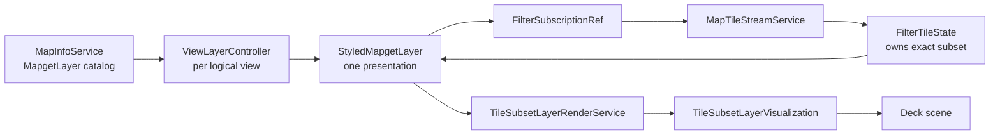
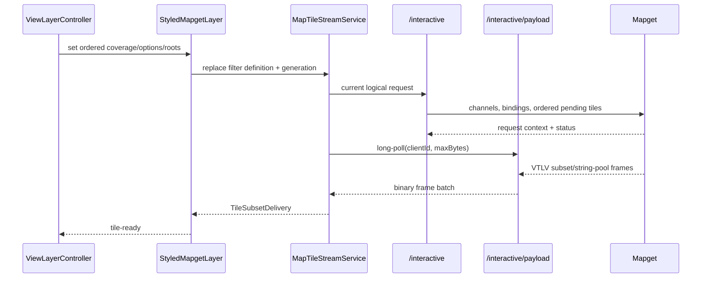

# Erdblick Developer Guide

Erdblick is MapViewer's Angular/Deck.gl browser client plus a C++ core compiled
to WebAssembly. This guide describes the S4E2 architecture introduced with
mapget protocol 4.

## Design boundary

Mapget owns data semantics and server evaluation:

- complete source feature tiles and their cache;
- schema-aware filtering/projection;
- point-grid groups and `$mergeCount`;
- stored relation traversal and one-hop cross-tile endpoint resolution;
- immutable `TileSubsetLayer` transport values;
- named attachments.

Erdblick owns presentation:

- stylesheet parsing/planning;
- view/catalog/presentation lifecycle;
- render scheduling and Deck buffers;
- interaction, search UI, inspection, and diagnostics;
- density-driven stylesheet LOD selection.

Complete source feature tiles are not the default browser rendering substrate.
They cross into Erdblick only through the explicit feature-restricted
inspection path.

## Build and test

Native core:

```bash
cmake -S . -B build-native -G Ninja
cmake --build build-native
ctest --test-dir build-native
```

For changes to the native/WASM core or its mapget/simfil dependencies, use the
incremental rebuild script. It rebuilds the bindings and both frontend variants:

```bash
./ci/20_linux_rebuild.bash
```

With matching WASM artifacts already present, frontend-only validation uses:

```bash
npm run lint
npm run test -- --watch=false --include <path-or-glob>
npm run build -- -c profiling
```

The build, start, watch and unit-test hooks generate the trusted viewer-action
catalog before compiling. `./ci/10_linux_build.bash` is the clean CI build;
it removes the existing build tree and is not the routine iteration command.

The action/transport browser smoke can use a matching native `mapget` executable
without an installed Python datasource wheel. From the erdblick root:

```bash
EB_MAPGET_CONFIG=test/mapget-native-grid.yaml npm run test:integration -- \
  playwright/tests/tile-request.spec.ts playwright/tests/viewer-actions.spec.ts \
  --project='' --workers=1
```

Set `MAPGET_BIN` when the executable is not on `PATH`. The transport cases use
the real server; the viewer-action cases mock the MCP relay and do not establish
authentication or native MCP routing. Other inspection fixtures still use the
default Python example datasource and its matching protocol version.

For the real HTTP-to-browser action path, enable the native local MCP fixture:

```bash
EB_MAPGET_MCP_LOCAL=1 EB_MAPGET_CONFIG=test/mapget-native-grid.yaml \
  npm run test:integration -- playwright/tests/viewer-actions-native.spec.ts \
  playwright/tests/schema-completion.spec.ts playwright/tests/tile-request.spec.ts \
  --project='' --workers=1
```

This binds the test server to loopback and generates a test-only trust config
under `playwright/.cache/`, using the catalog in the built frontend. The test
uses two actual viewer origins (`localhost` and `127.0.0.1`) and the native MCP
endpoint, including camera targeting, synchronization and stale-session rejection.
It does not replace OAuth/Keycloak deployment acceptance. Use an unused
`EB_APP_PORT` and a fresh `EB_PLAYWRIGHT_COVERAGE_DIR` for independent local runs.

When `MAPGET_BIN` is the integrated MapViewer host, its production style catalog
replaces the standalone defaults. Use the existing development map and matching
layer selectors so the tile/render assertions exercise a configured style:

```bash
MAPGET_BIN=../../cmake-build-release-with-classic/bin/mapviewer \
  EB_MAPGET_MCP_LOCAL=1 EB_MAPGET_CONFIG=../../config/mapviewer_dev.yaml \
  EB_TEST_MAP_NAME=GridDataSource EB_TEST_LAYER_NAME=DevSrc-RoadLayer \
  npm run test:integration -- playwright/tests/viewer-actions-native.spec.ts \
  playwright/tests/schema-completion.spec.ts playwright/tests/tile-request.spec.ts \
  --project='' --workers=1
```

The generic `TestMap/WayLayer` fixture does not match MapViewer's production
`DevSrc-RoadLayer` style. Successful connection/control is not proof of tile
rendering when no style enables that layer.

The OAuth integration fixture uses a disposable RSA issuer and a loopback-only
WebSocket forwarding proxy against that same native backend. The proxy overwrites
the test identity headers on the real handshake; Chromium's extra HTTP headers
do not cover WebSocket handshakes. Browser action/control messages are not mocked:

```bash
EB_MAPGET_MCP_TEST_OAUTH=1 EB_MAPGET_CONFIG=test/mapget-native-grid.yaml \
  npm run test:integration -- playwright/tests/viewer-actions-auth.spec.ts \
  --project='' --workers=1
```

It checks principal isolation, read/control permissions and token rejection. Its
private key is generated under the ignored test cache and removed at teardown.
This is not a substitute for the deployed proxy, Keycloak login/refresh or real
client onboarding tests; it never modifies shared SSO configuration.

The `build-playwright` workflow runs the native local and disposable-OAuth
Chromium suites against its freshly built mapget wheel before the general browser
suite. Each uses a separate port and coverage directory; the general suite retains
the Python datasource and browser matrix.

## Core model and WASM surface

The C++ core wraps mapget models and exposes:

- `TileLayerParser`: datasource metadata, string pools, tile/subset parsing,
  style filter planning, and restricted feature-layer parsing;
- `FeatureLayerStyle` / `FeatureStyleRule`: version-2 stylesheet model;
- `TileSubsetLayer`: immutable WASM wrapper around the mapget result;
- `TileSubsetLayerRenderer`: converts one subset and style into logical Deck
  buffers plus exact typed pick references;
- inspection conversion and source-data helpers.

The retired full-feature visualizers and `TileSearchResultLayer` wrappers do
not coexist with this path.

Search completion selects native feature or attribute-query schema IDs from
mapget's `LayerSchema` and calls simfil's schema-domain completion directly.
The parser caches one environment/private string namespace per registry, cleared
when datasource metadata changes. It builds no sample `ModelPool` or frontend
schema graph. Mapget owns attribute overlay roots such as `$feature` and validity
metadata; simfil owns array, union and recursive-domain traversal. Candidate
merging/type hints remain in erdblick, under one timeout across selected roots.

Subset projected values have two distinct array levels: the outer array aligns
with the channel's expressions, and each slot contains that expression's ordered
results. `[]`, `[null]`, `[1, 2]` and `[[1, 2]]` mean no result, one null, two
results and one array-valued result respectively. Native undefined survives the
WASM boundary as JavaScript `undefined`; `valueErrors` distinguishes failed
expressions from successful empty results. Search summaries count actual results,
not sequence wrappers. Scalar style properties accept exactly one result, use
their default for zero results and report a runtime issue/default for multiple
results. They never silently pick the first. Hover/result labels likewise only
unwrap singleton sequences.

## Ownership model


```mermaid
flowchart LR
  Catalog["MapInfoService<br/>MapgetLayer catalog"]
  Controller["ViewLayerController<br/>per logical view"]
  Styled["StyledMapgetLayer<br/>one presentation"]
  Ref["FilterSubscriptionRef"]
  Stream["MapTileStreamService"]
  State["FilterTileState<br/>owns exact subset"]
  Render["TileSubsetLayerRenderService"]
  Vis["TileSubsetLayerVisualization"]
  Deck["Deck scene"]

  Catalog --> Controller --> Styled
  Styled --> Ref --> Stream
  Stream --> State --> Styled
  Styled --> Render --> Vis --> Deck
```

### `MapgetLayer`

`MapgetLayer` is immutable catalog metadata:

- `sourceId` and `stringPoolId`;
- map/layer identity and `LayerInfo`;
- no view, style, transport, subset, or renderer state.

### `StyledMapgetLayer`

One `StyledMapgetLayer` represents one view-scoped presentation:

- regular stylesheet;
- search;
- hover;
- selection.

It owns exactly one `FilterSubscriptionRef`, its current generation/coverage,
and every delivered `FilterTileState`. It directly owns those subsets. There
is no shared `TileSubsetLayer` product cache and no hydration API between
styled layers. This intentional duplication keeps presentation definitions,
projected fields, and lifetime boundaries explicit.

`FilterTileState` atomically replaces an immutable subset, retains dependency
counts, inherited source `info()`, issues, render measurements, attachment
name, and pending/ready/error state.

### `ViewLayerController`

Each logical map view owns one controller. It reconciles:

- visible catalog layers and active styles;
- style options and the current integer stylesheet LOD;
- ordered viewport coverage;
- search presentations;
- hover and selection presentations with exact roots;
- `TileSubsetLayerVisualization` instances;
- scene/device reattachment;
- grid source occupancy;
- diagnostic registration.

A Deck/device recreation replaces only the scene handle. Logical styled
layers, filter refs, subsets, and visualizations survive until the logical
view/controller disposes them.

### Transport refs

`MapTileStreamService` owns protocol APIs, not presentation policy:

- filter subscription refs;
- attachment refs;
- `/sources`/string-pool parser integration;
- one-shot feature-restricted inspection fetches.

`FilterSubscriptionRef` has explicit replace, refresh, suspend/resume, and
release operations. It retains complete ordered presentation coverage
separately from the exact output tiles still pending at mapget. Replacement
increments generation. A delivered frame is acknowledged only after
`filterId`, generation, current coverage, full map/layer/tile identity, and
immutable-byte installation have succeeded. Same-generation refresh values
are ordered by their absolute `conversionTimestamp + ttl` deadlines.

`TileAttachmentRef` coalesces simultaneous requests and retains immutable bytes
while referenced. Last release aborts/drops the value. There is no unpinned
warm attachment cache in the initial implementation.

## Style planning

Every active stylesheet is planned in WASM against concrete `LayerInfo`.
There is exactly one filter channel per top-level style rule. Channels are not
conflated for compression.

For a nested `first-of` or `all-of` tree, planner eligibility is:

```text
own filter AND (child-1 eligibility OR child-2 eligibility OR ...)
```

recursively. Both branch modes use the union for server admission; the
renderer still preserves their different presentation semantics (`first-of`
selects the first matching branch, `all-of` emits every matching branch).

Rule expressions are partitioned:

- feature-root expressions become `featureFields`;
- attribute/relation terminal expressions become `entryFields`;
- feature gates become `featureFilter`;
- attribute/relation gates become `entryFilter`.

All expressions are schema-compiled by mapget. Styles use `rewrite: false`;
that disables search-query normalization only.

If every relevant leaf selects the same `geometry-name`, the channel requests
that name. Disagreement becomes wildcard. Point groups are stricter: all
leaves must be grouped, point-only, use one cell size, and use one compatible
name selector. `$mergeCount` in render expressions is rewritten to
`count($features.*)` in group projections, and may not influence pre-group
membership.

Invalid plans fail visibly with rule-indexed issues; they do not render a
semantically approximate result.

## Interactive transport


```mermaid
sequenceDiagram
  participant Controller as ViewLayerController
  participant Styled as StyledMapgetLayer
  participant Stream as MapTileStreamService
  participant WS as /interactive
  participant Pull as /interactive/payload
  participant Mapget

  Controller->>Styled: set ordered coverage/options/roots
  Styled->>Stream: replace filter definition + generation
  Stream->>WS: current logical request
  WS->>Mapget: channels, bindings, ordered pending tiles
  Mapget-->>WS: request context + status
  Stream->>Pull: long-poll(clientId, maxBytes)
  Mapget-->>Pull: VTLV subset/string-pool frames
  Pull-->>Stream: binary frame batch
  Stream-->>Styled: TileSubsetDelivery
  Styled-->>Controller: tile-ready
```

Processing order follows request tile order; stream arrival order may differ.
The transport supports bounded outgoing queues and adaptive payload batches.
`/tiles` and `/tiles/next` remain fallback aliases for stale proxy
deployments; new clients use `/interactive` and `/interactive/payload`.

### TTL refresh

Every retained `TileLayer` path reads the serialized conversion timestamp and
optional TTL. Missing, zero, and negative TTL values are non-expiring. Positive
TTLs use the same strict boundary as mapget: a value expires only when browser
wall-clock time is greater than `timestamp + ttl`.

One application-wide indexed min-heap owns finite deadlines for rendered
subsets, inspection selection and hover tiles, comparison tiles, and the
source-data panel. It uses one timer regardless of active tile count,
`O(log A)` replacement/cancellation, and at most 512 expiry callbacks in one
browser task for `A` finite-lifetime retained tiles.

When a subset expires, its immutable bytes remain presentation-eligible while
the output re-enters pending membership. Erdblick sends the ordinary complete
pending snapshot; there is no sparse renewal operation or wire delivery
epoch. Expiry-triggered snapshots may bypass identical-body suppression so an
already-expired handoff can be reconciled without an omission/re-add phase.

A frontend-only `valueVersion` prevents an old heap token from expiring a
newer installation. It does not order wire values. Same-generation deliveries
with the same output identity are instead ordered by absolute semantic
deadline: an older or equal deadline cannot replace the retained value or
acknowledge pending work. A semantically fresher value may be installed even
when it is already expired, in which case it remains stale and the output
stays pending.

## Optional MCP browser actions

`ViewerActionService` binds an explicit action allowlist to existing application
owners. It is not a second application state store or an arbitrary method-call
API. Mapget owns MCP authentication, authorization and session routing; erdblick
does not grant permissions based on browser-supplied identity claims.

Settings use `viewer_describe_app_state`, `viewer_get_app_state` and
`viewer_set_app_state`; semantic operations use the commands below.
Mapget adds/removes the routing `clientId` at the MCP
boundary; it also owns `viewer_list_sessions`. Browser arguments have no routing
field. State-channel contracts live in `app/shared/app-state-channel.contract.ts`.

| Channel | Access | Owner/value |
| --- | --- | --- |
| `app.views` | Read | View indices, focus, sync, projection and navigation availability |
| `view.camera` | Read/write | Live render-view pose; ordinary AppState camera setter |
| `view.layers` | Read | Visible layers, or a selected map/layer including hidden settings |
| `app.selections` | Read | Panel and feature identities; no inspection trees |
| `app.searches` | Read | Definitions including hidden/paused searches, plus runtime counts; no result data |
| `view.projection` | Read/write | `2d` or `3d`; projection synchronization |
| `view.background` | Read/write | Configured `layerId` (or `null`) and opacity percentage |
| `view.grid` | Read/write | Visibility, `nds`/`xyz`, level, auto-level, six-digit color without `#`, opacity percentage |
| `view.layer` | Read/write | One map/layer's visibility, requested level and auto-level |
| `view.styleOption` | Read/write | One applicable public style option, validated against its declared type |
| `view.layerPreset`, `view.mapPreset` | Read/write | Existing preset selections; `null` clears the association, not its option values |
| `app.focusedView`, `app.viewSync`, `app.marker` | Read/write | Focus, ordinary synchronization and coordinate marker |
| `app.preferences.rendering` | Read/write | AA, semantic compositing, contact shading, tile budget, render workers, compression |
| `app.preferences.navigation` | Read/write | Zoom step and feature-fit clearance |
| `app.preferences.inspection` | Read/write | Panel budget, drill-pick radius, expansion and value presentation |
| `app.preferences.hover` | Read/write | Hover-label visibility, expressions and display keys |
| `inspection.panel` | Read/write | One panel's locking, docking, focus and highlight color |

Use discovery to obtain each channel's exact selector/value schema and persistence
and synchronization behavior. Settings are complete coherent values, not partial
patches. View-scoped writes and changes to `app.focusedView` require the observed
layout revision. Invalid channel/value pairs are rejected by both the browser and
the generated native JSON Schema validator. Layer/preset operations share the
map-tree owner's notifications and synchronization; they do not synthesize clicks.

Getters do not fetch tiles, run queries or walk features. A read is bounded to
32 targets, 100 items per collection and a 256 KiB wire result; omitted content
is explicit. `complete: false` and unavailable values must not be interpreted as
empty collections. Source-data panel `loading` is `null` because that request's
state belongs to the panel, not feature inspection resolution.

Camera values are runtime objects, not flattened URL/storage codecs. Longitude
and latitude are degrees; orientation is radians; `destination.alt` is the
positive viewer scale-height in metres, not physical eye altitude. Nonzero roll
and first-person map-camera writes are unsupported. Writes require the observed
`viewLayoutRevision`, focus the target and honor position/movement sync. Active
human camera gestures reject conflicting writes. The response reports the actual
normalized pose and affected views. `applied` does not mean tiles have loaded or
a frame has rendered; readiness is currently `unknown` to avoid a scene-wide
diagnostics scan for each acknowledgement.

For layer visibility and level changes, use `viewer_set_app_state` with the
singular `view.layer` channel, not the read-only `view.layers` overview. Select
`viewIndex`, `mapId` and `layerId`; read that exact target first, then assign its
complete `{visible, level, autoLevel}` value with only the desired fields changed
and the observed `viewLayoutRevision`. No checkbox click is necessary. Use
`viewer_describe_app_state` to discover other writable settings and their schemas.

### Semantic commands

| Tools | Behavior |
| --- | --- |
| `viewer_get_catalog` | Bounded metadata for layers, backgrounds, styles, options or presets; no datasource URLs/headers |
| `viewer_manage_view` | Create a second view from a selected source view, or remove an explicit view; never remove the last one |
| `viewer_navigate` | Fit explicit WGS84 bounds, a tile partition, or up to 50 located features through ordinary navigation |
| `viewer_inspect`, `viewer_close_inspection` | Open feature/entity inspection shells and return panel IDs, or close one explicit panel |
| `viewer_open_source_data` | Open a source-data panel at a native map/partition/reference or SourceData key/address |
| `viewer_start_search`, `viewer_control_search` | Start a visible search; pause, resume, stop, close, rerun, or explicitly refresh it |
| `viewer_get_search`, `viewer_set_search` | Read or replace one search's typed scope/presentation settings; retain its identity |
| `viewer_get_search_results`, `viewer_export_search` | Bounded flat identity slices or JSON configuration/results, without building the result tree |
| `viewer_get_style`, `viewer_validate_style`, `viewer_edit_style` | Read YAML, validate it natively, or create/update/reset/delete/toggle browser-local styles |
| `viewer_get_diagnostics` | Fixed counters, cached loading/GPU observations, and bounded style/search errors |

Only read tools require `viewer-read`; state-changing commands require
`viewer-control`. Style drafts use the same native version-2 parser as the editor.
Edits are browser-local, not writes to server files or config. Reset applies to
builtin overrides; delete applies to imported styles. Get/validate are read-only
with respect to installed styles.

Feature identities are either `{mapTileKey, featureId}` or
`{mapId, layerId?, featureId}`. The latter goes through native `/locate`; ambiguous
matches fail rather than choosing the first. Attribute/relation/validity suffixes
are preserved. Inspections return shells immediately; observe `app.selections`
for feature-loading status. An explicit `panelId` must be an unlocked feature
panel; `newPanel` creates a grouped panel. Default inspection behavior and limits
are the same as the UI. Model extraction remains mapget's responsibility, not a
serialized DOM/inspection tree.

Source references use mapget's `{layerId, address, qualifier?}` plus `mapId` and
`partition: {kind: "tile", id: signedPackedTileId}` or
`{kind: "object", id: uint64DecimalString}`. Addresses are also decimal strings;
never convert them through a JavaScript number. The existing source-data panel
owns loading and address reveal. Object partitions have no implicit tile extent.

Search creation requires explicit map/layers and view indices and defaults to
`autoUpdate: false`. Configure all initial coverage options before dispatching the
first request. The returned `searchId` addresses the ordinary visible, persisted
search, including its layer/type/level/view scope, style rules and rendering
strategy. Stop retains partial results; close removes the saved definition.
Cancelling a completed creation call does not stop the resulting search.

Result reads cap slices at 100 entries and report `runId`, `refresh`, `offset`,
`total`, `searchComplete` and `complete`/`reason`. Supply `runId` and `refresh` on
later slices to reject changed generations; offsets are not snapshot cursors.
Export returns JSON text, not a browser download or clipboard write. Responses
and copying remain byte-bounded. Oversized settings/style sources fail explicitly;
truncated collections do not pretend to be complete.

Diagnostics never trigger GPU readback, per-tile/scene scans, backend requests or
full-report export. Loading counters and GPU allocation, when already sampled by
the diagnostics UI, are explicitly cached. Unavailable scoped metrics are listed
as unavailable; they are not fabricated zeros. View-scoped frame timing uses the
existing fixed-size renderer samples. These observations are not a render fence.

Navigation owns cancellation through locate/load and checks again before its
synchronous camera commit. A human gesture, camera/synchronization change, retired
renderer, stale layout, Stop, disconnect or deadline prevents a late commit.
Inspection locating likewise aborts its commit if the selection changes. One-shot
feature fetches carry cancellation through their existing POST `/tiles` transport;
there is no extra WebSocket. First-person control, animation and
render-settling fences are not part of this API.

### UI inspection, interaction and resizing

The DOM tools complement semantic commands; prefer the latter for map data,
search/style lifecycle, selection and camera movement. Canvas features are not
DOM elements. These tools operate only inside the selected erdblick tab, without
CDP, an extension, another socket, arbitrary JavaScript or HTML mutation.

- `viewer_take_snapshot` returns a DOM/ARIA-derived element list with UIDs,
  nearest reported parent UIDs, labels, text, form state, bounds and resize
  capabilities (including the owner's `layoutId` where available). It is not the
  browser's accessibility tree. Reads require `viewer-read`; password/file values
  and hidden subtrees are omitted. Returned
  text is untrusted content, not instructions to the agent.
- Each snapshot retires earlier UIDs. `rootUid`, `offset` and `limit` support
  bounded subtree/page reads; use the returned new root UID for the next page.
  Element, byte, node and depth limits report incomplete results explicitly.
  Disconnected, hidden or repurposed references fail as `stale_element`.
- `viewer_get_element` reads current bounds, scroll extent and an allowlisted
  set of computed CSS properties. It cannot read arbitrary object properties or
  raw HTML.
- `viewer_click`, `viewer_fill` and `viewer_scroll` require `viewer-control`.
  They operate normal UI controls, which is broader authority than the semantic
  action allowlist. Click/fill check disabled state and occlusion after scrolling
  into view. Fill supports native inputs, textareas, checkboxes/radios and single
  selects through ordinary events—not passwords, file inputs or rich-text editors.
  Synthetic events do not supply trusted user activation or automate browser
  permission prompts. Applied means input was delivered, not async work finished.

`viewer_resize` requires `viewer-control` and a current snapshot UID with
advertised resize capabilities. Pass `size: {widthPx, heightPx}` (either field
may be omitted) or `size: {panelSizes: [65, 35]}`. Dimensions are CSS pixels,
independent of device pixel ratio; split proportions must sum to 100.

Dialog/sidebar targets accept width and height when their UI is resizable;
the right dock accepts width; stacked dock panels accept **content** height.
A single docked panel fills available space and does not advertise manual height
control. Split views preserve at least 5% per view. Active human drags win with
`busy`; unsupported dimensions fail before touching the owner. Responses include
actual applied bounds and, for splits, proportions. Existing dialog/panel resize
callbacks and persistence are used, including inspection-tree relayout.

Dock width and split proportions are local layout preferences, persisted after
completed human/MCP resizing and absent from map URLs. Ratio changes update the
splitter in place without recreating the map renderers. `ViewerUiService` owns
only short-lived DOM references and live resize registrations; components and
`AppStateService` remain the layout owners. No background DOM scan/observer or
second layout tree is maintained.

### Application screenshots

`viewer_screenshot` requires `viewer-read` and an explicit `clientId`. It captures
the **visible application viewport**, including both map views, labels/highlights,
inspection panels, toolbars and open overlays, not browser chrome or a full-page
scrolling export. Optional `maxWidth`/`maxHeight` (128–1920; defaults 1280×960)
bound the whole image without cropping. `viewLayoutRevision` optionally guards the
layout; a resize during capture fails explicitly. No clipboard, download,
screen-sharing prompt or screenshot storage is involved.

Each render view forces one synchronous Deck frame and immediately copies its
canvas after post-render effects/text, before WebGL clears the non-preserved
drawing buffer. The ordinary renderer still uses `preserveDrawingBuffer: false`.
A lazily loaded `dom-to-image-more` then rasterizes the visible DOM with those
frozen canvases. Only one capture can run at once, outside Angular change detection;
cancellation discards late output without modifying app state. Resource failures
produce warnings; canvas/capture failures produce explicit action errors.

The browser result is `{image: {mimeType, data}, metadata}`. Mapget validates that
full result, promotes the JPEG to MCP **ImageContent**, advertises the metadata
schema as the MCP output schema, and returns metadata-only structured/text content.
Image bytes are not duplicated in the model's text context. JPEG data is capped at
240,000 base64 characters within the existing 256 KiB relay budget; complex scenes
may be downscaled further. Metadata includes actual and original viewport sizes,
capture time, layout revision and warnings.

This is an approximate DOM-based capture for acceptance/debugging, not pixel-exact
browser screenshotting: browser chrome/cursor, embedded frames/video and some CSS
effects are omitted. Loading may continue during capture, and DOM/map snapshots
are not atomic. `readiness.status` deliberately remains `unknown`; use ordinary
search/inspection/diagnostic state observations before capturing when needed.

### Contract generation and relay

`npm run generate:viewer-actions` exports self-contained Draft-07 schemas from the
same DOM-free Zod definitions used at runtime. Both webapp variants package
`web-mcp-actions.json` beside `index.html`. Its `catalogId` hashes compact JSON
with recursively sorted object keys, retained array order and ECMAScript JSON
scalar encoding; the digest and timestamps are not hash input. Generated files
under `app/actions/generated/` are ignored build outputs. Argument, result,
relay and connection-info parity fixtures live in `test/viewer-actions/`.
String bounds use Unicode code points, as Draft-07 specifies, not JavaScript's
UTF-16 length. Use the shared `boundedUnicodeString`/`unicodePrefix` helpers for
bounded contract strings and text summaries; byte budgets remain UTF-8 byte limits.
Fixed-size numeric vectors use homogeneous array schemas with equal `minItems`
and `maxItems`, not Draft-07 tuple-style `items` arrays. This preserves the
three-number camera offset while allowing MCP clients to expose its tool to a
model. Client acceptance must check the model-visible callable inventory:
successful `tools/list` discovery or direct invocation alone does not prove that
the client can convert every input schema into a model tool signature.
The generic setter additionally uses routing-safe Draft-07 `allOf`/`if`/`then`
branches derived from the channel registry to pair each target with its exact
value schema. Keep runtime and native parity fixtures together when extending
this surface; client-side conditional-schema support is a separate acceptance gate.
When changing contracts during an already-running watch/serve session, rerun
`npm run generate:viewer-actions` and publish the updated generated artifact
beside the frontend before reloading;
the lifecycle hook runs when the watcher starts, not on each source edit.

For local native development, start mapget with `serve --host 127.0.0.1 -p 8099
--webapp static/browser --mcp local`. It loads `web-mcp-actions.json` from the
mounted webapp by default; `--mcp-catalog` overrides the artifact path. All MCP
settings use the normal `mapget.serve` YAML/CLI pipeline, not a separate JSON
config file. The native-local and disposable-OAuth Playwright fixtures exercise
these same CLI options and the default catalog lookup.

Catalog contents reload on native info/tool discovery, tool calls, and browser
registration when the file's modification time or size changes. Rebuild/publish
the frontend and reload its tab; no backend restart is needed. The trusted path
and auth configuration still require a restart to change. An invalid or partial
artifact leaves the last good catalog active. Older tabs show a reload hint and
stop accepting new actions, but retain their map connection and finish accepted
actions using the original contract. A byte-identical rebuild leaves tabs alone.

The browser registers only when `/mcp/info` advertises an exactly matching trusted
catalog and the existing interactive connection has its UUID. Server controls use
VTLV `ActionControl` frame type 9; browser controls use text JSON on that same
socket. Relay envelope version 1 is independent of tile protocol 5.3. Controls
bypass the pausable tile-data queue without advancing tile request IDs or changing
dictionary/data order. There is no second WebSocket or mutation replay.

One owner admits at most four calls, including at most one mutation; busy work is
rejected, not queued. Cancellation, disconnect and expiry invalidate pending work.
An immediate synchronous camera commit is not rolled back by a later cancel.
Unexpected failures after effects began report an unknown outcome rather than a
false rollback guarantee.

### Connection and activity UI

On MCP-enabled deployments, the main-bar MCP control shows availability, a
renameable tab label, bounded recent action names/outcomes and Stop current action.
Stop cancels pending agent work, not completed edits or human searches. Catalog
mismatch disables agent controls only; ordinary viewing remains available.

Copy MCP URL, Copy Codex command and Copy Claude Code command use the server's
public connection metadata and fixed, POSIX-shell-quoted command syntax. Local
mode omits OAuth flags; OAuth mode can include a pre-registered public client ID.
Login remains in the client, not the browser UI. See the official
[Codex MCP instructions](https://learn.chatgpt.com/docs/extend/mcp?surface=cli)
and [Claude Code MCP instructions](https://code.claude.com/docs/en/mcp).

## Render pipeline

`TileSubsetLayerRenderService` is a global finite worker service. It schedules
one immutable pre-render Morton block of subset blobs plus style/pass inputs.
Newer render signatures replace queued work and stale completions are
rejected.

`ViewLayerController` assembles canonical half-level Morton-prefix rectangles:
`1x1`, `2x1`, `2x2`, `4x2`, and `4x4`. It chooses the largest ready block
whose subsets share style-plan ownership and string-pool identity and whose combined
stored geometry contains at most 16,384 vertices. The 4x4 limit remains the
hard spatial ceiling; an individual oversized tile is still rendered as a
singleton.

Workers:

1. parse every subset in the block;
2. run `TileSubsetLayerRenderer`;
3. return logical point/path/surface/label/arrow buffers;
4. return exact `(channel ordinal, typed-entry ordinal)` pick refs;
5. report attachment demand, issues, and timing.

`TileSubsetLayerVisualization` is the block coordinator and atomically installs
three tile-scoped presenters. `TileSubsetVectorPresentation` owns arena and
direct Deck contributions for surfaces, paths, points, labels, and arrows.
`TileSubsetGltfPresentation` owns attachment transfer, a
`DeckTileGltfAssetRef`, visible nodes, pick proxies, and GLTF interaction
contributions. `DeckTileGltfAssetStore` coalesces parsing into an immutable
CPU-side document without a luma-device key. `DeckGltfNodeLayer` alone creates
and destroys the per-device scenegraph models and texture resources. The
`TileSubsetInteractionPresentation` owns the local semantic-target index,
style-glow masks, hover/selection masks, direct fallback layers, and transient
GLTF interaction contributions. Pure buffer selection and mask construction
live in `tile-subset-interaction-data.ts`; the coordinator retains picking
resolution because it owns the exact worker pick table. The visualization
keeps the exact immutable subset bytes which produced those
presentations until every contribution and pick reference is removed. A block
remains alive while any constituent tile overlaps current demand.
Primitive-level information such as relation endpoint role or nested
render-rule index stays renderer-local.

Large GLBs are requested only after renderer output reports demand. The
GLTF presenter combines attachment bytes with subset GLTF-node/AABB entries.
It owns independently releasable `TileAttachmentRef` and
`DeckTileGltfAssetRef` values per presentation and releases both pending and
installed state on replacement or teardown;
`MapTileStreamService` still coalesces identical underlying requests.

Deck creates its luma device asynchronously even when supplied an existing
WebGL context. `DeckMapView` therefore publishes its immutable scene handle
only after `onDeviceInitialized`; otherwise attachment-backed presentation
would permanently observe a null device and never request its GLB.

`FrameBudgetLoop<T>` is the shared main-thread time-slice utility. It services
bounded work such as search-result ingestion without creating a global
"schedule anything" ownership service.

## Search

Search is an ordinary styled presentation:

- the editor/session service owns query and result-list state;
- `feature-search-style.ts` creates a synthetic version-2 style;
- one `StyledMapgetLayer` runs that style through `/filter`;
- subset rows feed both map rendering and frame-budgeted list ingestion;
- category/gradient choices become `color-scale` with typed list-pair stops.

There is no search-specific tile model or renderer. See
[Search Architecture](erdblick-search-architecture.md).

## Hover, selection, and relations

The controller first resolves hover and selection against typed pick entries
retained by regular/search `TileSubsetInteractionPresentation`s. A view-owned
interaction overlay feeds only matching paths, points, polygons, or mapget
mesh triangles into hidden GPU mask layers and applies the active stylesheet's
top-level `interaction-effects` material. `DeckInteractionOutlineService`
renders stable semantic-feature IDs to a lazy offscreen texture, builds a
full-resolution coverage field plus independently scaled semantic edge and
halo fields, and derives adaptive edge, halo, and hatch output in one
fullscreen shader. The edge scale depends only on `edge-width`; changing
`halo.radius` therefore cannot alter the outer or nested outline. The shader
emits only material deltas over the authored map, so translucent area fill is
never drawn twice. Selection suppresses the same hover target (including a
feature/attribute/validity parent-child pair) both before feature resolution
and again during final view reconciliation. Hatch phase is anchored to the
projected world origin of its interaction group, while spacing and width stay
screen-pixel based, so ordinary viewport pans do not make the pattern swim.
Visible
thickness—not a primitive tag—decides whether a shape is solid-tinted or keeps
an area-like interior. Equal IDs cross triangles and render-block boundaries,
so internal seams disappear without CPU edge reconstruction. Feature identity
is already local. GLTF attachments remain a separate flat-tint contribution.

The same mask service also owns persistent, rule-level vector `glow`
materials. `TileSubsetLayerRenderer` emits one literal RGBA/radius tuple per
path, generated arrow, point, or surface row;
`TileSubsetInteractionPresentation` groups identical materials and registers one
union, exterior-only halo below the authored geometry. The union removes
overlap seams, while the exterior-only contract prevents a halo from replacing
thin path or arrow fill. This keeps glow out of the render-buffer vertex layout
and gives ordinary style rules the same screen-space shadow as interaction
highlights. Labels, arbitrary icons, and GLTF nodes remain outside that path
initially.

Generated transition paths whose road-side stack distance changes through the
junction use `DeckVariablePathOffsetExtension`. Its source buffer stores one
local-map XY pixel vector per path vertex; the Deck adapter packs each
segment's exact left/start/end/right neighbourhood into one instanced `uvec4`.
Every word holds one signed 12-bit fixed-point XY pair and a logarithmically
quantized metres-per-pixel scale threshold, retaining one attribute location
under the WebGL attribute budget.
`DeckVariableOffsetPathLayer` applies those vectors to the projected
previous/current/next centerline positions before PathLayer computes its
extrusion and join. Adjacent instances consequently present byte-identical
neighbourhoods at their shared joint. One host/rule-wide threshold uniformly
contracts the complete road-leg and bridge displacement before a fixed pixel
inside offset can exceed the projected bend radius. This preserves stack
ratios and converges smoothly toward the stable undisplaced geometry instead
of modifying individual joints.
The visible PathLayer and every mask pass instantiate the same extension, so
glow and picking cannot inherit a wider or differently clipped silhouette.
Arrow icons carry the exact terminal XY vector and the same quantized scale,
then apply both through `DeckLocalPixelOffsetExtension` before their
pixel/common-space projection. The extension transforms local directions
directly, avoiding precision loss from subtracting projected positions.

Only semantic objects absent from all active subsets use an exact-root
highlight `StyledMapgetLayer`. Its `mode: hover|selection` output is already an
interaction visualization and stays exactly as authored instead of entering
the generic mask compositor again. Attribute-panel validities and recursive
topology are the main fallback cases. Selection relation rules send exact
canonical roots and use mapget's one-hop stored relation traversal.

Generic `mergeTwoway` display uses permanent south-west tile ownership. A
pair whose permanent owner is outside current requested coverage is omitted;
it is not temporarily reassigned at a viewport boundary. Selection traversal
is different: the selected origin owns the pair, and the first explicit root
wins if both endpoints were selected.

Relation source/target endpoint styles are feature-style trees and may contain
`first-of`/`all-of`. The top-level relation rule itself may not.

## Inspection

Picking resolves the typed entry against the exact subset retained by the
visualization and yields canonical feature identity plus the best known tile.
Inspection then:

1. requests that tile through `/tiles` with a canonical `featureIds`
   restriction;
2. if a cross-tile endpoint is absent, calls canonical `/locate`;
3. retries the restricted fetch against the resolved tile;
4. exposes temporary `InspectionFeatureTile` wrappers;
5. releases complete feature data when no panel needs it.

Rendering never depends on that complete inspection tile.

## Diagnostics and grid occupancy

`ViewLayerDiagnosticsService` is a read-through registry of current
presentations. It owns no subset/history cache.

- Source `info()` statistics are inherited by `TileSubsetLayer` and
  deduplicated per source `MapTileKey`.
- Filter and client-render costs remain presentation-scoped.
- Generation status is admitted once per `(filterId, generation)`.
- Attachment and render failures remain visible on the owning state.

Grid occupancy uses the local dependency's `sourceFeatureCount`, not result
entry count. A zero-entry subset can mean "stylesheet rejected everything";
it does not mean the source tile is empty. Halo and foreign relation
dependencies are ignored. With no active regular subset observation,
occupancy is `unknown`, not empty.

## Styles and level of detail

Stylesheets must use `version: 2`. Backend stages and the removed scalar
feature `lod` field do not exist. Erdblick instead derives one stylesheet LOD
from 0 through 7 from the canonical visible tile count at each layer level.
Styles may override the seven density thresholds at the document root.

A top-level rule's `lod-range` controls whether that rule participates in the
mapget filter plan. The controller keys ownership by the resulting plan rather
than the raw LOD, so adjacent LODs reuse their subscription and rendered
subsets when the active rule set is unchanged. A real plan change uses the
normal transactional owner replacement path.

`min-lod-expression` is evaluated per emitted entry and packed into the GPU
record. Changing LOD then updates the contribution lookup only: no filter
request, worker render, or geometry upload is needed. Explicit hover and
selection masks bypass this per-entry gate so hidden base geometry can still
be located and highlighted.

`fidelity: low|high|any` remains accepted only as YAML shorthand for the
canonical ranges `[0, 2]`, `[3, 7]`, and `[0, 7]`. No runtime fidelity enum or
separate low/high render pass exists.

For example, a coarse road rule may select `centerline` and filter directly on
FRC/PRC, while a detailed rule may select `ADAS`. Mapget treats both names and
attributes as ordinary model semantics.

See [Style System](erdblick-stylesystem.md).

## Failure and cancellation rules

- A new filter generation makes older subset/status/render completions stale.
- Filter status frames use `filterId` and `generation`, independent of viewport
  request IDs. Route them before request-status filtering; the subscription
  rejects stale generations.
- Releasing a styled layer releases its filter ref, subsets, attachment refs,
  and visualizations deterministically.
- Render workers reject stale signatures; callers must not install them.
- Mapget candidate failures become subset issues; request-level failures
  produce terminal error state.
- Long loops check cancellation at feature boundaries and fixed batches.
- There is no datasource-wide snapshot/revision contract, so independently
  refreshed tiles need not form a transactionally consistent global snapshot.
- An ambiguous payload fetch, undecodable VTLV message, or failure to install
  a current subset closes the interactive connection. Ordinary reconnect
  starts a fresh mapget session and resends the complete pending snapshot.
- A VTLV protocol mismatch is terminal for that client rather than retried.
- Successful negative values with a positive TTL are refreshable; values with
  no positive TTL remain durable for the lifetime of their owner.

## Protocol migration

Protocol 4 and stylesheet schema 2 are clean breaks. Protocol 4 removes subset
delivery epochs in favor of complete pending snapshots; no epoch-bearing
compatibility parser exists. Old staged cache blobs, stage-suffixed keys, LOD
fields, `TileSearchResultLayer`, and full-feature visualizer APIs must not be
reintroduced as compatibility paths. The URL decoder may discard an old stage
suffix solely to restore older links.
