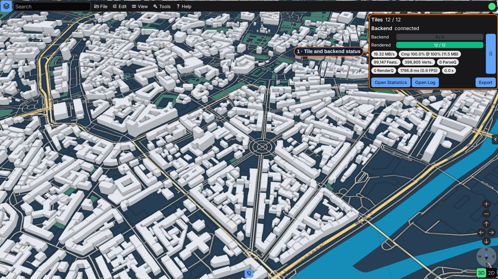
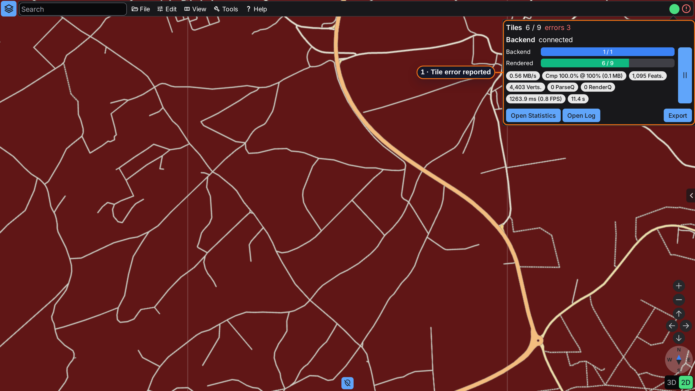
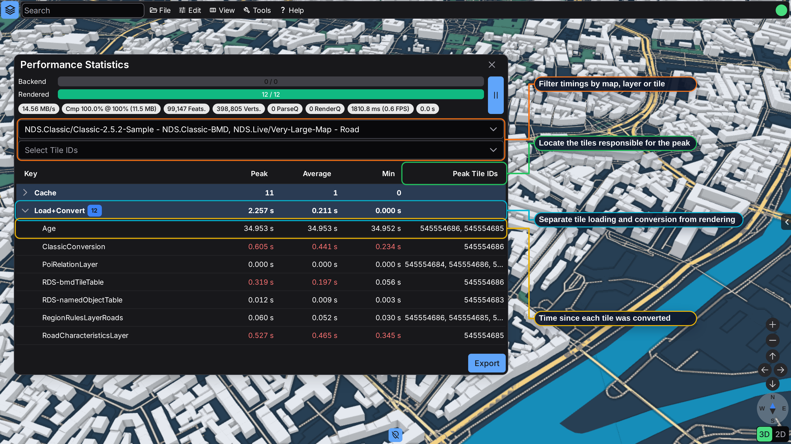

# Diagnostics and Status Guide

Erdblick exposes loading, rendering, backend, and logging state directly in the UI. Use these tools when you need to understand why tiles are slow, incomplete, empty, or inconsistent.

<!-- mcp:
title: "Viewer loading and connection diagnostics"
keywords: ["loading", "connected", "backend", "status", "progress", "ready"]
hint: "Use viewer_get_diagnostics for bounded cached browser transport/worker/loading/error information. mapget_get_diagnostics separately exposes a backend operational snapshot when global diagnostics permission allows it. Applied state changes are not render-completion fences; combine diagnostics with state and a screenshot when checking visual outcomes."
-->
## Status at a Glance

The **status popover (1)** brings tile progress and backend connection state
together, with actions to open statistics, inspect logs, or export diagnostics.

The top-right side of the main bar contains the diagnostics indicator:

- While tiles are still being fetched or rendered, it shows a spinner.
- If the tile pipeline is paused, the spinner stays visible but switches to the paused styling.
- Once the current workload is complete, the spinner turns into a status dot.
- If the backend connection is down, the idle dot switches to the disconnected state.
- If erdblick has seen tile errors or log entries with error level, an extra error badge appears next to the indicator.

Click the indicator to open the progress popover. It shows:

- loaded vs. expected tile counts
- tile error count
- backend connection state
- backend and rendering progress counters
- shortcuts to **Open Statistics**, **Open Log**, and **Export**

<!-- mcp:
title: "Tile loading error overlays"
keywords: ["red tile", "empty tile", "error overlay", "tile grid"]
hint: "Use view.grid to show tile borders and viewer_get_diagnostics to inspect cached errors. An empty tile or failed request is not proof that a searched attribute is absent. Search help for \"Nothing renders\" and \"Recovering from a datasource tile error\"."
-->
## Tile Loading Overlays

Enable the tile grid to see tile-status overlays directly on the map:

- **Empty**: translucent gray fill
- **Error**: translucent red fill

These overlays are the fastest way to distinguish "still loading", "loaded but empty", and "backend error".
The spinner stops once all work has completed or failed; failed tiles remain
in the error count and do not count as successfully loaded.

The **status popover (1)** reports failed tiles while the red overlay marks
the affected area. Other road data remains visible. Check the log for the failing
datasource before reloading.

<!-- mcp:
title: "Viewer performance diagnostics"
keywords: ["performance", "memory", "GPU", "worker", "tile budget", "slow"]
hint: "viewer_get_diagnostics exposes bounded cached counters and explicit unavailable metrics, not full backend reports or GPU readback. app.preferences.rendering controls tileLimit and renderWorkers; retain unrelated settings when changing them."
-->
## Performance Statistics

Open **Tools -> Performance Statistics** from the main bar, or use **Open Statistics** from the diagnostics popover.

The statistics dialog is the main place to inspect:

- tile counts and tile errors
- backend progress
- parse and render timings
- per-style rendering cost
- frame-time and FPS

Under **Load+Convert**, the **Age** row summarizes conversion-age samples for
the currently filtered loaded tiles:

- **Peak** shows the oldest (highest) conversion age.
- **Average** shows the mean conversion age.
- **Min** shows the newest (lowest) conversion age.

The Peak, Average, and Min columns are available for every performance metric.

Use the **layer and tile filters** to narrow the measurements to the data
you are investigating. Values describe the current session, not a benchmark.

Use it when:

- a map feels slow after enabling more layers or styles
- you want to compare low tile budgets vs. high tile budgets
- you need evidence for a rendering regression or backend bottleneck

Combine it with tile borders and the per-view grid toggle when you need to correlate slow areas with concrete tile IDs.

## Search Diagnostics

Feature-search panels have their own **Diagnostics** tab for query/result diagnostics. Use that tab for Simfil messages, query scope, result counts, value summaries, and `trace()` output.

The global diagnostics indicator can still show backend or rendering progress while searches are running. Exported diagnostics are useful for Search issues when backend search progress, result chunk ingress, and frontend result-tree construction appear to diverge.

## Logs and Backend State

Open **Tools -> Logs** to inspect the diagnostics log.

The log collects:

- browser-side console output
- backend connected / disconnected events
- transport and rendering errors that erdblick surfaces into the diagnostics stream

Use the log when the map looks healthy at first glance but the indicator shows an error badge, or when a datasource intermittently disconnects and reconnects.

<!-- mcp:
title: "Export diagnostics bundle"
keywords: ["diagnostics export", "bug report", "logs", "snapshot"]
hint: "Full diagnostics export is a UI operation. viewer_get_diagnostics is a bounded summary, not the downloadable bundle; do not report that it created an export file."
-->
## Exporting Diagnostics

Open **Tools -> Export Diagnostics** to create a diagnostics bundle for bug reports or offline analysis.

The export can include:

- current progress snapshot
- performance data
- collected logs
- backend status data, when available

This is the best way to hand over a reproducible diagnostics snapshot without asking somebody to manually copy values out of several dialogs.

## Pausing the Tile Pipeline

Erdblick can pause and resume tile rendering and backend communication. Use this when you want to freeze the current scene, inspect what is already loaded, or stop further churn while you investigate a specific tile state.

When the pipeline is paused:

- the diagnostics indicator keeps showing the paused state
- existing tiles remain visible
- no new backend/render progress is expected until you resume

## Typical Debugging Workflow

For difficult rendering or datasource issues, a simple sequence usually works well:

1. Focus the affected map or layer from **Maps & Layers**.
2. Enable tile borders if you need exact tile IDs.
3. Open the diagnostics popover and then the statistics dialog.
4. If the indicator shows errors, open the log as well.
5. Export a diagnostics bundle before resetting state or changing styles.

For broader recovery steps, see the [Troubleshooting Guide](erdblick-troubleshooting.md).
