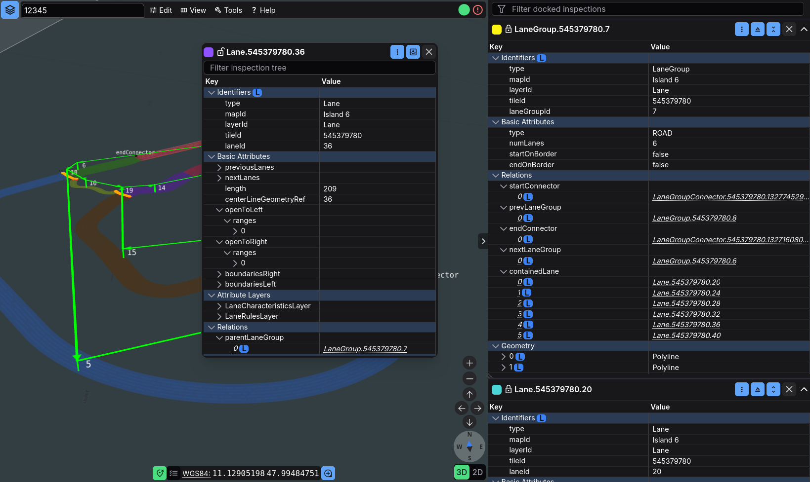
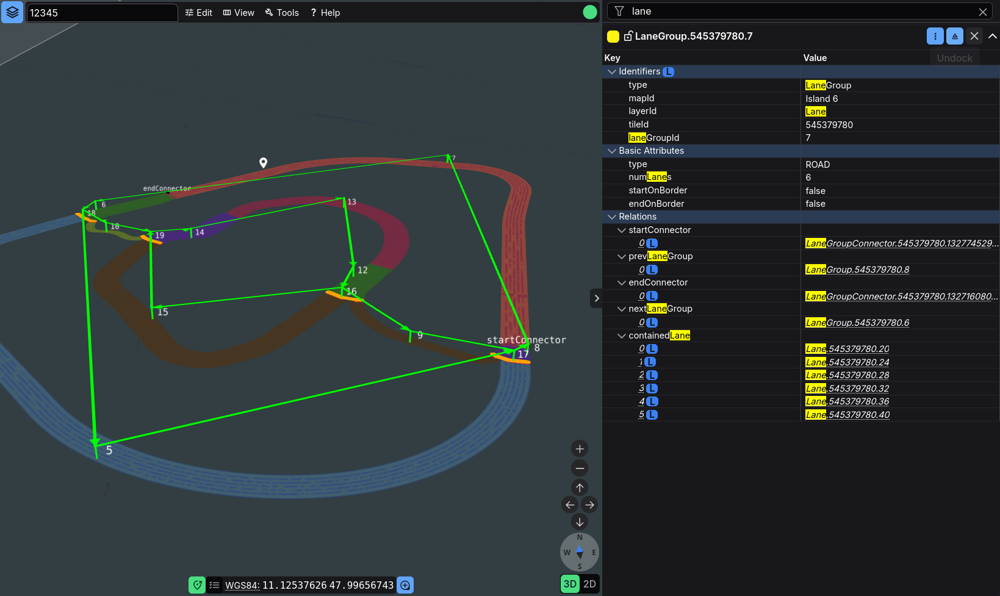

# Feature Inspection Guide

The inspection column is the fastest way to understand what you just clicked on: every selection opens a panel with a full tree of attributes, relations, and validity information. Erdblick remembers your panels, sizes, colors, and pinning preferences across sessions.

## Building a Selection

There are several ways to populate the inspection column, depending on whether you start from the map, a search result, or a feature reference:

- **Click a feature** – erdblick highlights the geometry and populates the first inspection panel with its details.
- **Multi-select** – hold `Ctrl` while clicking features to open additional, pinned panels. Each panel receives its own highlight color.
- **Use a jump action** – Feature jump actions (see [Search](erdblick-search.md)) select and center the target feature, which also appears in the inspector.
- **Select a search result** – Click any feature result in the search dialog (see [Search](erdblick-search.md)) to open the associated feature in the inspection column.
- **Click on a feature reference** – Within an open panel, click a feature reference to follow links. If the current panel is pinned, a new panel opens; otherwise the selection is replaced.

Selections persist until you close their panels or clear the saved viewer state in the Preferences dialog.

## Working With Multiple Panels

Once you have more than one selection, the panel column becomes a small workspace in its own right:

- **Default slots** – erdblick shows up to three panels by default. Enable “Allow unlimited inspected features” in the Preferences dialog if you want more.
- **Pin/unpin** – use the keep/keep_off button in the panel header. Pinned panels ignore new selections; unpinned panels are replaced when you click another feature.
- **Close** – click the ✕ button to remove a panel entirely. The next selection either fills the freed slot or creates a new panel (up to the configured limit).
- **Resize** – drag the panel border to change its size; erdblick reopens panels with the same proportions.
- **Back button** – SourceData panels have a back arrow that restores the previous feature selection without losing the panel slot.

When you pin multiple panels, use different highlight colors (color picker in the header) to keep them visually distinct on the map.

## Understanding the Tree

Each panel renders a tree view of the selected feature or features:

- **Expand/collapse** – sections follow the feature’s schema. Geometry nodes include validity polygons, attributes include their layers and names, and relations list all connected features.
- **Filtering** – use the filter input above the tree to search by key or value. Hidden nodes remain collapsed, so you can quickly locate fields without scrolling.
- **Relation traversal** – hovering or clicking relation entries highlights related features on the map. Clicking a feature ID focuses or jumps to that related feature.
- **Source data references** – nodes with source references display a small icon; clicking it opens the SourceData inspector with the matching blob selected.
- **GeoJSON view** – the GeoJSON actions menu exports the entire panel selection as a GeoJSON FeatureCollection. The context menu on individual values also offers a “Copy GeoJSON path” entry, which matches how the data is seen by Simfil in feature search.

Null values are collapsed by default, so the tree keeps noisy attributes out of your way. Arrays flatten into comma-separated lists with numeric precision trimmed to eight decimal places for readability.

## SourceData Panels

When you choose “Inspect source data” (from the inspection tree, context menu, or search palette), erdblick swaps the panel into SourceData mode:

- The header shows the tile ID and map ID, plus a dropdown listing every SourceData layer for that tile.
- Use the dropdown to switch between attribute layers (for example “Road” vs. “Metadata”) without leaving the panel.
- The back button returns to the original feature selection while keeping the panel slot.

The SourceData inspector itself is covered in the [SourceData Inspection Guide](erdblick-sourcedata.md). This guide focuses on the handoff between feature panels and SourceData panels.

## Sharing and Collaboration

The inspection view is also a convenient starting point for sharing investigations or handing cases to colleagues:

- **URL state** – inspection panels (including pin state, size, and color) are serialized into the browser URL and `localStorage`. Copying the URL allows colleagues to open the same selection layout.
- **Clipboard** – use the context menu and GeoJSON actions to copy key/value pairs, GeoJSON paths, or full GeoJSON payloads to the clipboard.
- **GeoJSON export** – export the current selection as a `.geojson` file or open it in a separate tab when you need to share raw data or feed it into external tools.
- **Browser navigation** – use the browser’s Back and Forward buttons to walk through recent selection states.

## Tips

A few small habits make inspection sessions more efficient and easier to revisit later:

- Use the color picker to assign meaning (e.g., red for problematic features, green for expected results).
- If panels stop updating, close unpinned panels or use the “Clear” button for viewer properties and search history in the Preferences dialog to reset local state.
- Combine inspection with split view: pin a reference feature and keep it in focus in the right pane while exploring related features on the left.

Between multi-panel support, hover-aware trees, and one-click SourceData jump-ins, the inspection UI gives you everything you need to audit features without leaving the browser.
