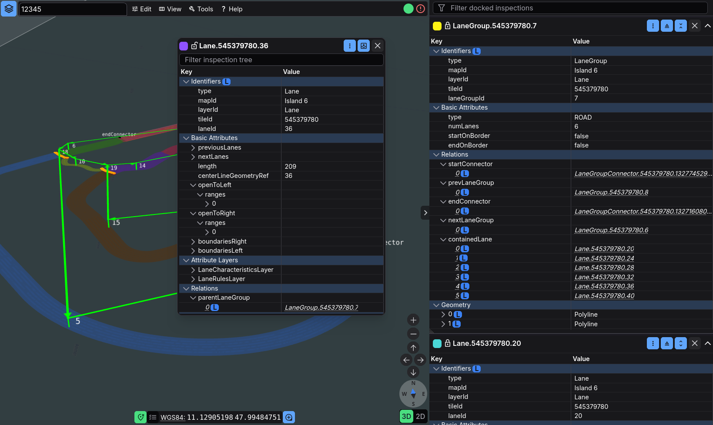
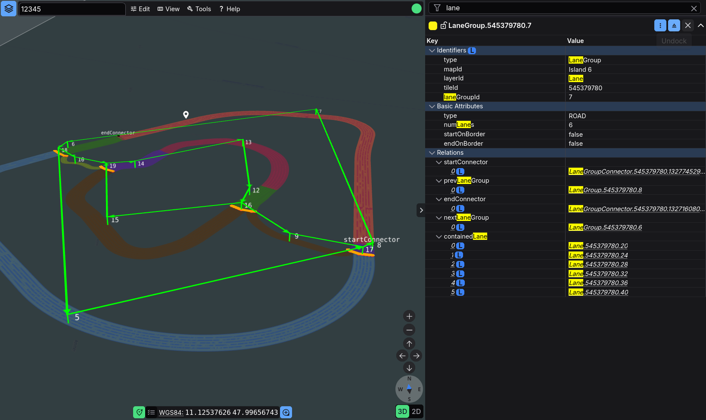
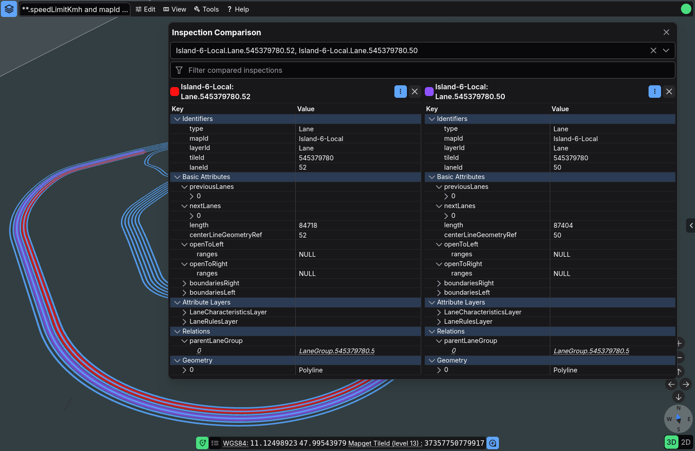

# Feature Inspection Guide

Inspection is the fastest way to understand a selected feature in erdblick. Each selection opens a panel with attributes, relations, geometry, validity information, and links back to SourceData. Panels can stay docked, be undocked into dialogs, or participate in the comparison dialog.

## Building a Selection

You can open feature inspection from several entry points:

- **Click a feature** on the map to inspect it directly.
- **Ctrl-click** to open an additional panel and lock it immediately.
- **Run a feature jump** or **pick a search result** from the search panel.
- **Follow a relation or feature reference** inside an existing panel.

Selections persist until you close the panel or clear the stored viewer state.

## Working With Panels

The inspection dock is a small workspace in its own right:

- **Locked vs. unlocked** – locked panels keep their content. Unlocked panels are reused by the next feature selection.
- **Color coding** – feature panels expose a color picker so you can keep several highlighted selections apart on the map.
- **Undocking** – use the eject action in the panel header to move a panel into its own dialog.
- **Resizing** – drag the panel border to change its size. Erdblick restores panel sizes across sessions.
- **Auto sizing** – docked panels can expand to fit content and then shrink back to the default height.
- **Panel limit** – the default maximum number of simultaneous inspections is controlled by **Max Inspections** in Preferences.

When you keep several locked panels around, use consistent colors and titles so later comparison work stays readable.

## Understanding the Tree

The tree view mirrors the internal inspection model rather than a flattened table:

- **Expand/collapse** sections according to the feature schema.
- **Filter** by key or value without leaving the panel.
- **Hover relations** to highlight related features on the map.
- **Click feature IDs** to follow references.
- **Open SourceData** from nodes that carry source references.
- **Copy Search Path** from the context menu when you want to reuse the same field in Simfil search.

Erdblick also applies a few presentation rules that matter in practice:

- null-heavy branches stay collapsed to reduce noise
- simple scalar arrays are flattened into more readable comma-separated values
- ByteArray-backed values are rendered as regular scalar inspection values so they can be copied and searched more easily

### Validity Display and Hovering

When you hover validity-aware nodes in the tree, erdblick tries to highlight the most specific validity that matches the hovered attribute or subnode. If no single validity is the right match, it falls back to showing all validities attached to that node.

`COMPLETE` means the attribute applies to the complete referenced geometry or feature scope.

## Comparison Dialog

The panel action menu can open the **Inspection Comparison** dialog. This is the best way to compare several features side by side without manually arranging multiple docked panels.

Use it when you want to:

- compare two related features from different maps or layers
- freeze a reference feature while exploring alternatives
- keep several inspections open with a shared filter string

The comparison dialog keeps one column per inspected feature and preserves the individual selection colors.

## SourceData Handoff

Feature inspection and SourceData inspection use distinct panel modes:

- feature panels stay feature-focused
- SourceData opens in its own dedicated panel mode
- SourceData panels expose a layer dropdown when several raw layers exist for the same tile

If you jump from a feature node into SourceData, erdblick keeps the map/tile/layer context aligned so you land on the matching raw payload quickly. The dedicated SourceData workflow is documented in the [SourceData Inspection Guide](erdblick-sourcedata.md).

## Sharing and Collaboration

Inspection is also a useful handoff tool:

- **URL state** – open panels, lock state, sizes, colors, and SourceData selections are encoded in the URL and mirrored into local state.
- **Clipboard actions** – copy key/value pairs, search paths, or full GeoJSON snippets from the context menu.
- **GeoJSON export** – export the current inspected selection as a GeoJSON FeatureCollection.
- **Browser history** – the browser’s Back and Forward buttons walk through previous inspection layouts.

## Tips

- Use the color picker to encode meaning, for example "reference" vs. "candidate".
- If panel state looks inconsistent, clear stored viewer properties and search history from Preferences.
- Combine inspection with split view: keep a locked reference in one pane and continue exploring in the other.

Between locked panels, dock/undock support, validity-aware hovering, and SourceData handoff, the inspection UI is intended to support serious debugging work without leaving the browser.
