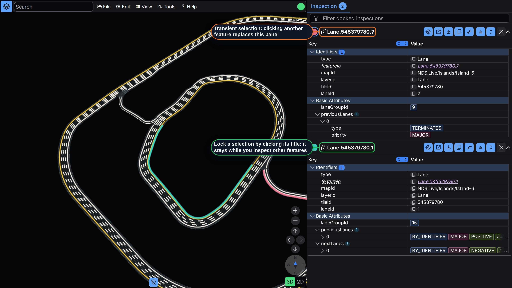
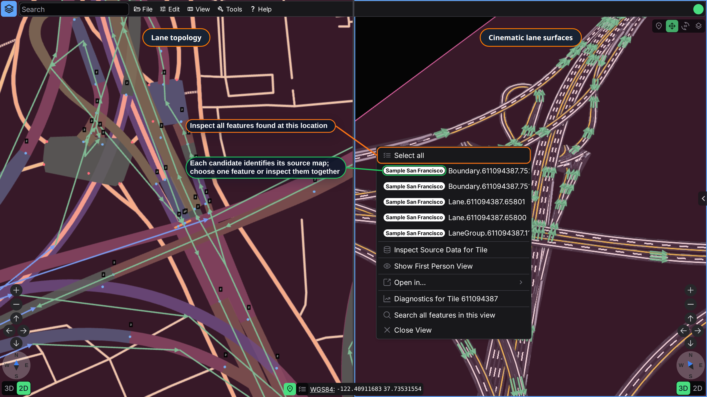
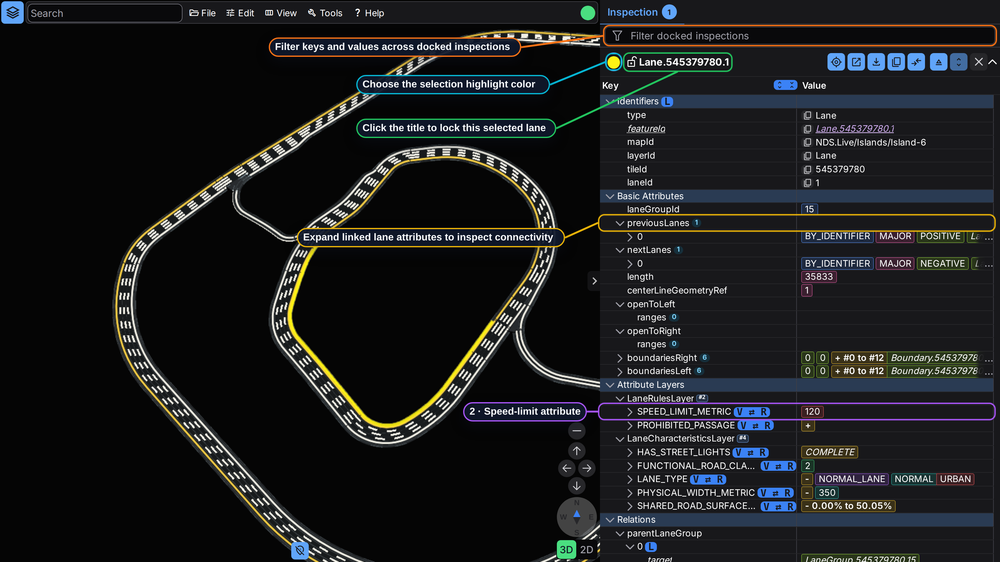
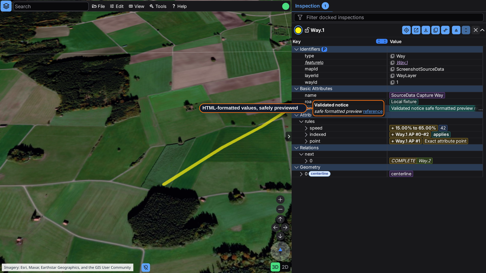
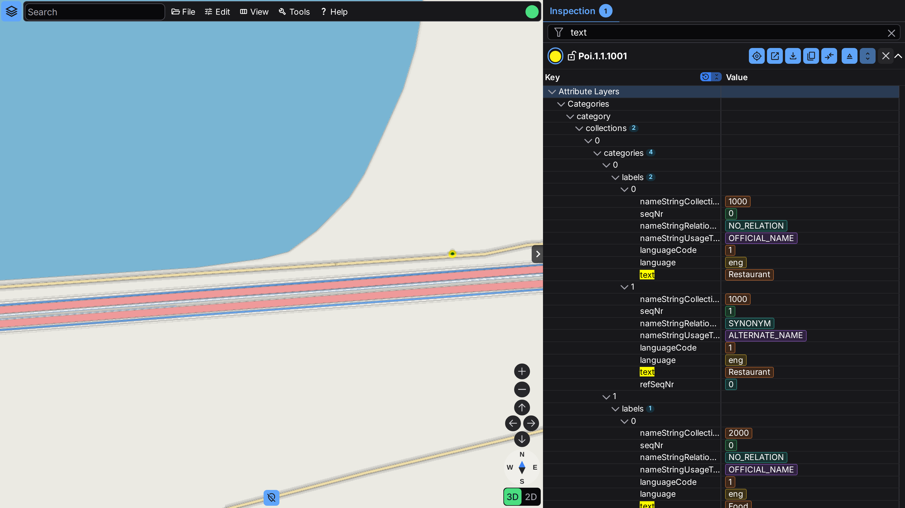
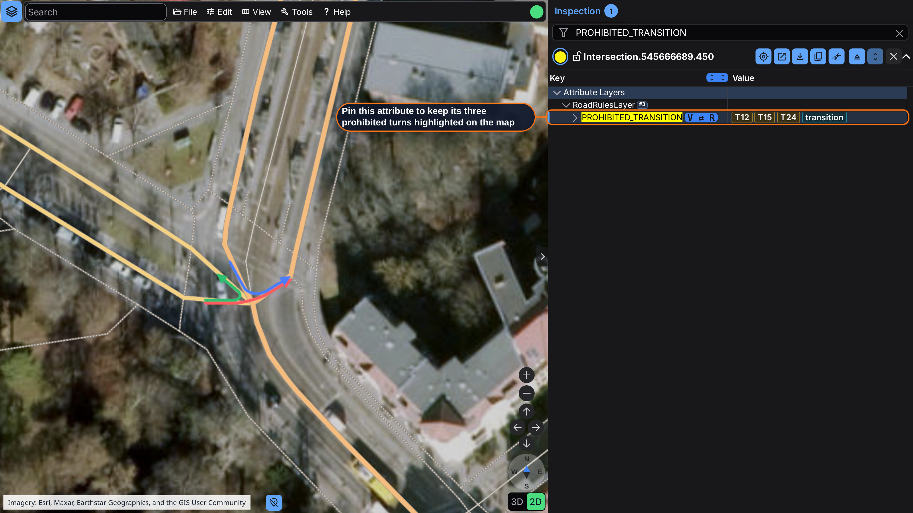
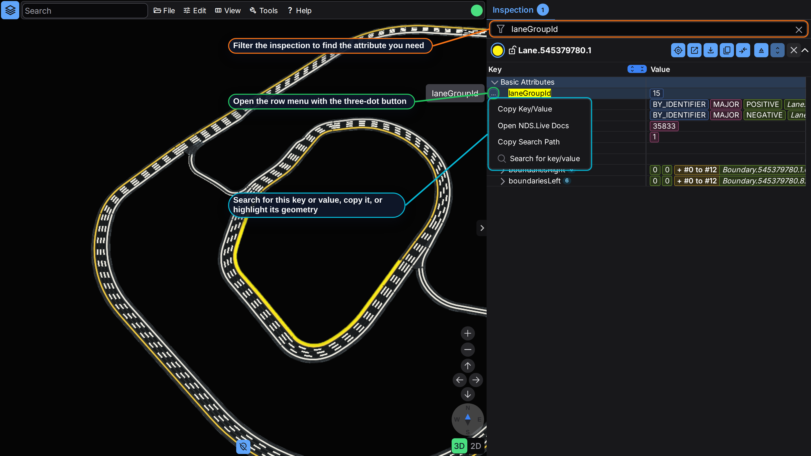
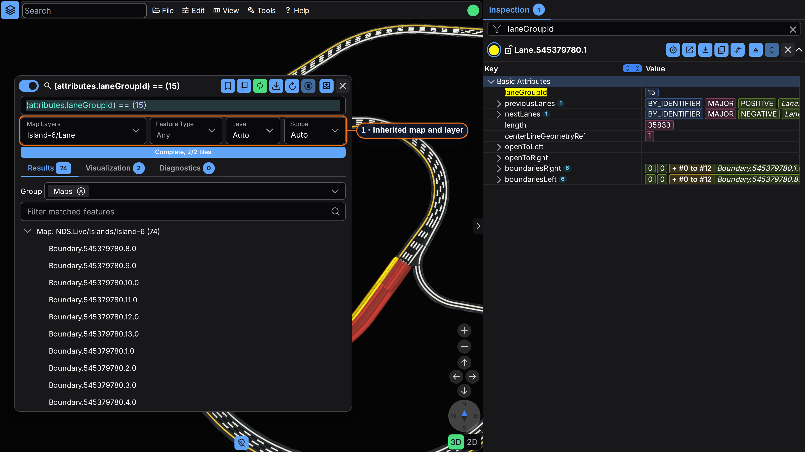
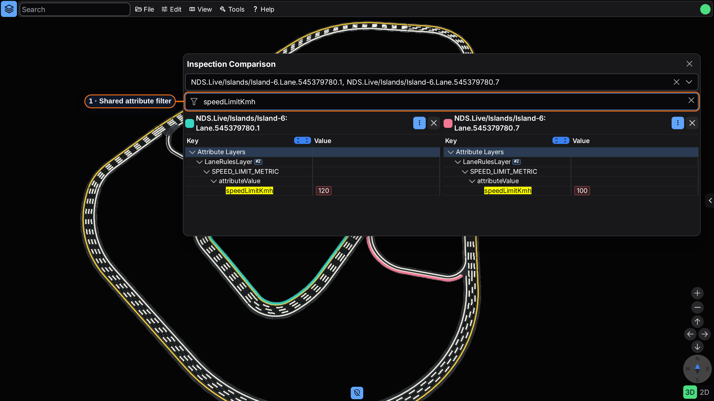

# Feature Inspection Guide

Inspection is the fastest way to understand a selected feature in erdblick. Each selection opens a panel with attributes, relations, geometry, validity information, and links back to SourceData. Panels can stay docked, be undocked into dialogs, or participate in the comparison dialog.

Click a panel title to lock its selection while exploring another feature.
The unlocked panel shows the transient selection and is reused on the next click.
Selection colors connect each inspection to its geometry on the map.

## Building a Selection

You can open feature inspection from several entry points:

- **Click a feature** on the map to inspect it directly.
- **Ctrl-click** to open an additional panel and lock it immediately.
- **Run a feature jump** or **pick a search result** from the search panel.
- **Follow a relation or feature reference** inside an existing panel.

Selections persist until you close the panel or clear the stored viewer state.

When several rendered features overlap at the pointer, the drill-pick menu
lists the individual candidates and offers a **Select all** action:

## Working With Panels

The inspection dock is a small workspace in its own right:

- **Locked vs. unlocked** – locked panels keep their content. Unlocked panels are reused by the next feature selection.
- **Color coding** – feature panels expose a color picker so you can keep several highlighted selections apart on the map.
- **Undocking** – use the eject action in the panel header to move a panel into its own dialog.
- **Resizing** – drag the panel border to change its size. Erdblick restores panel sizes across sessions.
- **Auto sizing** – docked panels can expand to fit content and then shrink back to the default height.
- **Panel limit** – the default maximum number of simultaneous inspections is controlled by **Max Inspections** in Preferences.

When you keep several locked panels around, use consistent colors and titles so later comparison work stays readable.

While selection data is still pending, the dock opens an immediate loading
shell instead of leaving the workspace without feedback.

## Understanding the Tree

The **selected lane** has a **120 km/h speed-limit attribute (2)**.
The surrounding tree keeps identifiers, basic attributes, attribute layers,
relations, and geometry together.

The tree view mirrors the internal inspection model rather than a flattened table:

- **Expand/collapse** sections according to the feature schema.
- **Filter** by key or value without leaving the panel.
- **Hover relations** to highlight related features on the map.
- **Click feature IDs** to follow references.
- **Open SourceData** from nodes that carry source references.
- **Open the row action menu** with the three-dot button that appears on the left of a row when you hover it.
- **Copy Search Path** from the row action menu when you want to reuse the same field in Simfil search.

Erdblick also applies a few presentation rules that matter in practice:

- null-heavy branches stay collapsed to reduce noise
- simple scalar arrays are flattened into more readable comma-separated values
- ByteArray-backed values are rendered as regular scalar inspection values so they can be copied and searched more easily

Formatted scalar values can expose a compact preview from their value row. In
this example, `formattedNotice` shows a titled preview with formatted text and
a reference label. The presentation is sanitized and inert: formatting is
retained, but attributes such as navigation targets are removed.

Datasource-specific inspection trees also preserve resolved hierarchies. The
NDS.Classic POI example below expands a resolved collection from its top-level
structure to the selected `Restaurant` leaf. The collection also contains
its resolved parent categories, including `Food` and `Top level`:

### Validity Display and Hovering

When you hover validity-aware nodes in the tree, erdblick tries to highlight the most specific validity that matches the hovered attribute or subnode. If no single validity is the right match, it falls back to showing all validities attached to that node.

`COMPLETE` means the attribute applies to the complete referenced geometry or feature scope.

Validity details can include a semantic geometry name when a validity refers
to a particular geometry such as `centerline` or `boundary`. Geometry names
describe the source model; they do not encode presentation fidelity.

Search result selections can point at the same validity targets. When a feature-search result was produced in attribute scope, selecting the result focuses the owning feature and highlights the matched attribute or validity when that target is available.

Use **Highlight Attr/Validity** in the attribute row menu to pin a validity
highlight. Here, the intersection's `PROHIBITED_TRANSITION` attribute marks
three forbidden turns. The highlight stays visible when the pointer leaves
the inspection tree.

### Inspection data boundary

Map rendering keeps only immutable filter subsets. When a panel needs the
complete feature, erdblick requests that canonical ID through mapget's
feature-restricted `/tiles` path. Cross-tile relation endpoints may first be
resolved with `/locate`, then fetched from their owning tile. The complete
feature wrapper is released with the inspection; it is never inserted into a
viewport tile cache.

### Searching From Inspection

Open the row menu on `laneGroupId` and choose **Search for key/value**
to find other features in the same group.

The row action menu contains two search helpers for rows that expose a search path:

- **Copy Search Path** copies the reusable Simfil path fragment for the row.
- **Search for key/value** opens a feature search for the scalar value in the inspected map/layer context.

`Search for key/value` is only offered for scalar values that can be represented as Simfil literals: numbers, booleans, strings, feature IDs, byte-array values rendered as scalar inspection values, and `NULL` values. Nested objects and arrays are not offered as direct key/value searches.

Literal handling follows the inspected type:

- strings and feature IDs are quoted
- numbers stay numeric
- booleans stay boolean
- `NULL` becomes `null`

The generated search uses the map and layer of the inspected tile as its initial **Map Layers** selection. This keeps the first run focused on the context that produced the inspected value; you can widen the map/layer selection from the Search panel afterwards.

Typical workflow:

1. Select a representative feature.
2. Hover the attribute row you want to investigate.
3. Open the three-dot row action menu.
4. Choose **Search for key/value**.
5. Use the Search panel to inspect, group, style, or export all matching results.
6. Keep the original inspection locked and compare selected search results beside it when you need a reference/candidate workflow.

The generated search inherits the **map and layer (1)** from the inspected
lane, with the original attribute still visible alongside its results.

## Comparison Dialog

Use the **shared filter (1)** to bring the same attribute into view for both
features. This example compares their `speedLimitKmh` values.

The panel action menu can open the **Inspection Comparison** dialog. This is the best way to compare several features side by side without manually arranging multiple docked panels.

Use it when you want to:

- compare two related features from different maps or layers
- freeze a reference feature while exploring alternatives
- keep several inspections open with a shared filter string

The comparison dialog keeps one column per inspected feature and preserves the individual selection colors.

## SourceData Handoff

Feature inspection and SourceData inspection use distinct panel modes:

- feature panels stay feature-focused
- SourceData opens in its own dedicated panel mode
- SourceData panels expose a layer dropdown when several raw layers exist for the same tile

If you jump from a feature node into SourceData, erdblick keeps the map/tile/layer context aligned so you land on the matching raw payload quickly. The dedicated SourceData workflow is documented in the [SourceData Inspection Guide](erdblick-sourcedata.md).

## Sharing and Collaboration

Inspection is also a useful handoff tool:

- **URL state** – open panels, lock state, sizes, colors, and SourceData selections are encoded in the URL and mirrored into local state.
- **Clipboard actions** – copy key/value pairs, search paths, or full GeoJSON snippets from the context menu.
- **GeoJSON export** – export the current inspected selection as a GeoJSON FeatureCollection.
- **Browser history** – the browser’s Back and Forward buttons walk through previous inspection layouts.

Point geometries share a preview budget of 256 coordinates per selected feature,
including features with several point-cloud clusters. A truncated geometry shows
its full point count and how many coordinates are previewed. Lines, polygons and
meshes retain their existing coordinate display. Full feature GeoJSON is generated
when you choose an export action; it includes all coordinates, including those
omitted from the inspection preview.

## Tips

- Use the color picker to encode meaning, for example "reference" vs. "candidate".
- If panel state looks inconsistent, clear stored viewer properties and search history from Preferences.
- Combine inspection with split view: keep a locked reference in one pane and continue exploring in the other.

Between locked panels, dock/undock support, validity-aware hovering, and SourceData handoff, the inspection UI is intended to support serious debugging work without leaving the browser.
