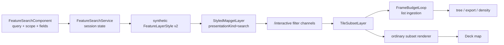

# Erdblick Search Architecture

Feature search is a specialization of the same styled-subset pipeline used by
normal map rendering. There is no `/search` endpoint, search-result tile
class, search-specific renderer, or complete-tile cache.

## Responsibilities

Erdblick owns:

- editor drafts, saved sessions, completion, and schema analysis;
- synthetic search stylesheet generation;
- result-list ingestion, grouping, density overlays, export, and UI state;
- category/gradient palette choices;
- the search presentation lifetime.

Mapget owns:

- complete source-tile loading/cache;
- schema-aware SIMFIL compilation and evaluation;
- feature/attribute candidate expansion;
- validity geometry;
- projected values, traces, and issues;
- immutable `TileSubsetLayer` output.

## End-to-end flow



`FeatureSearchService` owns a shared search presentation rather than one
backend request per view. Every consuming view attaches that presentation to
its own controller/render scene.

## Query and scope

The user chooses feature, attribute, or auto scope.

- Feature scope evaluates once per admitted feature.
- Attribute scope expands attribute entries and validity contexts.
- Auto scope runs `LayerSchema::normalizeSearchQuery()` and is normalized to a
  concrete scope before the result channel is constructed.

Schema analysis normalizes the search query before runtime style compilation.
Outgoing render and result channels therefore use `rewrite: false`; every
filter and projected field is still schema-compiled by mapget.

Attribute evaluation exposes:

- `$feature`;
- `$layer`, `$name`, and `$attributeIndex`;
- `$hasValidity`;
- `$validityIndex` and `$validityCount`.

The explicit bit matters because "no validity" and "first validity" would
otherwise both appear as index zero/count one.

## Synthetic stylesheet

`feature-search-style.ts` translates the session's GUI rules into flat
top-level rules. The concrete search scope is applied only to this transient
runtime source; it is not written into a reusable stylesheet. Labels,
category/gradient expressions, and geometry choices use the same native style
properties as bundled styles.

The ordinary planner produces one render channel per top-level rule. Erdblick
preserves those channel IDs and native predicates, intersects their feature
types with the search selection, and combines the normalized backend query
with each channel's entry predicate. It then appends one dedicated
`search-results:<presentation>` channel containing the result-list fields.
The subset renderer deliberately skips that reserved channel, while
`FeatureSearchService` reads only its stored ordinal. Results therefore enter
the list once even when several rendering rules match them.

### Color mapping

Search categories use:

```yaml
color-scale:
  mode: categorical
  expression: "<category expression>"
  stops:
    - [value-a, "#..."]
    - [value-b, "#..."]
  fallback: gray
```

Numeric gradients use `mode: linear` and strictly increasing numeric keys.
Stops are list pairs, not a YAML map, so boolean/numeric/string key types
survive parsing. Typed categorical keys are distinct.

Multiple GUI rows remain multiple flat rules. `all-of` and `first-of` are
reserved for styles that genuinely need native branch semantics; the search
writer does not introduce them as a transport wrapper.

## Reusable search styles

A reusable search style has one authoritative representation: an ordinary
imported YAML stylesheet with `category: search`. Its exact YAML `name` is the
style identity and may contain slashes for existing tree grouping. There is no
parallel configuration ID/revision store or generated YAML cache.

`search-style-sheet.converter.ts` emits deterministic version-2 source with
`default: false` and flat rules. It deliberately excludes query, scope,
map/layer identity, views, feature-type selection, density controls, UI row
IDs, and automatic-rule metadata. The normal imported-style lifecycle parses,
persists, lists, edits, renders, and exports that source. Imported persistence
stores only a versioned list of raw YAML sources; no legacy search-style store
is read.

The reverse codec parses the authoritative YAML into the shared Quick rule
GUI. AST-based Quick edits preserve comments, root metadata, unsupported keys,
and untouched rules. Ambiguous branch/dynamic rules remain read-only and are
reported as warnings. Feature Search uses the same projection permissively:
compatible rules are deep-copied, incompatible rules are omitted with visible
reasons, and the YAML source is never changed.

## Result identity

Each search session owns a stable presentation instance ID. Definition,
coverage, query, projected fields, or style changes replace the filter and
increment generation.

The accepted transport identity is:

```text
filterId + generation + output MapTileKey
```

There is no content/request fingerprint. Stale subset frames, status updates,
render results, and ingestion tasks are ignored when their generation no
longer matches.

## Result ingestion

A delivered `TileSubsetLayer` serves two consumers:

1. `TileSubsetLayerVisualization` renders it through the global finite worker
   service.
2. `FeatureSearchService` extracts typed entries into result-list records.

List extraction is scheduled through `FrameBudgetLoop` so a large result tile
cannot monopolize the browser thread. Tasks are generation-aware and
cancellable. The frame loop is a utility, not an owner of search or map
objects.

Entry values follow the channel field schema. Scalar projection behavior is:

- no result -> null;
- first result wins;
- later results are ignored.

Structured projection values are not a hidden full-feature transport. Search
exports and UI metadata should request explicit scalar fields.

## Geometry and map rendering

Search map results use `TileSubsetLayerRenderer`, exactly like regular styles.
Feature rows carry selected geometry; attribute-validity rows carry effective
validity geometry when available. There is no high-fidelity search renderer.

Density dots/pins/labels remain UI overlay layers derived from ingested search
records. They are not a replacement for subset geometry and do not own backend
models.

## Hover, selection, and inspection

Hovering or selecting a result passes exact canonical feature identity to the
controller. If that typed search/regular entry is still rendered, a local
interaction overlay applies the stylesheet's `interaction-effects` material
without a backend request. Only a requested validity/relation semantic absent
from every active subset creates an exact-root highlight presentation; its
output is fed through the same overlay material path.

Inspection is separate:

1. request the declared tile through feature-restricted `/tiles`;
2. canonical `/locate` if a relation endpoint belongs elsewhere;
3. retry against the owning tile;
4. release complete feature data when the panel closes.

Search result subsets never hydrate or share a complete source tile.

## Completion and schema analysis

The completion worker uses datasource `featureModelSchema` plus parser-owned
string/schema state. It provides:

- syntax diagnostics;
- direct/nested field completion;
- enum values and numeric ranges;
- feature/attribute ownership analysis;
- candidate label/category/gradient fields.

This worker is advisory. Backend compilation remains authoritative.
`rewrite: false` still schema-compiles for correctness and speed; it merely
skips search-query normalization.

## Diagnostics

There are three distinct diagnostic sources:

- editor/worker syntax and schema-analysis diagnostics;
- backend `FilterIssue` aggregates and SIMFIL traces on subsets;
- transport/render/ingestion timing and failures on presentation state.

Do not fabricate a backend AST in TypeScript. If exact compiled backend
expressions become necessary, serialize that metadata in the filter result.

Source tile statistics come from inherited subset `info()` and dependencies,
deduplicated by the diagnostics service. Search-filter and renderer costs stay
presentation-specific.

## Cancellation and limits

- Re-running a session replaces its filter generation.
- Coverage follows the active search viewport policy.
- Backend loops check cancellation at feature boundaries/fixed batches.
- Frontend ingestion checks generation between batches.
- One-hop relation depth does not bound breadth; production deployments should
  cap roots, relations, target tiles, and output bytes.

## Key files

- `app/search/feature.search.service.ts`
- `app/search/feature-search-style.ts`
- `app/search/feature.search.component.ts`
- `app/search/search-completion.worker.ts`
- `app/shared/frame-budget-loop.ts`
- `app/mapdata/styled-mapget-layer.model.ts`
- `app/mapview/view-layer.controller.ts`
- `app/mapview/deck/tile-subset-layer.visualization.ts`
- `libs/core/src/style-filter-plan.cpp`
- `libs/core/src/subset-renderer.cpp`
