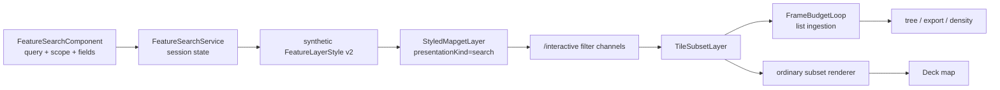

# Erdblick Search Architecture

Feature search is a specialization of the same styled-subset pipeline used by
normal map rendering. There is no `/search` endpoint, search-result tile
class, search-specific renderer, or complete-tile cache.

## Responsibilities

Erdblick owns:

- editor drafts, saved sessions, completion, and schema analysis;
- synthetic search stylesheet generation;
- result-list ingestion, grouping, density overlays, export, and UI state;
- category/gradient palette choices;
- the search presentation lifetime.

Mapget owns:

- complete source-tile loading/cache;
- schema-aware SIMFIL compilation and evaluation;
- feature/attribute candidate expansion;
- validity geometry;
- projected values, traces, and issues;
- immutable `TileSubsetLayer` output.

## End-to-end flow



`FeatureSearchService` owns a shared search presentation rather than one
backend request per view. Every consuming view attaches that presentation to
its own controller/render scene.

## Query and scope

The user chooses feature, attribute, or auto scope.

- Feature scope evaluates once per admitted feature.
- Attribute scope expands attribute entries and validity contexts.
- Auto scope runs `LayerSchema::normalizeSearchQuery()` and is normalized to a
  concrete scope before the result channel is constructed.

Search-generated channels set `rewrite: true` only when the user requested
normalization. Every filter and projected field is schema-compiled regardless
of that flag.

Attribute evaluation exposes:

- `$feature`;
- `$layer`, `$name`, and `$attributeIndex`;
- `$hasValidity`;
- `$validityIndex` and `$validityCount`.

The explicit bit matters because "no validity" and "first validity" would
otherwise both appear as index zero/count one.

## Synthetic stylesheet

`feature-search-style.ts` translates one session into a normal stylesheet:

- the visible query becomes the top-level rule filter;
- the chosen scope becomes `scope`;
- result label/category/gradient expressions become presentation fields;
- selected geometry modes become semantic geometry selectors;
- category or numeric coloring becomes one `color-scale`.

The planner then applies the same one-top-level-rule/one-channel contract as
bundled styles. Search does not bypass or duplicate planner semantics.

### Color mapping

Search categories use:

```yaml
color-scale:
  mode: categorical
  expression: "<category expression>"
  stops:
    - [value-a, "#..."]
    - [value-b, "#..."]
  fallback: gray
```

Numeric gradients use `mode: linear` and strictly increasing numeric keys.
Stops are list pairs, not a YAML map, so boolean/numeric/string key types
survive parsing. Typed categorical keys are distinct.

When multiple search predicates need to participate in presentation, the
generator uses a synthetic `all-of` wrapper. This keeps one top-level channel
while retaining the rule tree used by the ordinary renderer.

## Reusable search styles

Reusable search styles have two deliberately separate persisted forms:

1. `searchStyleConfigurations` is a versioned, storage-only `AppState`. Each
   configuration owns an ID, revision, name, timestamps, and normalized
   high-fidelity rules. It never owns a query, search scope, selected search
   layers, result views, or density/render-strategy controls.
2. `searchGeneratedStyleData` is StyleService's separate collection of
   canonical YAML projections. These sheets are parsed through
   `FeatureLayerStyle` but are not inserted into the active `styles` map in
   Act 1.

Applying a configuration copies its normalized rules into the target search.
The search stores optional ID/revision provenance for UI feedback, but the
copied rules are not linked: any local edit clears that provenance and cannot
mutate the source configuration. The JSON rules retain per-rule `mapLayers`
hints for search-runtime applicability.

`search-style-sheet.converter.ts` deterministically emits one version-2 sheet
per configuration. It sets `default: false`, omits top-level `layer` and
`scope`, includes every configured rule, and does not serialize `mapLayers`.
Omitted scope intentionally uses the native feature default; attribute
projection for generated-sheet rendering belongs to Act 2. Runtime search
compilation remains scope-aware and continues to filter per-rule layer hints
against the concrete search target.

Canonical conversion rejects unsupported operators and non-scalar rule values
instead of coercing them. Native-invalid projections retain a diagnostic entry
but cannot be exported or copied as a canonical style.

The Search Styles UI may export canonical YAML directly. Its copy-to-edit
flow rewrites the copy to a unique style name and opens a transient editor
session. Saving that session enters the existing imported-style lifecycle;
there is no reverse YAML-to-configuration update path.

## Result identity

Each search session owns a stable presentation instance ID. Definition,
coverage, query, projected fields, or style changes replace the filter and
increment generation.

The accepted transport identity is:

```text
filterId + generation + output MapTileKey
```

There is no content/request fingerprint. Stale subset frames, status updates,
render results, and ingestion tasks are ignored when their generation no
longer matches.

## Result ingestion

A delivered `TileSubsetLayer` serves two consumers:

1. `TileSubsetLayerVisualization` renders it through the global finite worker
   service.
2. `FeatureSearchService` extracts typed entries into result-list records.

List extraction is scheduled through `FrameBudgetLoop` so a large result tile
cannot monopolize the browser thread. Tasks are generation-aware and
cancellable. The frame loop is a utility, not an owner of search or map
objects.

Entry values follow the channel field schema. Scalar projection behavior is:

- no result -> null;
- first result wins;
- later results are ignored.

Structured projection values are not a hidden full-feature transport. Search
exports and UI metadata should request explicit scalar fields.

## Geometry and map rendering

Search map results use `TileSubsetLayerRenderer`, exactly like regular styles.
Feature rows carry selected geometry; attribute-validity rows carry effective
validity geometry when available. There is no high-fidelity search renderer.

Density dots/pins/labels remain UI overlay layers derived from ingested search
records. They are not a replacement for subset geometry and do not own backend
models.

## Hover, selection, and inspection

Hovering or selecting a result passes exact canonical feature identity to the
controller. If that typed search/regular entry is still rendered, a local
interaction overlay applies the stylesheet's `interaction-effects` material
without a backend request. Only a requested validity/relation semantic absent
from every active subset creates an exact-root highlight presentation; its
output is fed through the same overlay material path.

Inspection is separate:

1. request the declared tile through feature-restricted `/tiles`;
2. canonical `/locate` if a relation endpoint belongs elsewhere;
3. retry against the owning tile;
4. release complete feature data when the panel closes.

Search result subsets never hydrate or share a complete source tile.

## Completion and schema analysis

The completion worker uses datasource `featureModelSchema` plus parser-owned
string/schema state. It provides:

- syntax diagnostics;
- direct/nested field completion;
- enum values and numeric ranges;
- feature/attribute ownership analysis;
- candidate label/category/gradient fields.

This worker is advisory. Backend compilation remains authoritative.
`rewrite: false` still schema-compiles for correctness and speed; it merely
skips search-query normalization.

## Diagnostics

There are three distinct diagnostic sources:

- editor/worker syntax and schema-analysis diagnostics;
- backend `FilterIssue` aggregates and SIMFIL traces on subsets;
- transport/render/ingestion timing and failures on presentation state.

Do not fabricate a backend AST in TypeScript. If exact compiled backend
expressions become necessary, serialize that metadata in the filter result.

Source tile statistics come from inherited subset `info()` and dependencies,
deduplicated by the diagnostics service. Search-filter and renderer costs stay
presentation-specific.

## Cancellation and limits

- Re-running a session replaces its filter generation.
- Coverage follows the active search viewport policy.
- Backend loops check cancellation at feature boundaries/fixed batches.
- Frontend ingestion checks generation between batches.
- One-hop relation depth does not bound breadth; production deployments should
  cap roots, relations, target tiles, and output bytes.

## Key files

- `app/search/feature.search.service.ts`
- `app/search/feature-search-style.ts`
- `app/search/feature.search.component.ts`
- `app/search/search-completion.worker.ts`
- `app/shared/frame-budget-loop.ts`
- `app/mapdata/styled-mapget-layer.model.ts`
- `app/mapview/view-layer.controller.ts`
- `app/mapview/deck/tile-subset-layer.visualization.ts`
- `libs/core/src/style-filter-plan.cpp`
- `libs/core/src/subset-renderer.cpp`
