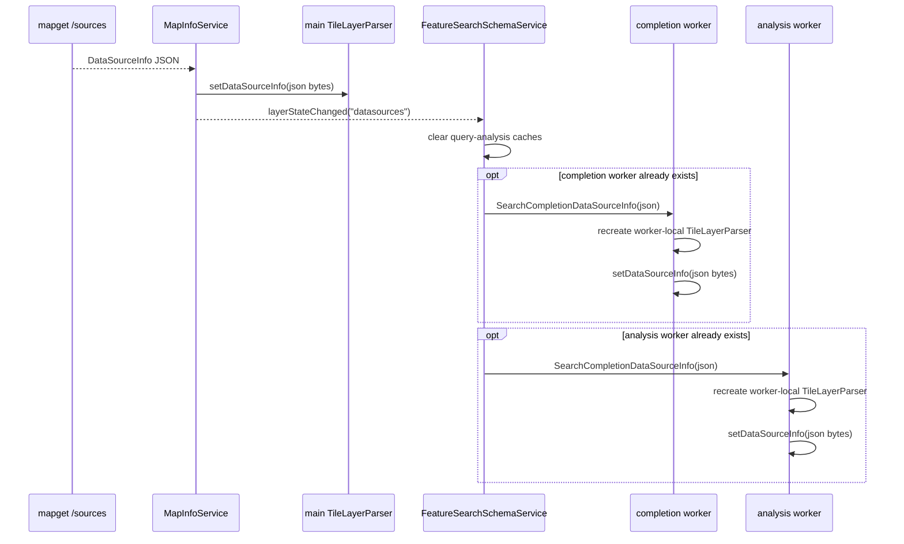
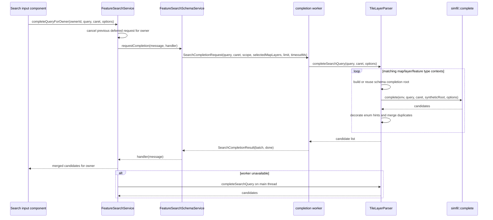
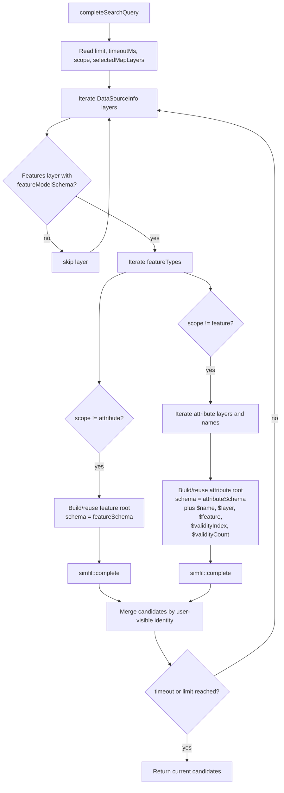
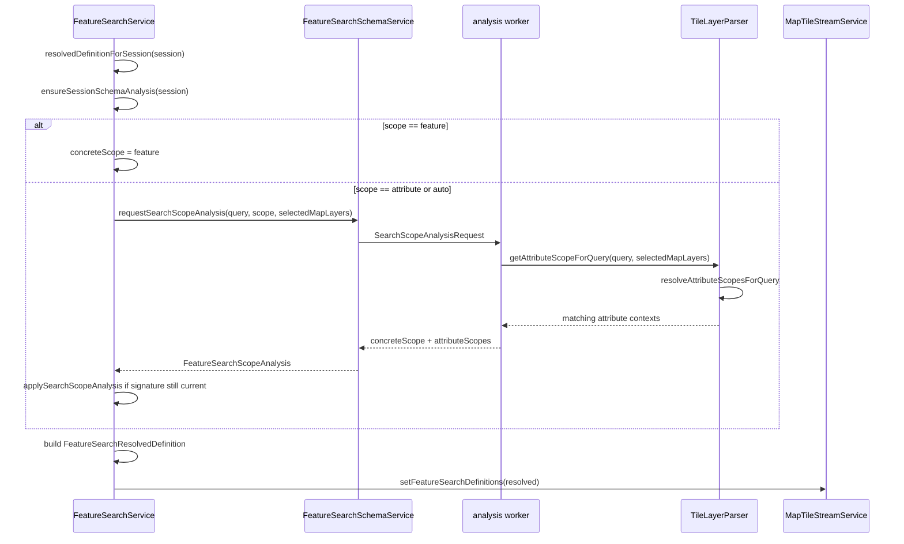
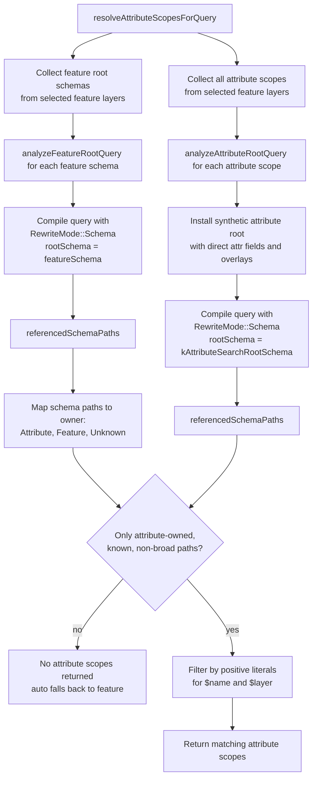
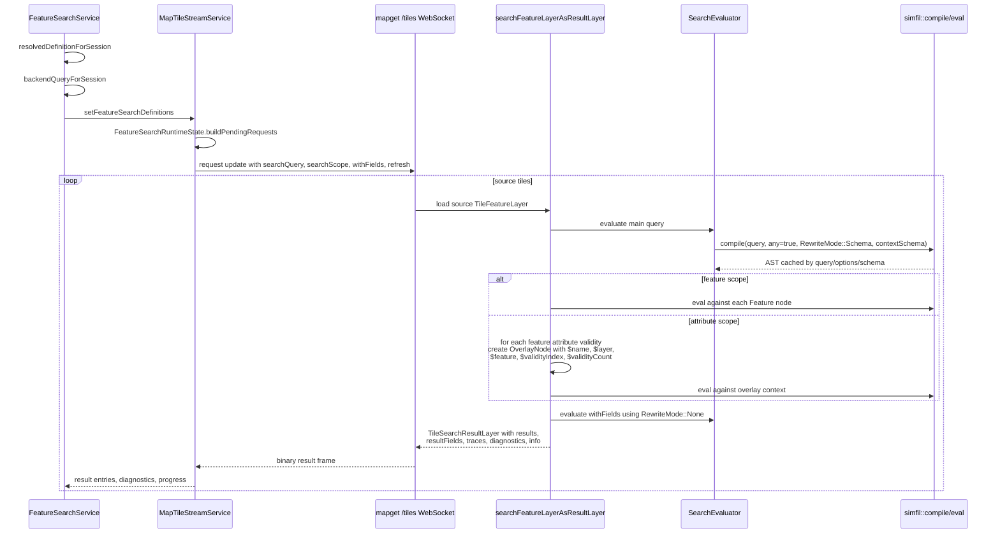
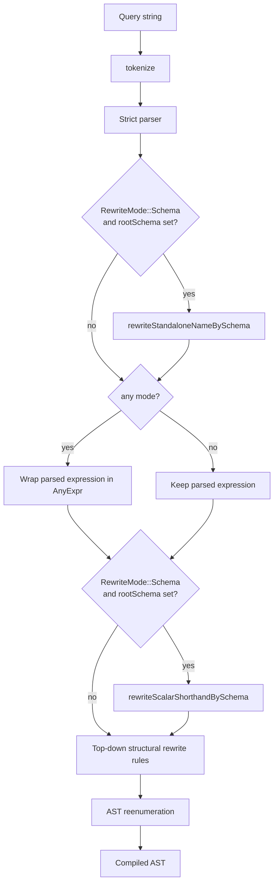
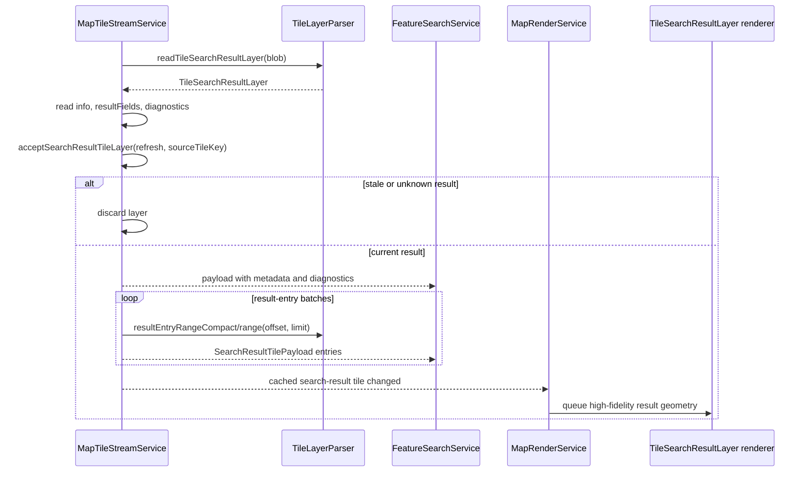
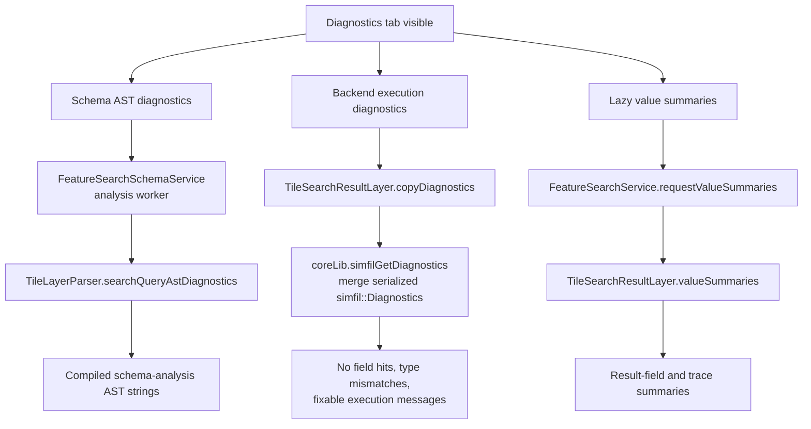

# Erdblick Search Architecture

This document is the developer-facing map of Erdblick feature search, schema completion, auto-scope inference, attribute search, and query diagnostics. User-facing behavior is documented in the MapViewer [Search and Jump](../../../docs/mv-search.md) guide; this page focuses on code paths, contracts, and the places where Erdblick's schema analysis deliberately differs from mapget's backend execution.

## Scope

Feature search is split across three runtime layers:

- Erdblick TypeScript owns persisted search definitions, UI state, completion requests, search progress, result lists, low-fidelity markers, diagnostics display, and result-style controls.
- Erdblick WASM/native code owns schema-backed parser helpers through `TileLayerParser`, using datasource metadata from `/sources` rather than loaded feature tiles.
- Mapget owns actual feature/attribute query execution and streams `TileSearchResultLayer` payloads back over the `/tiles` WebSocket data plane.

The common language machinery is SIMFIL. Erdblick and mapget both call `simfil::compile`, but they do not always compile with the same root schema, `any` mode, or runtime model context.

## Component Map

```mermaid
flowchart LR
  subgraph ui[Erdblick UI]
    Palette[SearchPanelComponent<br/>palette and query input]
    Dialog[FeatureSearchComponent<br/>search dialog]
    SimfilInput[SimfilExpressionInputComponent<br/>style/filter inputs]
  end

  subgraph search[Search services]
    SearchSvc[FeatureSearchService<br/>sessions, progress, results]
    SchemaSvc[FeatureSearchSchemaService<br/>completion/analysis orchestration]
    TileStreamSvc[MapTileStreamService<br/>/tiles WebSocket and tile caches]
    State[AppStateService<br/>persisted definitions]
  end

  subgraph workers[Browser workers]
    CompletionWorker[completion worker<br/>TileLayerParser clone]
    AnalysisWorker[analysis worker<br/>TileLayerParser clone]
  end

  subgraph wasm[Erdblick native/WASM]
    Parser[TileLayerParser<br/>schema roots, completion, scope diagnostics]
    Renderer[TileSearchResultLayer renderer<br/>high-fidelity result geometry]
  end

  subgraph backend[Mapget backend]
    TilesWs[/tiles WebSocket<br/>request updates]
    SearchExec[searchFeatureLayerAsResultLayer<br/>real tile execution]
    Simfil[SIMFIL compile/eval<br/>schema rewrites and diagnostics]
  end

  Palette --> SearchSvc
  Dialog --> SearchSvc
  SimfilInput --> SearchSvc
  SearchSvc --> State
  SearchSvc --> SchemaSvc
  SearchSvc --> TileStreamSvc
  SchemaSvc --> CompletionWorker
  SchemaSvc --> AnalysisWorker
  SchemaSvc -.fallback.-> Parser
  CompletionWorker --> Parser
  AnalysisWorker --> Parser
  TileStreamSvc --> TilesWs
  TilesWs --> SearchExec
  SearchExec --> Simfil
  SearchExec --> TileStreamSvc
  TileStreamSvc --> SearchSvc
  TileStreamSvc --> Renderer
```

## Key Data Types

- `FeatureSearchStateEntry`: persisted UI definition. It stores the visible query, requested scope (`feature`, `attribute`, or `auto`), selected map/layer filters, style rules, enabled state, and pause state.
- `FeatureSearchScopeAnalysis`: async schema-analysis result. It stores the concrete scope and, when applicable, the attribute contexts that can evaluate the query.
- `FeatureSearchResolvedDefinition`: runtime definition sent to `MapTileStreamService`. It adds `concreteScope`, `backendQuery`, and server-side `resultFields`.
- `FeatureSearchRuntimeState`: per-search coverage state inside `MapTileStreamService`. It owns desired source tiles, refresh ids, request order, and stale-result rejection.
- `FeatureSearchTileRequest`: serialized search request embedded in the next `/tiles` WebSocket request update.
- `TileSearchResultLayer`: mapget result tile containing matched geometries, result-field values, result metadata, traces, and serialized SIMFIL execution diagnostics.

## Datasource Metadata And Parser Clones

All schema assistance starts with `/sources`. Erdblick's main parser and worker-local parsers are configured from the same JSON metadata, but they are separate WASM objects.



Important details:

- `MapInfoService` owns current datasource metadata and the main `TileLayerParser` instance.
- `FeatureSearchSchemaService` owns query-analysis caches and two isolated worker lanes: `completion` and `analysis`.
- Worker parsers are created lazily. A worker only receives `/sources` metadata after it exists and the service sends the current JSON snapshot.
- The worker lanes are intentionally separate so heavy analysis or diagnostics cannot block completion streaming.
- Worker failure is handled conservatively. Emscripten aborts reset the worker lane; some operations fall back to the main-thread parser when possible.

## Completion Flow

Completion is schema-backed and does not inspect loaded tiles. It works by constructing lightweight synthetic model roots from `LayerInfo.featureModelSchema`, then asking SIMFIL completion to complete against those roots.



Native completion context construction:



Completion caveats:

- Datasources without `featureModelSchema` intentionally produce no schema candidates.
- Global completion may visit many schemas. Selected map/layer filters and timeout budgets are the main performance controls.
- Completion can suggest fields and enum-like constants even when no loaded tile currently contains them, because it is schema-driven.
- Completion roots are cached inside each parser instance by registry pointer, scope kind, schema id, overlay schema id, and qualifier.

## Auto-Scope Flow

Search definitions can request `feature`, `attribute`, or `auto` scope. Only `auto` requires a decision; explicit `feature` is immediately concrete. Explicit `attribute` still uses schema analysis to find attribute contexts for shorthand handling, but it remains attribute scope even if analysis is unavailable.



Native attribute-scope inference:



Conservatism is intentional:

- Broad recursive access such as unconstrained `**` can make ownership ambiguous and therefore prevents auto attribute scope.
- Feature-owned or unknown schema paths prevent auto attribute scope.
- Positive `$name == "..."` and `$layer == "..."` literals narrow candidate attribute contexts after ownership analysis.
- Explicit `attribute` scope can still run broadly across all selected attribute contexts when inference cannot narrow further.

## Attribute Search Execution

Attribute search is still executed by mapget, not by Erdblick. Erdblick decides the concrete scope and request shape; mapget iterates the actual tile contents.



Backend query handling:

- The visible UI query remains in `FeatureSearchStateEntry.query`.
- `FeatureSearchResolvedDefinition.backendQuery` is the query sent to mapget.
- For most queries, `backendQuery == query`.
- For an explicit or inferred attribute search whose query is exactly one bare attribute identifier, Erdblick rewrites the backend query to `$name == "ATTRIBUTE"` when schema analysis proves that identifier names one selected attribute. This protects mapget from Erdblick-only synthetic shorthand that is meaningful for analysis but too broad for direct backend execution.
- Main search expressions use `RewriteMode::Schema` and `any=true` in mapget.
- `withFields` expressions use `RewriteMode::None` because they are result-value expressions, not search predicates.

## SIMFIL Compile And Schema Rewrites

SIMFIL compilation is centralized. The important options are `CompileOptions.any`, `CompileOptions.rewriteMode`, and `CompileOptions.rootSchema`.



Schema rewrite rules relevant to search:

- Standalone enum-like symbol: if a whole query token is a schema enum symbol, quoted or unquoted, SIMFIL rewrites it to exact schema-derived equality checks, for example a type or attribute-name predicate.
- Standalone field name: if a whole query token is a reachable schema field and not an enum symbol, SIMFIL rewrites it to a recursive wildcard field expression, equivalent to `**.field`.
- Ambiguous standalone field/enum token: SIMFIL rejects the rewrite because the user needs to disambiguate.
- Scalar shorthand operand: if an attribute name appears as a standalone operand inside an expression and is not already part of a path, schema hooks can rewrite it to the first scalar value field below that attribute type, for example `SPEED_LIMIT_METRIC > 80` to `attributeValue.speedLimitMetric > 80`.
- Enum operand: if an unquoted operand is not scalar shorthand, not a reachable field, and the schema proves it is an enum value, SIMFIL rewrites it to the corresponding string literal. Completion prefers the quoted form for enum-only symbols, for example `"SPEED_LIMIT_END"`, and the unquoted field form for field/enum collisions such as `SPEED_LIMIT_METRIC`.
- Multiple scalar paths: if a shorthand maps to several scalar paths, SIMFIL emits a path-alternatives expression. Normal SIMFIL semantics then apply: `any` can stop after the first true result, while `each` requires every produced value to satisfy the predicate.
- Quoted string literals are not scalar shorthand operands. `"SPEED_LIMIT_METRIC" > 10` remains a string comparison, while `SPEED_LIMIT_METRIC > 10` can be treated as schema scalar shorthand.

Mode differences:

| Call site | `any` | `RewriteMode` | Root schema |
| --- | --- | --- | --- |
| Mapget main search predicate | `true` | `Schema` | real feature or attribute context schema |
| Mapget `withFields` result expressions | `false` | `None` | none |
| Erdblick feature-scope analysis | `false` | `Schema` | feature schema from `/sources` |
| Erdblick attribute-scope analysis | `false` | `Schema` | synthetic attribute root schema |
| Erdblick completion | completion mode | schema-aware environment | synthetic feature or attribute model root |
| Style YAML and generic validation | usually `false` | `None` | none |

Search query normalization is mapget-owned. Erdblick's schema worker calls `TileLayerParser.normalizeSearchQuery`, which delegates to each selected layer's `SchemaRegistry::normalizeSearchQuery` and merges the layer-local results. That normalizer performs AST-based post-processing:

- It first parses exact whole-query symbols through SIMFIL, then compiles against each feature root with `RewriteMode::Schema`.
- It consumes SIMFIL `referencedSchemaPaths`, including generated `path == "ENUM"` comparisons, to classify feature-owned vs. attribute-owned references.
- For attribute scope, it emits `$feature.typeId`/`$layer`/`$name` guards and rewrites feature-root attribute paths to attribute-root suffixes.
- It leaves recursive wildcard-field expressions in the final SIMFIL compile path so schema-pruned wildcard execution remains available.

## Schema-Based Runtime Optimization

SIMFIL also uses schema ids while evaluating wildcard field expressions. This is separate from compile-time shorthand rewriting.

```mermaid
flowchart TD
  Eval[Evaluate WildcardFieldExpr<br/>from **.field] --> NodeSchema[Read current ModelNode.schema()]
  NodeSchema --> HasSchema{env.querySchema(schemaId)<br/>returns schema?}
  HasSchema -- no --> Generic[Generic recursive iteration]
  HasSchema -- yes --> CanHave{schema.canHaveField(field)?}
  CanHave -- no --> Prune[Skip this subtree]
  CanHave -- yes --> Plans{enableWildcardFieldPlans?}
  Plans -- no --> Generic
  Plans -- yes --> CachedPlan[Get/build cached SchemaPlan<br/>by schemaId and schema revision]
  CachedPlan --> Direct[Emit direct field when possible]
  CachedPlan --> SparseChildren[Only visit object child fields<br/>that can lead to the target field]
  Direct --> Results[Forward matching values]
  SparseChildren --> Results
  Generic --> Results
```

Optimization consequences:

- Exact schema rewrites are fastest because they avoid recursive wildcard traversal.
- `**.field` is still much cheaper with useful schema ids because subtrees whose schemas cannot contain `field` are pruned.
- `enableWildcardFieldPlans` is enabled by default. It builds per-schema cached plans for sparse object traversal and invalidates through the schema revision counter.
- This optimization depends on runtime model nodes carrying correct schema ids. Erdblick schema analysis uses `/sources` schemas; mapget execution uses schemas attached to actual `TileFeatureLayer` nodes.
- If the schema is missing, dirty, or too broad, SIMFIL falls back to conservative generic traversal.

## Search Result Ingress And Rendering

The backend sends result layers as ordinary tile-stream payloads. Erdblick keeps result-tile ingestion separate from final UI aggregation so large result sets can be chunked without blocking the browser.



Important details:

- `refresh` guards against stale result chunks after a search definition changes or an area update starts a new backend generation.
- `sourceTileKey` maps a search-result layer back to the original source map/layer/tile.
- Result-entry extraction is batched so large result tiles yield between frames.
- Low-fidelity result markers and density buckets are maintained in `FeatureSearchService`; high-fidelity result geometry is rendered by the native/deck result visualization path.

## Diagnostics Flow

The Diagnostics tab combines three different sources. They should not be conflated.



Diagnostics responsibilities:

- Schema AST diagnostics are developer/debug diagnostics. They show how Erdblick's schema-analysis passes compile the query for feature and attribute roots.
- Execution diagnostics come from mapget's actual search evaluation and are serialized into `TileSearchResultLayer`. They are authoritative for what happened during backend execution, but they currently do not expose mapget's compiled AST string.
- Value summaries are lazy post-processing over completed search-result tiles. They summarize result fields and `trace()` output; they are not compile diagnostics.
- Erdblick schema-analysis ASTs can differ from mapget execution ASTs because Erdblick uses synthetic roots, `/sources` metadata, and usually `any=false`, while mapget evaluates real tile nodes with `any=true`.

## Known Non-Identical Paths

These differences are intentional and should be preserved unless a change explicitly moves a responsibility:

- Completion never evaluates real feature data. It uses synthetic schema roots built from `/sources`.
- Auto-scope inference is conservative and metadata-only. It should not require loading tiles.
- Attribute search execution is backend-only. Erdblick does not scan feature tiles in the browser for server-side feature search.
- Erdblick may send a normalized `backendQuery` instead of the visible UI query, but that query must come from mapget `SchemaRegistry::normalizeSearchQuery`.
- Mapget compiles the main predicate with `any=true`; Erdblick schema diagnostics compile analysis ASTs with `any=false`.
- Mapget `withFields` expressions intentionally bypass schema shorthand rewrites with `RewriteMode::None`.
- The Diagnostics tab can show Erdblick schema-analysis ASTs, the normalized backend query, and backend execution diagnostics, but not yet the exact mapget execution AST.

## Extension Points

- Add a new schema-backed shorthand in SIMFIL or `SchemaRegistry::normalizeSearchQuery` when the rewrite should be shared by Erdblick and mapget.
- Add a new synthetic Erdblick-only search helper in `TileLayerParser` only when it is used for completion, scope analysis, or UI diagnostics and not sent directly to mapget.
- Add a new backend-only search behavior in mapget when it depends on real tile contents or datasource execution state.
- Add new result-style fields through `featureSearchResultFields` and `TileLayerParser.searchStyleFieldsForQuery`; remember that result-field expressions sent to mapget use `RewriteMode::None`.
- If the Diagnostics tab needs exact backend compiled queries, have mapget serialize compiled AST metadata into `TileSearchResultLayer::info()` rather than trying to mirror mapget's runtime compile path in Erdblick.

## Code Reference Map

- `app/search/feature.search.service.ts`: search sessions, scope-analysis scheduling, completion ownership, result aggregation, diagnostics aggregation.
- `app/mapdata/feature-search-schema.service.ts`: worker orchestration, schema-analysis caches, completion and analysis worker lifecycle.
- `app/search/search-completion.worker.ts`: worker-local parser setup, completion, scope analysis, style-field enumeration, query diagnostics.
- `app/mapdata/feature-search-runtime-state.model.ts`: per-search source-tile coverage, refresh ids, backend request construction.
- `app/mapdata/map-tile-stream.service.ts`: `/tiles` transport, search-result layer parsing, entry batching, stale-result rejection.
- `libs/core/src/parser.cpp`: `TileLayerParser` completion roots, auto-scope analysis, query-AST diagnostics, style-field enumeration.
- `libs/core/src/layer.cpp`: WASM wrapper for `TileSearchResultLayer` result entries, info, result fields, diagnostics, summaries.
- `libs/core/src/visualization-deck.cpp`: high-fidelity search-result geometry rendering.
- `deps/mapget/libs/model/src/featurelayer-search.cpp`: backend feature/attribute search execution.
- `deps/mapget/libs/model/src/schemaregistry.cpp`: schema registry bindings for SIMFIL schema rewrites and attribute scalar shorthand.
- `deps/simfil/src/simfil.cpp`: centralized compile path and schema rewrite rules.
- `deps/simfil/src/expressions.cpp`: wildcard field evaluation and schema-based pruning.
