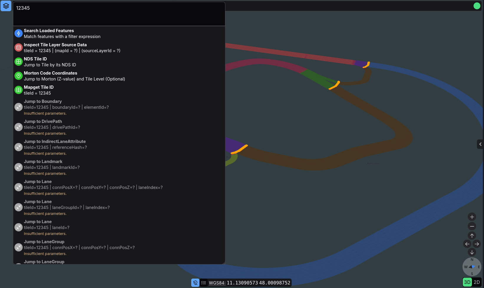
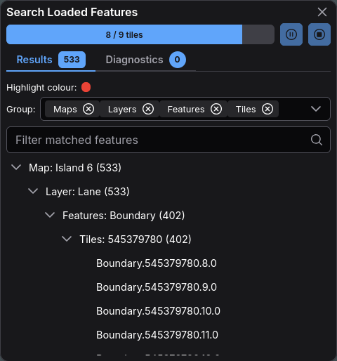

# Search Guide




<!-- --8<-- [start:overview] -->
Erdblick's search palette unifies jump targets, utility actions, and the Simfil-based feature search. Open it with `Ctrl+K` or by clicking the magnifier icon; the textarea expands into a command palette whenever the dialog is visible.

## Working With the Palette

1. **Input field** – accepts coordinates, tile IDs, feature identifiers, or full Simfil expressions. The field turns multi-line while the palette is open.
2. **Autocompletion** – the worker-driven completer runs after ~150 ms of inactivity and places hints next to the caret. Use `Tab`, `ArrowUp`, `ArrowDown`, or the mouse to pick a candidate; `Enter` inserts it.
3. **Active vs. inactive items** – targets validate your input in real time. Matching targets move to the top of the list with colored icons; non-matching entries remain grey and show inline warnings such as “Insufficient parameters”.
4. **History** – every executed target is stored in `localStorage`. Matching entries appear below the active actions and can be re-run or removed individually. Typing filters the list, so `Tab` quickly cycles through reusable queries.
5. **Execution shortcuts** – press `Enter` to run the first active target, or click any entry. `Escape` dismisses autocompletion, clears the current input, or closes the palette (in that order).
6. **Context hand-offs** – right-click SourceData actions, map coverage buttons, and other tools push pre-filled queries into the palette so you can continue workflows without retyping.

The palette closes automatically when you click the map or another control, but search history and partially typed queries are preserved until you clear them.
<!-- --8<-- [end:overview] -->

## Built-in Jump and Utility Targets

<!-- --8<-- [start:jump-targets] -->
| Action | Input syntax | Result |
| --- | --- | --- |
| **Search Loaded Features** | Any valid [Simfil](https://github.com/ndsev/simfil/blob/main/docs/simfil-language.md) expression | Runs the feature search across every tile currently loaded in all open views. Syntax errors are shown inline before you execute the query. |
| **Mapget Tile ID** | `<tileId>` (integer without spaces) | Navigates to the requested tile by computing its bounding box. Useful for links copied from logs or SourceData tools. |
| **WGS84 Lon-Lat Coordinates** | `lon, lat` or `lon lat [level]` (decimal) • `12°34'56"W 48°01'30"N [level]` (DMS) | Positions the active view on the provided longitude/latitude pair. An optional zoom `level` (1–14) snaps to the matching tile. |
| **WGS84 Lat-Lon Coordinates** | `lat, lon` or `lat lon [level]` (decimal/DMS) | Same as above but with the order reversed for users accustomed to `lat,lon` input. |
| **Open WGS84 Lat-Lon in Google Maps** | Same patterns as “WGS84 Lat-Lon” | Opens a new Google Maps tab centered on the parsed coordinates and drops a marker in erdblick. |
| **Open WGS84 Lat-Lon in OpenStreetMap** | Same patterns as “WGS84 Lat-Lon” | Opens OpenStreetMap in a new tab (zoom 16) and marks the same position in erdblick. |
| **Inspect Tile Layer Source Data** | `<tileId> ["Map Id"] ["Source Layer"]`<br/>Quotes are optional; escape spaces with `\ ` | Opens the SourceData inspector for the chosen tile/layer. The validator checks that the map ID exists and that the layer matches a known SourceData entry. |
| **Feature ID Jump** | `FeatureType key1=value1 key2=value2 ...` | Locates a specific feature by its identifier fields, pans the active view to the match, and highlights it. Only feature types advertised by the loaded maps are offered. |

All coordinate targets accept decimal or degree-minute-second formats. When you include a zoom level, erdblick converts the coordinates into a tile rectangle before animating the camera.
<!-- --8<-- [end:jump-targets] -->

### Feature Jump Targets

<!-- --8<-- [start:feature-jumps] -->
In addition to the static entries above, erdblick exposes per-feature actions based on the map data loaded in the client. These show up as **Feature ID Jump** targets specific to each feature type:

- Start your query with a feature type prefix (e.g. `LaneGroup`) followed by the ID parts defined in that type’s schema. Tokens may be separated by spaces, commas, dots, or semicolons.
- The palette lists every compatible feature type, showing the required key/value pairs. An invalid entry reveals parser errors such as “Expecting I32”.
- If the feature type is offered by multiple maps, erdblick prompts you to pick the target map before it asks the backend to locate and highlight the feature.
- Successful jumps move the camera in the currently focused view and select the located feature.
<!-- --8<-- [end:feature-jumps] -->

## SourceData Integration

<!-- --8<-- [start:sourcedata] -->
Typing `tileId "Map" "SourceLayer"` is not the only way to reach SourceData:

- The map’s right-click menu can pre-fill the last inspected tile ID and map ID into the palette. Selecting the “Inspect Tile Layer Source Data” entry reopens the inspector with the correct layer highlighted.
- When you copy tile information from the SourceData panel, it uses the same quoting rules, so you can paste the string straight into the search input.
<!-- --8<-- [end:sourcedata] -->

## Feature Search (Simfil)

<!-- --8<-- [start:feature-search] -->
Running the **Search Loaded Features** action allows searching the loaded features deeply by their attributes, geometry and relations. Key capabilities:

- **Scope** – searches span every tile currently loaded (or scheduled for loading) in each view. Increase the “Max tiles to load/visualize” limits in Preferences if you need to cover a broader area before launching a search.
- **Workers and progress** – queries run inside web workers. Progress shows “processed tiles / scheduled tiles”, so you immediately see whether you have enough data loaded. The map overlay drops temporary markers with a configurable highlight color.
- **Pause/Resume/Stop** – use the toolbar buttons to pause a long-running search, resume where it left off, or stop it entirely. Pausing preserves current results, and stopping reveals any accumulated worker errors.
- **Result grouping** – choose how results are organized (by map, layer, feature type, tile) via the multi-select dropdown. Counts per branch keep large sets navigable, and the filter box becomes available as soon as the tree contains entries.
- **Highlight color** – adjust the highlight color per search to avoid confusing overlapping markers.
- **Selecting results** – clicking a node zooms to the feature and highlights it in the inspector. Clipboard shortcuts work on the tree entries, so you can copy IDs directly.
- **Diagnostics tab** – after a search finishes, the diagnostics worker summarizes warnings or parse errors per tile. Each message may include a suggested fix; click the link to rewrite the query accordingly.
- **Traces tab** – optionally lists instrumented Simfil operators (name, call count, total microseconds). Use it to spot expensive clauses before rewriting a filter.
- **Performance stats** – elapsed time, tile counts, and cluster pin tiers are tracked for each search run, so you can compare queries and tune performance.

Because the search iterates over loaded tiles, it will not “page in” additional data. If a query returns too few matches, pan/zoom to the desired area, [increase tile limits in the Preferences dialog](erdblick-ui-basics.md#preferences-and-resets), or run the search from both split-view panes.

<!-- --8<-- [end:feature-search] -->

## Crafting feature queries

<!-- --8<-- [start:crafting] -->
When you compose Simfil expressions, it helps to start from the data that erdblick actually sees:

- Use the inspection column to explore a feature and right-click an attribute to choose **Copy GeoJSON path**. The copied path matches the structure Simfil operates on in feature search.
- Keep early queries simple, for example `**.speedLimitKmh > 80` to highlight fast segments or `**.functionalRoadClass == 4` to focus on a particular road class.
- Combine multiple conditions with logical operators (`and`, `or`, `not`) and build up complexity gradually. If you run into syntax issues, the diagnostics tab will usually point at the problematic clause.
- Use the GeoJSON actions in the inspector to download sample features as `.geojson` if you want to experiment with queries outside erdblick.

For the full set of operators and syntax rules, refer to the Simfil language guide linked above.
<!-- --8<-- [end:crafting] -->

#### Understanding Feature Paths

To effectively use auto-complete, it's helpful to understand how features are structured. Use the inspection panel's "Copy GeoJSON Path" functionality to explore the exact paths to specific elements in the inspection tree. This gives you insight into the data structure and helps you understand the path syntax.

## Autocompletion and Inline Diagnostics

<!-- --8<-- [start:assist] -->
The search dialog offers live assistance while you type so that you can refine expressions without repeatedly guessing and rerunning queries:

- **Autocompletion** uses the search worker to inspect the tile data and offer context-aware path suggestions. Results appear next to the caret, show the candidate text plus a kind/hint, and disappear as soon as you click elsewhere.
- **Validation** happens before you execute a Simfil search. The parser diagnostics that appear beneath the “Search Loaded Features” entry help you fix obvious syntax issues before you run a long search.

When you don't know the exact path to an attribute field:

1. **Start with wildcards**: Type `**.` to filter any node in the feature structure.
2. **Search by partial name**: `**.speed` might suggest `**.speedLimitKmh`.
3. **Hint completions**: The auto-complete provides "hint" suggestions for wildcard queries, helping you discover available attributes without memorizing exact paths.
4. **Efficient shortcuts**: The wildcard `**.speedLimitKmh` is a shortcut for the full path:
   ```
   properties.layer.LaneRulesLayer.SPEED_LIMIT_METRIC.attributeValue.speedLimitKmh
   ```
<!-- --8<-- [end:assist] -->

## Troubleshooting

<!-- --8<-- [start:troubleshooting] -->
If the search palette behaves unexpectedly or seems unresponsive, walk through these common failure modes first:

- **No jump targets light up** – check the inline warnings. Coordinate targets expect two numbers (plus an optional zoom). Mapget tile IDs must be numeric. SourceData jumps require at least a tile ID; map and layer names are optional but validated.
- **Simfil query hangs at 0 tiles** – load more data (use the focus buttons or raise tile limits) and try again. The worker only sees tiles that erdblick already has in memory.
- **Search keeps erroring** – open the Diagnostics tab after stopping the search. Errors reported there include suggested fixes. Use the provided button to apply a fix directly to the search input.
- **Feature jump shows multiple maps** – this is expected when several maps offer the same feature type. Select the desired map from the prompt or cancel to abort the jump.

With these tools in place, the search palette doubles as both a navigation console and the entry point for deep Simfil investigations—all without leaving the browser.
<!-- --8<-- [end:troubleshooting] -->
