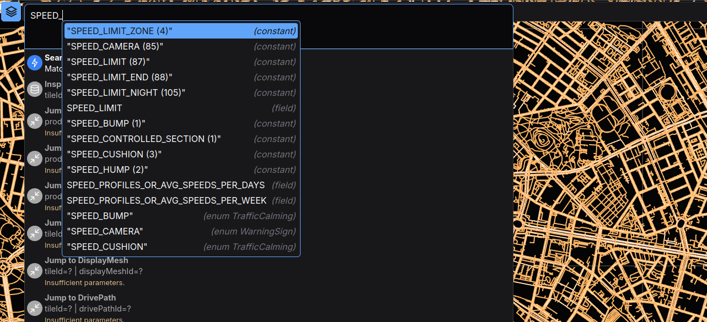
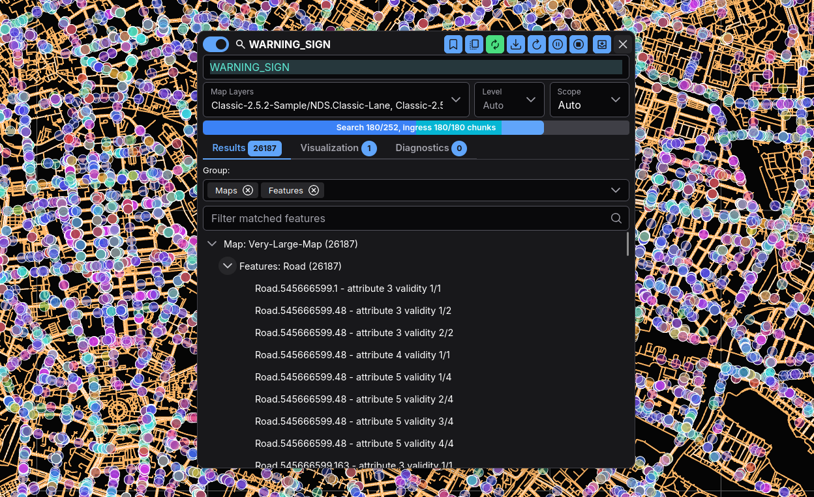
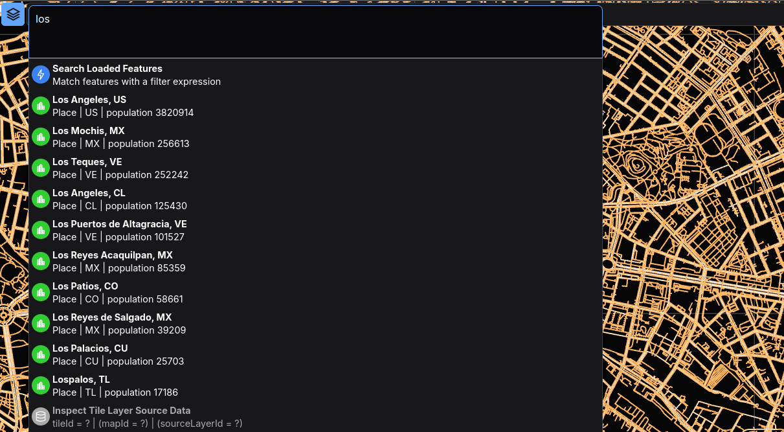

# Search Guide

Erdblick has two search surfaces:

- The palette, opened with `Ctrl+K` or the magnifier icon, starts jump targets, utility actions, and feature searches.
- A feature search opens its own persistent **Search Loaded Features** panel with results, visualization controls, and diagnostics.

## Working With the Palette

<!-- --8<-- [start:overview] -->
Erdblick's search palette unifies jump targets, utility actions, and the Simfil-based feature-search entry point. Open it with `Ctrl+K` or by clicking the magnifier icon; the textarea expands into a command palette whenever the dialog is visible.

1. **Input field** - accepts coordinates, tile IDs, feature identifiers, or Simfil expressions. The field turns multi-line while the palette is open.
2. **Autocompletion** - suggestions appear near the caret after a short delay. Use `Tab`, `ArrowUp`, `ArrowDown`, or the mouse to pick a candidate; `Enter` inserts it.
3. **Active vs. inactive items** - targets validate your input in real time. Matching targets move to the top of the list with colored icons; non-matching entries remain grey and show inline warnings such as "Insufficient parameters".
4. **History** - executed targets are stored in browser state. Matching entries appear below active actions and can be re-run or removed individually.
5. **Execution shortcuts** - press `Enter` to run the first active target, or click any entry. `Escape` dismisses autocompletion, clears the current input, or closes the palette, depending on the current focus state.
6. **Context hand-offs** - SourceData actions, inspection row actions, map coverage buttons, and other tools can push pre-filled queries into the palette or directly open a feature-search panel.

The palette closes automatically when you click the map or another control, but search history and partially typed queries are preserved until you clear them.
<!-- --8<-- [end:overview] -->

## Built-in Jump and Utility Targets

<!-- --8<-- [start:jump-targets] -->
| Action | Input syntax | Result |
| --- | --- | --- |
| **Search Loaded Features** | Any valid Simfil expression | Opens a feature-search panel for the query. The panel streams result layers from the backend, keeps its own result tree, and can be docked, undocked, paused, refreshed, styled, bookmarked, or closed independently. |
| **Place / Location Matches** | Place-name text such as `Munich` | Shows matching locations from the configured location providers. Selecting a match jumps the active view to that place, drops the location marker, and briefly labels the chosen result on the map. |
| **Mapget Tile ID** | `<tileId>` (integer without spaces) | Navigates to the requested tile by computing its bounding box. Useful for links copied from logs or SourceData tools. |
| **WGS84 Lon-Lat Coordinates** | `lon, lat` or `lon lat [level]` (decimal) / `12°34'56"W 48°01'30"N [level]` (DMS) | Positions the active view on the provided longitude/latitude pair. An optional zoom `level` snaps to the matching tile. |
| **WGS84 Lat-Lon Coordinates** | `lat, lon` or `lat lon [level]` (decimal/DMS) | Same as above but with the order reversed for users accustomed to `lat,lon` input. |
| **Open in Google Maps** | Optional WGS84 coordinates | Opens Google Maps at the supplied coordinates, or at the current marker/viewport fallback location. |
| **Open in Google Street View** | Optional WGS84 coordinates | Opens Google Street View at the supplied coordinates, or at the current marker/viewport fallback location. |
| **Open in OpenStreetMap** | Optional WGS84 coordinates | Opens OpenStreetMap at the supplied coordinates, or at the current marker/viewport fallback location. |
| **Open in Bing Maps** | Optional WGS84 coordinates | Opens Bing Maps at the supplied coordinates, or at the current marker/viewport fallback location. |
| **Inspect Tile Layer Source Data** | `<tileId> ["Map Id"] ["Source Layer"]` Quotes are optional; escape spaces with `\ ` | Opens the SourceData inspector for the chosen tile/layer. The validator checks that the map ID exists and that the layer matches a known SourceData entry. |
| **Feature ID Jump** | `FeatureType key1=value1 key2=value2 ...` | Locates a specific feature by its identifier fields, pans the active view to the match, and highlights it. Only feature types advertised by the loaded maps are offered. |

All coordinate targets accept decimal or degree-minute-second formats. When you include a zoom level, erdblick converts the coordinates into a tile rectangle before animating the camera.

The four **Open in** actions use explicit coordinates when the input is a valid WGS84 pair. With ordinary text or an empty input, they use the enabled marker position if one exists, otherwise the centre of the focused viewport. They only open the external service: they do not move the erdblick camera or create a marker. Right-click a map location and use **Open in…** for the same services at that exact location.
<!-- --8<-- [end:jump-targets] -->

### Place-Name Location Search

<!-- --8<-- [start:location-search] -->
Location search is part of the same palette as coordinate jumps and feature search. Type a place name such as `Munich`, wait for the configured providers to return matches, and select the desired result from the active actions list.

Erdblick only sends name-like queries to location providers. Numeric IDs, coordinates, and mixed strings such as postal-code searches stay with the normal jump and feature-search targets. The default minimum query length is two characters.

Location results are sorted by population when the provider supplies it, then by name, provider, and stable result id. Selecting a result moves the active view to its WGS84 coordinate, enables the location marker, and shows a short-lived label with the selected place name. The selected result is stored in search history with enough payload to rerun it later in the same browser profile.

Use **Edit -> Settings -> Location Matches** to control how many location matches the palette asks providers to return. The default is 10; the supported range is 1 to 50.
<!-- --8<-- [end:location-search] -->

### Feature Jump Targets

<!-- --8<-- [start:feature-jumps] -->
In addition to the static entries above, erdblick exposes per-feature actions based on the feature types advertised by the loaded maps:

- Start your query with a feature type prefix, for example `LaneGroup`, followed by the ID parts defined in that type's metadata. Tokens may be separated by spaces, commas, dots, or semicolons.
- The palette lists compatible feature types and shows the required key/value pairs. Invalid entries reveal parser errors such as "Expecting I32".
- If the feature type is offered by multiple maps, erdblick prompts you to pick the target map before it asks the backend to locate and highlight the feature.
- Successful jumps move the camera in the currently focused view and select the located feature.
<!-- --8<-- [end:feature-jumps] -->

## SourceData Integration

<!-- --8<-- [start:sourcedata] -->
Typing `tileId "Map" "SourceLayer"` is not the only way to reach SourceData:

- The map's right-click menu can pre-fill the last inspected tile ID and map ID into the palette. Selecting the **Inspect Tile Layer Source Data** entry reopens the inspector with the correct layer highlighted.
- When you copy tile information from the SourceData panel, it uses the same quoting rules, so you can paste the string straight into the search input.
<!-- --8<-- [end:sourcedata] -->

## Feature Search Sessions

<!-- --8<-- [start:feature-search] -->
Running **Search Loaded Features** opens a persistent feature-search session. Each session owns its query, selected map layers, selected views, streamed result set, visualization settings, diagnostics, and browser-state entry.

The backend search is an ordinary mapget `/filter` presentation. It evaluates
the selected map/layer coverage and streams immutable `TileSubsetLayer`
results. The same subset feeds styled map geometry and frame-budgeted result
list ingestion, so matches can appear while backend work and tree construction
are still in progress.

Important controls:

- **Docked or floating panel** - keep a search in the Search dock, undock it into a dialog, reorder docked panels by dragging their headers, or keep several searches open side by side.
- **Enabled toggle** - disables a search without deleting it. A disabled search keeps its query and results visible but does not run, auto-update, or accept query edits until it is enabled again.
- **Query input** - edit the Simfil expression inline. Press `Enter` to rerun. If the text differs from the active search, the refresh action becomes **Rerun search**.
- **Map Layers** - restrict the search to selected maps and layers. This also narrows schema-aware completion and style-field pickers.
- **Scope** - choose `Auto`, `Feature`, or `Attribute`. Feature scope evaluates once per feature. Attribute scope evaluates once per attribute/validity context and exposes `$name`, `$layer`, `$feature`, `$attributeIndex`, `$hasValidity`, `$validityIndex`, and `$validityCount`. Auto chooses attribute scope when schema metadata proves that the query targets attribute-layer fields.
- **View** - in split view, choose where the result layer is visualized: left view, right view, or both. Auto-update follows the visible tiles of the selected view set.
- **Auto update area** - when enabled, panning, zooming, layer changes, and split-view changes refresh the search area automatically. When disabled, use **Update area** to replace the search area with the current visible tiles without changing the query.
- **Refresh / rerun** - refresh repeats the active search over its current area. When the query text is dirty, the same action becomes **Rerun search** and commits the edited query before searching.
- **Bookmark** - keep important searches in state and protect them from accidental close. Closing a bookmarked search prompts you to confirm, with an option to export first.
- **Pause, resume, and stop** - pause or stop long searches without closing the panel. Pausing preserves current results; stopping terminates the active backend run for that session.
<!-- --8<-- [end:feature-search] -->

## Results

<!-- --8<-- [start:results] -->
The **Results** tab is built for large streamed result sets.

- **Progress** is split into backend search, result chunk ingress, and result-tree construction. A search can show matches before all progress phases are complete.
- **Grouping** lets you organize results by map, layer, feature, and tile. Counts per branch keep large sets navigable.
- **Filtering** appears when the tree contains results and filters matched feature rows without rerunning the backend search.
- **Selection** is a normal feature-selection entry point. Clicking a result focuses the map, opens or updates inspection, and highlights the matched feature.
- **Attribute-scope selection** can focus a specific attribute/validity target instead of only the owning feature. When validity geometry is available, the map highlight follows that validity.
- **Hovering** a result previews the matching feature or attribute target without changing the selected inspection.
- **Export as JSON** writes the search configuration and/or result data for offline analysis. Exports preserve enough map/layer/result metadata to reopen the investigation context and are useful before closing a bookmarked search. Treat the exact JSON fields as an integration format, not as a hand-edited user format.
<!-- --8<-- [end:results] -->

## Result Visualization

<!-- --8<-- [start:visualization] -->
The **Visualization** tab controls how one search session is drawn on the map. Its high-fidelity rules can also be saved as reusable search-style configurations.

### Result Density Map

The density map is the safe overview for broad searches. It aggregates matches into visible source-tile buckets and draws colored markers.

- Toggle density markers on or off.
- Pick the density/pin color for the search session.
- Show or hide density labels.
- Enable a heat-gradient mode for denser buckets.
- Adjust marker size with the multiplier slider.

### High-fi Visualization

High-fi visualization draws styled result geometry when the visible tile count is low enough for detailed rendering.

- Toggle styled result geometry on or off.
- Enable per-feature result pins when high-fi geometry is active.
- The default high-fidelity cutoff is 512 visible tiles. Above that limit, density markers remain the practical overview.
- Geometry for attribute-scope results uses computed validity geometry when available and falls back to feature display geometry otherwise.

### Style Rules

Search style rules are evaluated only for the result layer of the current search.

- **Add Rule** creates another rule. Reset restores a rule to its generated defaults; delete removes it. Rule names are only local labels for keeping several result styles readable.
- Rule headers show compact summaries for geometry, filters, color mode, and preview colors.
- **Filter** conditions can use schema-backed field pickers, comparison operators, numeric inputs, enum value pickers, text values, or custom Simfil expressions. Multiple conditions inside one rule are combined for that rule.
- **Geom** chooses the rendered kind: any geometry, line, polygon, mesh, point, or label. Geometry rules expose the relevant width, size and opacity controls for the selected kind.
- **Labels** can use a selected field or a custom label expression. Common labels are speed-limit values, feature types, validation rule IDs, and issue IDs.
- **Color** supports solid colors, numeric gradients, and categories for enum/string-like values. Category and gradient modes include a fallback color for missing or unmatched values. **Update from data** uses the Diagnostics/Values summaries from the current result set when available.

Auto-created rules prefer fields mentioned by the query. Manual edits stop those rules from being replaced by later query changes.

Use **Save** beside the high-fidelity controls to store only the current rule list. The search query, scope, selected layers, result views, density controls, and other session state are deliberately not part of a saved search style. Select a saved entry from the adjacent **Saved styles** menu to apply a detached copy; later changes in the search do not modify the saved configuration.

Saved configurations retain optional per-rule source-layer applicability. This is useful when applying a configuration back to a heterogeneous search, but it does not pin the reusable configuration to a required map or layer.

### Search Styles in the Style Sheets Dialog

Open **Edit -> Styles Configurator -> Search Styles** to create, rename, duplicate, delete, and reconfigure saved high-fidelity rule sets. This tab uses the same rule editor as Feature Search and works without a concrete feature/attribute scope; schema-backed pickers and completion are available only when a search provides that transient context.

Each valid saved JSON configuration has exactly one deterministic canonical YAML projection. The generated sheet:

- has style version 2 and `default: false`;
- has no query, map ID, layer selector, or explicit scope;
- includes all rules, regardless of their JSON `mapLayers` hints;
- is parsed and stored separately from normal active styles.

Unsupported legacy values or native parser errors are shown as an invalid generation status. Invalid projections cannot be exported or copied until the JSON rules are corrected and saved.

In the current Act 1 implementation, generated sheets are not registered for regular map rendering. **Export YAML** downloads the canonical projection. **Copy to editor** opens a renamed, transient copy; importing that copy creates a normal imported style and never changes or creates a search-style configuration.

Use density markers for broad searches or early exploration. Switch to high-fi geometry and labels when the visible tile count is small enough that individual result geometry is more useful than aggregate buckets.
<!-- --8<-- [end:visualization] -->

## Search Diagnostics

<!-- --8<-- [start:diagnostics] -->
The **Diagnostics** tab explains what the current search did and helps tune queries.

- **Messages** lists backend or parser diagnostics. When a message offers a fix, click **Fix** to rewrite the query in the input.
- **Query** shows the active query, effective scope, elapsed time, searched feature count, matched result count, and schema-derived notes when they are available.
- **Values** summarizes result fields and `trace()` output. Cards include sample counts, missing/null counts, kind counts, numeric min/max/average values, histograms, and trace call timings.

Values are loaded lazily and may wait until result chunks have finished ingress. Use them when you want to understand the distribution behind a search before creating labels, categories, or gradients. Useful trace expressions include `trace(typeId)`, `trace(**.speedLimitKmh)`, and named traces such as `trace(valueKph, name="speed limits")` when several measurements should appear as separate value cards.
<!-- --8<-- [end:diagnostics] -->

## Crafting Feature Queries

<!-- --8<-- [start:crafting] -->
When you compose Simfil expressions, start from the data that erdblick actually receives:

- Use inspection to explore one feature. Open the three-dot hover menu on the left of a scalar row and choose **Copy Search Path** to copy the exact Simfil path.
- From the same row menu, choose **Search for key/value** to open a search for that scalar value in the inspected map/layer context.
- Keep early queries simple, for example `speedLimitKmh > 80`, `**.speedLimitKmh > 80`, or a completed enum value such as `"SPEED_LIMIT_END"`.
- Use attribute scope for validity-specific searches, for example to find all matching warning-sign or speed-limit validities and then inspect the matched validity geometry.
- Search transition-validity payloads through their semantic fields when present, for example `transitionNumber == 1` or `fromConnectedEnd == "END"`.
- Use `trace()` when you want diagnostics instead of only yes/no filtering, for example `trace(typeId)` or `trace(**.speedLimitKmh)`.
- Combine conditions with `and`, `or`, and `not` once the individual pieces are known to work.

For the full set of operators and syntax rules, refer to the Simfil language guide linked from the MapViewer Search Guide.
<!-- --8<-- [end:crafting] -->

## Autocompletion and Inline Diagnostics

<!-- --8<-- [start:assist] -->
Search inputs offer live assistance while you type:

- **Schema-aware completion** suggests fields, enum-like string constants, and function names. It respects the selected map layers and the selected search scope where possible.
- **Non-blocking completion** runs outside the main UI path. Suggestions can briefly lag behind datasource metadata changes, but typing and panel interaction should remain responsive.
- **Wildcard shortcuts** can be expanded through schema metadata. If a datasource schema proves where `speedLimitKmh` exists, a short expression such as `speedLimitKmh > 80` can target the concrete field without forcing you to write the complete path.
- **Enum constants** are suggested from schema metadata as quoted string literals, for example `"SPEED_LIMIT_END"`. If the same token is also a reachable field, completion prefers the unquoted field form, for example `SPEED_LIMIT_METRIC`.
- **Forced field access** is available when a token could be interpreted several ways. Use `_.FIELD` or `["FIELD"]` to make a name a field access.
- **Inline diagnostics** appear before or during a search for parse errors, ambiguous schema rewrites, missing fields, and fixable query patterns.

When you do not know the exact path to an attribute field, type part of the name, use `**.` to search recursively, or copy the path from inspection.
<!-- --8<-- [end:assist] -->

## Troubleshooting

<!-- --8<-- [start:troubleshooting] -->
If search behaves unexpectedly, check these common failure modes first:

- **No jump targets light up** - check the inline warnings. Coordinate targets expect two numbers plus an optional zoom. Mapget tile IDs must be numeric. SourceData jumps require at least a tile ID; map and layer names are optional but validated.
- **A search cannot be edited** - check the enabled toggle in the search-panel header. Disabled searches keep their state but lock editing and rerun controls.
- **Results seem incomplete** - verify the selected map layers, selected split views, current visible area, tile budgets, and Auto update area setting.
- **Search progress appears stuck** - open Diagnostics and compare backend search, result ingress, and result-tree progress. Large result sets can spend visible time building the result tree after backend matches already arrived.
- **A short field query is ambiguous** - use a more explicit path, force field access with `_.FIELD`, or restrict Map Layers so the schema resolver has fewer possible targets.
- **A broad search is too slow** - narrow Map Layers, search a smaller area first, prefer schema-resolved fields over recursive wildcards when possible, and use density visualization before enabling high-fi labels over many tiles.
- **Search keeps erroring** - open the Diagnostics tab and apply available fixes. If the same query fails against one datasource only, export diagnostics and include the selected map/layer information in the bug report.
- **Feature jump shows multiple maps** - select the desired map from the prompt or cancel to abort the jump.

With these tools in place, the search palette and feature-search panels cover navigation, feature discovery, visualization, and query diagnostics without leaving the browser.
<!-- --8<-- [end:troubleshooting] -->
