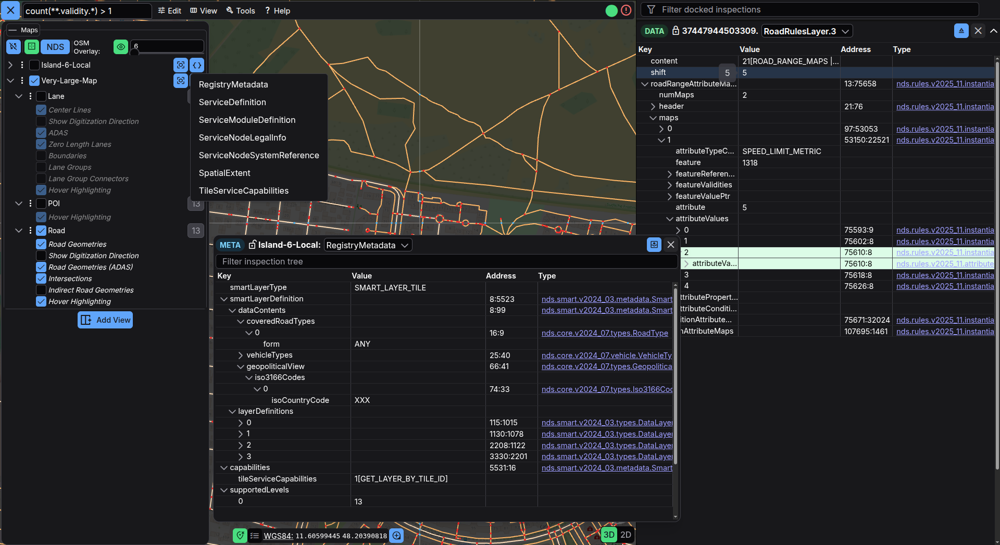
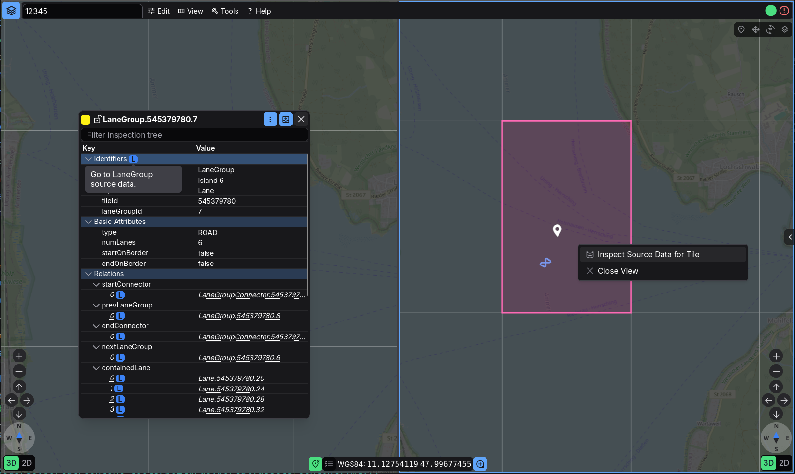

# SourceData Inspection Guide

The SourceData inspector lets you read the raw payloads that underlie the visible features. Use it when you need to verify converter input, inspect service metadata, or debug why a feature looks different from its original source.



## Ways to Open SourceData

You can open SourceData from several entry points:

1. **Map context menu** – right-click a location on the map and choose **Inspect Source Data**.
2. **Inspection links** – many feature nodes expose a source-data action that opens the matching raw payload.
3. **Search command** – enter `<tileId> "<Map Id>" "<Source Layer>"` into the search panel. Example:
   ```text
   37443649601549 "Road 4 Test Data" "SourceData-road.layer.RoadLayer-1"
   ```
4. **Map metadata** – use the metadata action in **Maps & Layers** to open service- and module-level blobs such as `ServiceDefinition`, `SpatialExtent`, or registry metadata.



## Dedicated SourceData Panels

SourceData panels are treated differently than feature inspection panels:

- the header shows the current map and tile context
- the panel content is restricted to SourceData display
- the source-layer dropdown lets you switch between compatible raw layers for the same tile (or different metadata blobs)

This separation keeps feature inspection and raw-payload inspection from competing for the same panel slot.

## Navigating the Raw Payload

Once the panel is open:

- use the filter box to find field names or values
- expand nodes to inspect structure, offsets, and values
- switch between raw layers with the dropdown when a tile exposes several SourceData entries
- inspect metadata-only layers such as service definition or registry metadata without leaving the same overall workflow

When SourceData is opened from a feature node, erdblick tries to preselect the matching address range in the raw tree so you can line up the interpreted feature view with the original payload faster.

## Hints for Efficient Debugging

- Combine SourceData with a locked feature inspection so you can compare interpreted and raw views side by side.
- Enable tile borders when you need exact tile IDs for follow-up searches or bug reports.
- Use map-level metadata actions to inspect Smart Layer service metadata, not just feature blobs.
- Copy the URL when you want to share a specific map/tile/layer SourceData state with a colleague.
