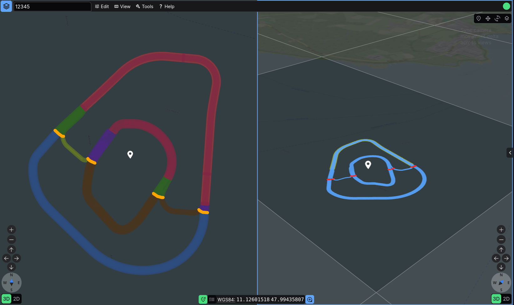

# Split-Screen Usage Guide

Erdblick can render two map views side by side. Each pane keeps its own camera state, layer configuration, and per-layer style options, while the built-in sync controls let you share selected parts of that state. This guide explains how to open split view, focus a specific pane, and use the sync options effectively.

## Opening, Closing, and Focusing Views

You can enter split view in three equivalent ways:

1. Choose **View -> Split View** from the main bar.
2. Open **Maps & Layers** (`M`) and click **Add View** at the bottom.
3. Right-click inside the map and choose **Split View** from the context menu.

Once split view is open:

1. The **Maps & Layers** dialog shows separate fieldsets for **Maps Left View** and **Maps Right View**.
2. Close the right pane either from **View -> Close Right View** or from the `[x]` button in the **Maps Right View** header.
3. Click inside a pane to focus it. The focused pane gets a blue outline, and keyboard shortcuts (`WASD`, `Q/E`, `Ctrl+K`, jump actions, and so on) apply only there.
4. Use `Ctrl+ArrowRight` / `Ctrl+ArrowLeft` to move focus without touching the mouse.

## View Sync Controls

The secondary pane shows a small toggle group in its top-left corner. These switches control how camera and layer state is shared between views:

- **Position (`pos`)** – keeps all cameras on the same destination and orientation. Moving the focused view moves the others to the same place.
- **Movement (`mov`)** – mirrors mouse/keyboard movement deltas in real time while preserving each view’s relative offset. When you enable this, erdblick automatically resolves conflicts with position sync.
- **Projection (`proj`)** – keeps all views in the same projection. Switching one view between 2D and 3D updates the others as well.
- **Layers (`lay`)** – synchronizes map and layer visibility, per-layer style option values, and OSM overlay settings across views.

The sync settings are encoded in the URL and mirrored into local state, so reloaded sessions keep the same behavior. Hover a toggle to see a short description of what it controls.

## Per-View Layer Management

Each view maintains its own layer tree:

- **One section per pane** - the **Maps & Layers** dialog renders one expandable section per view. The icon next to each header shows whether the section controls the left or right pane.
- **Layer sync button** - the circular-arrows button in each section copies visibility, zoom level, and style-option states from that pane to compatible layers, and also syncs that pane's tile-border flag.
- **Add/remove** - use **Add View** or **View -> Split View** to open the second pane. Close it from the fieldset header or via **View -> Close Right View**. Camera and layer selections are encoded in the URL, so split-view links are shareable.

## Typical Workflows

Once split view is active, a few recurring patterns make it easier to compare data or styles across panes:

- **Compare data sources** - enable `pos` and `lay`, then point both panes at the same bounding box. Load an NDS.Live map on the left and NDS.Classic or GeoJSON on the right.
- **Style A/B testing** - keep `pos` on but leave `lay` off. This keeps the camera synchronized while letting each pane render its own style combinations or per-layer options.
- **Investigations with frozen reference** - lock a reference feature in the right pane, leave the sync toggles off there, and continue exploring in the left pane. The blue outline shows which pane receives keyboard navigation.
- **2D vs 3D** - enable `lay` and `pos`, disable `proj`. Switch only one pane to 2D, leaving the other in 3D to compare interactions.

_[Screenshot placeholder: Two panes showing different styles, sync toggles highlighted.]_

## Tips and Troubleshooting

When split view does not behave as expected, or you are fine-tuning performance, keep a few practical tips in mind:

- **URL/state persistence** - split-view layout, focus, and view-sync toggles are stored in the URL. Copy the browser URL to preserve the current split configuration.
- **Visualization-only mode** - the sync toolbar and Maps dialog are hidden in visualization-only builds. Use URL parameters to preconfigure both panes instead.
- **Focus issues** - if a pane stops reacting to keyboard input, click inside it or use `Ctrl+Arrow` to move focus. The blue border always indicates the current target.
- **Statistics** - the statistics dialog aggregates data from both panes. If performance suffers, lower tile limits in Preferences or disable unused styles.

With these controls in place, split view becomes a practical comparison workspace for sources, styles, projections, and inspection workflows without juggling multiple browser windows.
