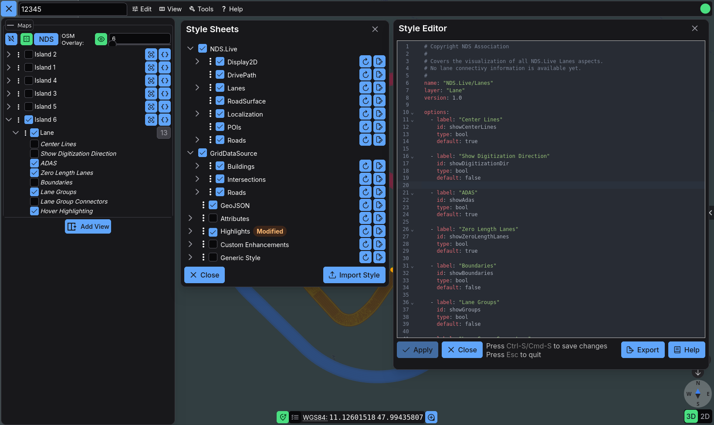
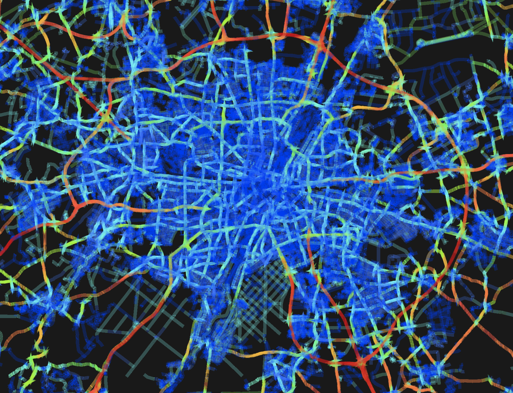

# Style System Guide

Erdblick visualizes every feature through YAML-defined style sheets. This guide explains how to manage styles in the UI, how the YAML schema works, and which rule fields are available for advanced styling.



## Managing Styles in the UI

Most day-to-day style work happens directly inside the Styles dialog, where you can toggle, edit, and reset style sheets without touching files on disk:

1. **Open the Styles dialog** via the quick action menu → **Styles**.
2. **Activate/deactivate style sheets** to control which rules run.
4. **Use the style editor** (pencil icon) for live editing:
   - Syntax-highlighting with validation messages for YAML errors.
   - Auto-complete based on the current schema.
   - Import/Export buttons to move styles in and out of the browser’s `localStorage`.
5. **Reset browser-stored versions** via the Preferences dialog: use the “Clear” buttons for imported styles and modified built‑in styles if the UI behaves unexpectedly.

In addition to these global switches, the **Maps & Layers** panel exposes per-layer toggles for style options (`StyleOptionNode`s). That means you can enable a debug overlay for one layer while keeping the same style disabled elsewhere, or run separate combinations in split view.

## Style Sheet Anatomy

At the top level, a style sheet is usually split into two sections: a list of rendering `rules` and an optional set of `options` that expose toggles in the UI for each layer the style sheet applies to:

```yaml
name: Subgroup/DefaultStyle 
layer: Road|Lane
rules:
  - type: LaneGroup
    geometry: [line]
    color: "#00B5FF"
    width: 6
options:
  - id: show_lane_labels
    label: "Show lane labels"
    type: bool
    default: true
```

- `name` – Mandatory. Free to set. May contain slash-separated grouping.
- `layer` – Optional regex to limit which mapget layers the style sheet is applied to.
- `rules` – ordered list of rule objects. Each rule is evaluated for every feature in the loaded tiles.
- `options` – optional array of UI controls. Each option becomes available as `$options.<id>` inside expressions.

## Rule Field Reference

### Matching and Interaction

| Field | Description |
| --- | --- |
| `type` | Regex that matches the feature type ID (e.g., `LaneGroup`). |
| `filter` | Simfil expression that runs against the current feature/relation/attribute. |
| `geometry` | Array or string that limits the rule to `point`, `line`, `polygon`, or `mesh` primitives. Optional `geometry-name` narrows it to specific geometry identifiers. |
| `aspect` | `feature` (default), `relation`, or `attribute`. Controls how the rule interprets the current entity. |
| `mode` | `none`, `hover`, or `selection`. Use separate rules for hover/selection-specific rendering. |
| `selectable` | `true`/`false` flag that decides whether the feature can be selected or will be skipped when the user clicks it. |
| `first-of` | Array of child rules; erdblick evaluates them top-to-bottom and applies only the first match. Remaining child rules are skipped. |

### Core Visual Properties

| Field | Description |
| --- | --- |
| `color` / `color-expression` | Solid color or Simfil expression for meshes/lines/polygons. Accepts CSS colors or RGBA arrays. |
| `opacity` | Convenience alpha override for `color`. |
| `width` | Width in pixels (lines/points) or meters (meshes). |
| `flat` | Clamp geometry to ground, ignoring heights. |
| `outline-color`, `outline-width` | Outline rendering for meshes and lines. |
| `near-far-scale` | `[near, nearValue, far, farValue]` scaling curve. |
| `offset` / `vertical-offset` | `[x, y, z]` offsets in meters (or a single vertical offset). Useful for stacking multiple representations. |
| `icon-url` / `icon-url-expression` | Static path or Simfil expression for billboard icons. |
| `dashed`, `dash-length`, `gap-color`, `dash-pattern` | Controls for dashed lines. Set `dashed: true` and specify the remaining fields as needed. |
| `arrow` / `arrow-expression` | `none`, `forward`, `backward`, or `double` arrowheads. Expressions can switch per feature. |
| `point-merge-grid-cell` | `[x, y, z]` cell size for merging coincident POIs. When set, `$mergeCount` appears in the expression context. |

### Labeling

| Field | Description |
| --- | --- |
| `label-text` | Static string used as the label. |
| `label-text-expression` | Simfil expression returning the label text (e.g., `**.name`). |
| `label-color`, `label-outline-color`, `label-background-color`, `label-font`, `label-style`, `label-scale` | Standard Cesium label attributes. |
| `label-outline-width`, `label-background-padding` | Outline/padding controls. |
| `label-horizontal-origin`, `label-vertical-origin`, `label-height-reference`, `label-eye-offset`, `label-pixel-offset` | Advanced Cesium label positioning knobs. |

### Distance-Based Properties

Each entry accepts `[near, nearValue, far, farValue]`:

| Field | Description |
| --- | --- |
| `translucency-by-distance` | Fades primitives based on camera distance. |
| `scale-by-distance` | Scales points or billboards. |
| `offset-scale-by-distance` | Adjusts offsets according to distance. |

### Relation-Specific Fields (`aspect: relation`)

| Field | Description |
| --- | --- |
| `relation-type` | Regex that filters relation names (e.g., `nextLaneGroup|prevLaneGroup`). |
| `relation-recursive` | Continue following relations until the tile boundary is reached. |
| `relation-merge-twoway` | Treat bidirectional relations as one. |
| `relation-line-height-offset` | Vertical offset in meters. |
| `relation-line-end-markers` | Nested style that defines markers at relation endpoints. |
| `relation-source-style`, `relation-target-style` | Optional nested styles for source/target highlights. |

### Attribute-Specific Fields (`aspect: attribute`)

| Field | Description |
| --- | --- |
| `attribute-layer-type` / `attribute-type` | Regex filters that pick which attributes to visualize. |
| `attribute-filter` | Simfil expression evaluated against each attribute payload. |
| `attribute-validity-geom` | `required`, `none`, or `any` (default) to control whether attributes must provide validity geometries. |

### Labels and Expressions

Simfil expressions evaluate inside context objects:

- **Feature aspect**: `$mergeCount`, `geometry`, `properties`, etc.
- **Relation aspect**: `$source`, `$target`, `$twoway`, `sourceValidity`, `targetValidity`.
- **Attribute aspect**: `$name`, `$layer`, `$feature`, `validity`, and nested attribute fields.

Because expressions run for every candidate feature, keep them as specific as possible—prefer direct field access over broad `**` wildcards unless necessary.

Note: The context also contains values for all declared style option IDs.

## Style Options and Per-Layer Overrides

Each entry under `options` exposes a UI control:

```yaml
options:
  - id: show_lane_id_labels
    label: "Show Lane ID labels"
    type: bool
    default: false
    internal: false
    description: "Adds lane IDs next to the geometry"
```

- `id` becomes the Simfil variable name, accessible as `$options.<id>`.
- `label` is rendered in the Styles dialog and under individual layers.
- `type` currently supports `bool`.
- `default` defines the initial value until the user toggles it.
- `internal` hides the option from the UI when set to `true`.
- `description` (optional) adds hover text in the Styles dialog.

Per-layer overrides in the Maps & Layers panel map directly to these options. Behind the scenes, erdblick stores the values per `mapId/layerId/styleId` combination, which lets you run different variants across split views or specific layers without cloning the entire style file.

## Attribute Validity Visualization

Attribute validities (for example positional or range validities) are exposed through the dedicated `Attributes` style sheet:

- Enable the `Attributes` style in the Styles dialog to make validity overlays available.
- Use the style’s options (for example “Position Validity”, “Range Validity”) to control which validity classes are rendered.
- Combine the style with feature selection: by default, validity overlays are drawn only for selected features, keeping the scene readable.

!!! warning "Use global validity overlays sparingly"
    Enabling validity visualization for all features in a large viewport can be expensive. Start with selection-based overlays and narrow attribute filters, then only widen the scope when you are sure that performance remains acceptable.

SourceData panels and the inspection tree mirror the same validity information; the overlays are intended as a visual aid, not as the sole source of truth.

## Relations, Labels, and Source Data References

When you move beyond basic coloring and start visualizing relations or labels, a few patterns make styles easier to reason about:

- **Relations**: use `aspect: relation` plus `relation-recursive: true` when you want the UI to traverse relation chains (for example lane groups). Recursion stops at tile boundaries and only follows relations within the same layer. Combine this with separate rules for `mode: hover` or `mode: selection` if relation highlighting should only appear on hover or selection.
- **Labels**: to keep labels legible, consider combining `label-text-expression` with `scale-by-distance`. When stacking multiple labels, adjust `label-eye-offset` to avoid z-fighting.
- **Source references**: rules inherit the same hover/selection colors used in the inspector. If you need a dedicated highlight color, create a `mode: selection` rule with the desired `color`/`opacity`.

## Performance Considerations

Style filters can significantly impact performance. While wildcards (`*` and `**`) are convenient for accessing nested properties, they require checking multiple paths for each feature. Since filters are applied to thousands of features with complex attribute structures, inefficient filters can slow down the mapviewer considerably. This is particularly important for `first-of` filters, which evaluate sub-rules sequentially until finding a match.

Consider this example of a road speed heatmap, which demonstrates two common performance pitfalls:

1. It uses `first-of` filters, which means each feature must be checked against multiple filter conditions until a match is found. As explained in the erdblick documentation, `first-of` evaluates each sub-rule in order until one matches, making it important to optimize these filter checks. The order of rules matters - place the most frequently matching rules first to avoid unnecessary evaluations of subsequent rules.

2. It uses wildcards (`**`) which require expanding and checking multiple possible paths in the data structure. This is particularly inefficient when combined with `first-of` since each wildcard expansion needs to happen for every filter check until a match occurs.

{width=800}

Here's how an inefficient style config may look like:

```yaml
  - type: Road
    geometry: [line]
    filter: "showHeatMap == true"
    width: 10
    offset: [0,1,0]
    first-of:
      - filter: "**.averageSpeed <= 20"
        color: "#0045f1"

      - filter: "**.averageSpeed <= 40"
        color: "#8cf6f4"

      - filter: "**.averageSpeed > 40"
        color: "#c01f1f"
```

This can be optimized in two ways:

1. Using full paths instead of wildcards eliminates the need to search through multiple possible paths
2. Ordering the rules by likelihood - in this example, we assume speeds > 40 are most common in our map data, so we check that condition first to avoid unnecessary evaluations of the other rules

Here's how an optimized style config may look like:

```yaml
  - type: Road
    geometry: [line]
    filter: "showHeatMap == true"
    width: 10
    offset: [0,1,0]
    # Use full path and order by likelihood (if applicable)
    first-of:
      - filter: "properties.layer.RoadCharacteristicsLayer.AVERAGE_SPEED.attributeValue.averageSpeed > 40"
        color: "#c01f1f"

      - filter: "properties.layer.RoadCharacteristicsLayer.AVERAGE_SPEED.attributeValue.averageSpeed <= 20"
        color: "#0045f1"

      - filter: "properties.layer.RoadCharacteristicsLayer.AVERAGE_SPEED.attributeValue.averageSpeed <= 40"
        color: "#8cf6f4"
```

Key performance considerations:

* Using full paths instead of wildcards (`**`) reduces the number of evaluations needed
* Each wildcard expansion requires checking multiple paths, which can significantly impact performance
* The impact becomes more noticeable with complex filters or when many features are visible
* The feature inspector provides a convenient "Copy Path" functionality - simply inspect a feature that has the property you're interested in, navigate to and click on the relevant text, then select "Copy Path" to get the exact path to use in your styles
* This copied path can be directly used in style configurations instead of wildcards for better performance

While wildcards are convenient for exploration and quick prototyping, using explicit paths is recommended for production configurations, especially when dealing with large datasets or complex styling rules.

## Configuring Styles on Disk

To control which style sheets are available in a given deployment, configure them on disk before starting erdblick:

- Place `.yaml` files under `config/styles` before building erdblick or before launching the bundle.
- List each file in `config/config.json`:
  ```json
  {
    "styles": [
      { "url": "styles/default.yaml" },
      { "url": "styles/debug.yaml" }
    ]
  }
  ```
- Containerized deployments can mount their own directories over the bundle’s `config/styles` path (for example by binding a host directory to `/app/erdblick/bundle/styles` or the equivalent location in your image).
- Imported styles added through the UI are stored in the browser’s `localStorage`, so remember to export the YAML if you want to reuse the edits elsewhere.
