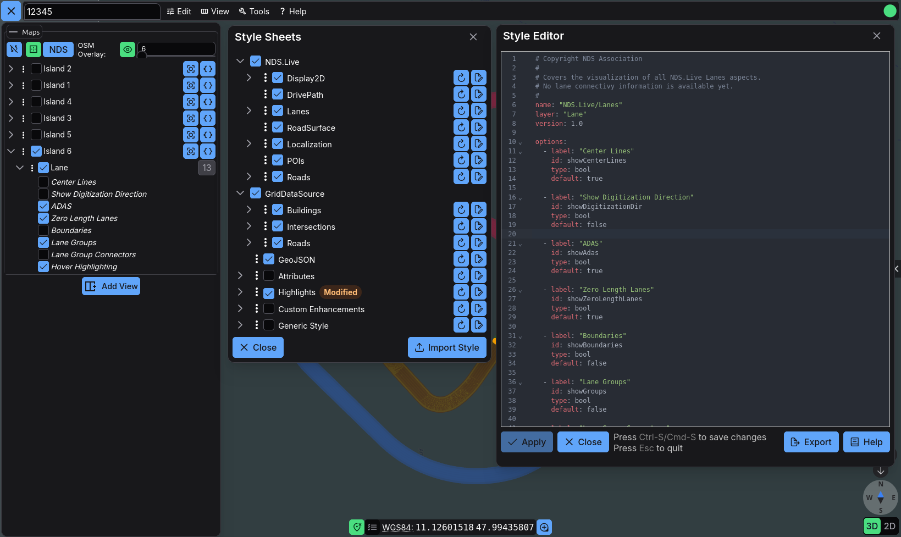
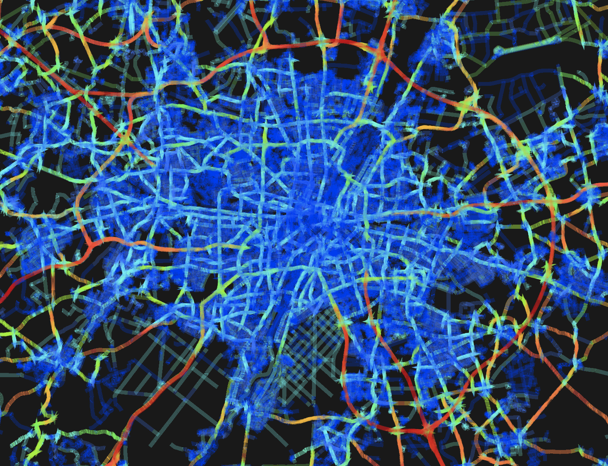

# Style System Guide

Erdblick visualizes every feature through YAML-defined style sheets. This guide explains how to manage styles in the UI, how the YAML schema works, and which rule fields are available for advanced styling.



## Managing Styles in the UI

Most day-to-day style work happens directly inside the Styles dialog, where you can toggle, edit, and reset style sheets without touching files on disk:

1. **Open the Styles dialog** via **Edit -> Styles Configurator** in the main bar.
2. **Activate/deactivate style sheets** to control which rules run.
3. **Use the style editor** (pencil icon) for live editing:
   - Syntax-highlighting with validation messages for YAML errors.
   - Auto-complete based on the current schema.
   - Import/Export buttons to move styles in and out of the browser’s `localStorage`.
4. **Reset browser-stored versions** via the Preferences dialog: use the “Clear” buttons for imported styles and modified built-in styles if the UI behaves unexpectedly.

Built-in styles that were edited locally show a **Modified** tag. Click it to open the **compare dialog** against the shipped version. Styles supplied through `additionalStyles` show an **Additional** tag. If an additional style overrides a base style with the same YAML `name:`, clicking **Additional** opens a read-only comparison against the base style.

In addition to these global switches, the **Maps & Layers** panel exposes per-layer toggles for style options.
That means you can enable a debug overlay for one layer while keeping the same style disabled elsewhere, or run separate combinations in split view.

## Style Sheet Anatomy

At the top level, a style sheet is usually split into two sections: a list of rendering `rules` and an optional set of `options` that expose toggles in the UI for each layer the style sheet applies to:

```yaml
name: Subgroup/DefaultStyle
layer: Road|Lane
rules:
  - type: LaneGroup
    geometry: [line]
    color: "#00B5FF"
    width: 6
options:
  - id: show_lane_labels
    label: "Show lane labels"
    type: bool
    default: true
```

- `name` – Mandatory. Free to set. May contain slash-separated grouping.
- `layer` – Optional regex to limit which mapget layers the style sheet is applied to.
- `stage` – Optional minimum loaded tile stage required before the style sheet can render.
- `rules` – ordered list of rule objects. Each rule is evaluated for every feature in the loaded tiles.
- `options` – optional array of UI controls. Each option becomes available as `$options.<id>` inside expressions.

## Stages, Fidelity, and LOD

Tile stages, render fidelity, and feature LOD are related, but they answer different questions:

- **Tile stage** describes which payload slice of a tile has arrived from the backend. A layer can publish one or more numbered stages (`0`, `1`, `2`, ...). Stage labels are display text; rendering decisions use the numeric stage and the layer metadata.
- **Render fidelity** is erdblick's current rendering mode for a tile in a view. The frontend chooses `low` or `high` from the visible tile count at the current camera distance. Style sheets can react to that choice with rule-level `fidelity`.
- **Feature LOD** is a per-feature value supplied by the backend (`0..7`). In low-fidelity rendering erdblick can cull features above the active LOD cap. Rules can also match an exact feature LOD with `lod`.

Layer metadata defines the high-fidelity threshold:

- `LayerInfo.stages` gives the number of staged payloads the layer can provide.
- `LayerInfo.stageLabels` provides UI labels for those stages.
- `LayerInfo.highFidelityStage` defines the first stage that belongs to high-fidelity rendering.

For geometry selection, erdblick uses this threshold as follows:

- `fidelity: high` rules can render geometry from `highFidelityStage` and later stages.
- `fidelity: low` rules can render geometry before `highFidelityStage`; if `highFidelityStage` is `0`, stage `0` is also available as the low-fidelity fallback stage.
- `fidelity: any` rules are eligible in both render modes.

The two YAML fields named `stage` have different scopes:

- Top-level `stage` is a style-sheet readiness gate. A style with `stage: 1` waits until the tile has loaded at least stage `1` before rendering any of its rules. If a dataset exposes fewer stages than the style requests, erdblick treats the style as ready once the tile is complete for that layer.
- Rule-level `stage` is an exact geometry-stage filter. A rule with `stage: 1` only applies to geometry whose own stage is `1`.

`stage` and `lod` are independent. Stage controls which backend payload slice provides the geometry. LOD controls which features are kept or matched inside that payload. A common pattern is to use `first-of` with exact `lod` matches to draw coarse features differently from fine ones:

```yaml
rules:
  - type: Road
    geometry: [line]
    first-of:
      - lod: 0
        width: 2
      - lod: 4
        width: 5
      - width: 8
```

## Rule Field Reference

### Matching and Interaction

| Field | Description |
| --- | --- |
| `type` | Regex that matches the feature type ID (e.g., `LaneGroup`). |
| `filter` | Simfil expression that runs against the current feature/relation/attribute. |
| `geometry` | Array or string that limits the rule to `point`, `line`, `polygon`, `mesh`, `aabb`, or `gltf` primitives. |
| `aspect` | `feature` (default), `relation`, or `attribute`. Controls how the rule interprets the current entity. |
| `mode` | `none`, `hover`, or `selection`. Use separate rules for hover/selection-specific rendering. |
| `fidelity` | `low`, `high`, or `any` (default). Controls whether the rule participates in low-fidelity rendering, high-fidelity rendering, or both. |
| `stage` | Optional exact geometry-stage match. This is separate from the top-level style-sheet `stage` readiness gate. |
| `lod` | Optional exact feature LOD match (`0..7`). Useful inside `first-of` chains to style coarse and fine features differently. |
| `selectable` | `true`/`false` flag that decides whether the feature can be selected or will be skipped when the user clicks it. |
| `first-of` | Array of child rules; erdblick evaluates them top-to-bottom and applies only the first match. Remaining child rules are skipped. |
| `all-of` | Array of child rules; erdblick evaluates every matching child and renders all matching leaves. `first-of` and `all-of` can be nested, but not used on the same rule node. |

### Core Visual Properties

| Field | Description |
| --- | --- |
| `color` / `color-expression` | Solid color or Simfil expression for meshes/lines/polygons. Accepts CSS colors or RGBA arrays. |
| `opacity` | Convenience alpha override for `color`. |
| `width` | Width in pixels (lines/points) or meters (meshes). |
| `billboard` | Optional `true`/`false` override for camera-facing rendering. When omitted, erdblick keeps the primitive-specific default (for example paths stay world-oriented, while labels/icons stay billboarded). |
| `flat` | Clamp geometry to ground, ignoring heights. |
| `outline-color`, `outline-width` | Outline rendering for meshes and lines. |
| `depth-test` | Whether the rendered geometry participates in depth testing. Set `false` for overlay-style highlights that should render on top. |
| `offset` / `vertical-offset` / `lateral-offset` | Base local `[x, y, z]` offset in meters, or scalar aliases for `z` and local `x`. For line geometry, local `x` is the lateral side-of-line offset. |
| `offset-type` | Optional offset algorithm name. Only `miter` is currently supported, and it is the default line-offset behavior. |
| `offset-increment` | Additional local `[x, y, z]` offset step used for stacked rendering. Effective offset is `offset + offset-increment * slot`, where the slot increments per emitted feature for `aspect: feature` rules and per rendered attribute/transition slot for `aspect: attribute` rules. |
| `icon-url` / `icon-url-expression` | Static path or Simfil expression for billboard icons. |
| `dashed`, `dash-length`, `gap-color`, `dash-pattern` | Controls for dashed lines. Set `dashed: true` and specify the remaining fields as needed. |
| `arrow` / `arrow-expression` | `none`, `forward`, `backward`, or `double` arrowheads. Expressions can switch per feature. |
| `point-merge-grid-cell` | `[x, y, z]` cell size for merging coincident POIs. When set, `$mergeCount` appears in the expression context. |

### GLTF and AABB Geometry

`geometry: ["gltf"]` and `geometry: ["aabb"]` are the two 3D-oriented geometry families currently exposed by erdblick:

- `gltf` renders feature-owned node subsets from a tile-level GLB attachment.
- `aabb` renders explicit feature bounding boxes. This is mainly useful for low-fidelity 3D fallbacks, debug views, and coarse interaction proxies.
  For GLTF-backed features, `aabb` rules can also render the exported node bounding box instead of the real model geometry.

For `gltf` rules, the style system currently treats the attached model as fixed geometry and uses the rule mostly as a visibility/highlight/tint contract:

- Supported and meaningful fields:
  - `type`, `filter`, `mode`, `fidelity`, `stage`, `lod`, `selectable`
  - `color` / `color-expression`
  - `opacity`
  - `depth-test`
- Fields that currently do **not** reshape visible GLTF node rendering:
  - `width`
  - `outline-color`, `outline-width`
  - `offset`, `vertical-offset`, `offset-increment`
  - `billboard`

Important behavior for GLTF highlights:

- `mode: hover` and `mode: selection` rules do not instantiate separate model copies. They act as temporary style overrides on the same shared GLTF node set.
- In practice this means GLTF highlight rules are best used for `color` / `opacity` overlays, not for geometric displacement tricks.
- If a GLTF highlight should always stay visible on top of the base model, set `depth-test: false`.

For `aabb` rules, the regular mesh/polygon-style properties apply normally because erdblick renders the box geometry itself. That also applies when the source feature is GLTF-backed and the box comes from the node's exported bounds instead of an explicit backend AABB feature.

Example:

```yaml
rules:
  - type: Display3D
    fidelity: high
    filter: show3d == true
    geometry: ["gltf"]

  - type: Display3D
    fidelity: low
    filter: show3d == true
    geometry: ["aabb"]
    color: pink
    opacity: 0.2

  - type: Display3D
    geometry: ["gltf"]
    mode: hover
    color: yellow
    opacity: 0.5
    depth-test: false
```

If you rely on the built-in `Highlights` style for hover/selection, make sure its feature highlight rules include `gltf` (and optionally `aabb`) in their `geometry` lists.

### Labeling

| Field | Description |
| --- | --- |
| `label-text` | Static string used as the label. |
| `label-text-expression` | Simfil expression returning the label text (e.g., `**.name`). |
| `label-color`, `label-outline-color`, `label-background-color`, `label-font`, `label-style`, `label-scale` | Standard deck.gl label attributes. |
| `label-outline-width`, `label-background-padding` | Outline/padding controls. |
| `label-horizontal-origin`, `label-vertical-origin`, `label-height-reference`, `label-eye-offset`, `label-pixel-offset` | Advanced deck.gl label positioning knobs. |

### Relation-Specific Fields (`aspect: relation`)

| Field | Description |
| --- | --- |
| `relation-type` | Regex that filters relation names (e.g., `nextLaneGroup|prevLaneGroup`). |
| `relation-recursive` | Continue following relations until the tile boundary is reached. |
| `relation-merge-twoway` | Treat bidirectional relations as one. |
| `relation-line-height-offset` | Vertical offset in meters. |
| `relation-line-end-markers` | Nested style that defines markers at relation endpoints. |
| `relation-source-style`, `relation-target-style` | Optional nested styles for source/target highlights. |

### Attribute-Specific Fields (`aspect: attribute`)

| Field | Description |
| --- | --- |
| `attribute-layer-type` / `attribute-type` | Regex filters that pick which attributes to visualize. |
| `attribute-filter` | Simfil expression evaluated against each attribute payload. |
| `attribute-validity-geom` | `required`, `none`, or `any` (default) to control whether attributes must provide validity geometries. |

### Labels and Expressions

Simfil expressions evaluate inside context objects:

- **Feature aspect**: `$mergeCount`, `geometry`, `properties`, etc.
- **Relation aspect**: `$source`, `$target`, `$twoway`, `sourceValidity`, `targetValidity`.
- **Attribute aspect**: `$name`, `$layer`, `$feature`, `validity`, and nested attribute fields.

Because expressions run for every candidate feature, keep them as specific as possible—prefer direct field access over broad `**` wildcards unless necessary.

Note: The context also contains values for all declared style option IDs.

## Style Options and Per-Layer Overrides

Each entry under `options` exposes a UI control:

```yaml
options:
  - id: show_lane_id_labels
    label: "Show Lane ID labels"
    type: bool
    default: false
    internal: false
    description: "Adds lane IDs next to the geometry"
```

- `id` becomes the Simfil variable name, accessible as `$options.<id>`.
- `label` is rendered in the Styles dialog and under individual layers.
- `type` currently supports `bool`.
- `default` defines the initial value until the user toggles it.
- `internal` hides the option from the UI when set to `true`.
- `description` (optional) adds hover text in the Styles dialog.

Per-layer overrides in the Maps & Layers panel map directly to these options. Behind the scenes, erdblick stores the values per `mapId/layerId/styleId` combination, which lets you run different variants across split views or specific layers without cloning the entire style file.

## Attribute Validity Visualization

Attribute validities (for example positional or range validities) are exposed through the dedicated `Attributes` style sheet:

- Enable the `Attributes` style in the Styles dialog to make validity overlays available.
- Use the style’s options (for example “Position Validity”, “Range Validity”) to control which validity classes are rendered.
- Combine the style with feature selection: by default, validity overlays are drawn only for selected features, keeping the scene readable.

!!! warning "Use global validity overlays sparingly"
    Enabling validity visualization for all features in a large viewport can be expensive. Start with selection-based overlays and narrow attribute filters, then only widen the scope when you are sure that performance remains acceptable.

SourceData panels and the inspection tree mirror the same validity information; the overlays are intended as a visual aid, not as the sole source of truth.

## Relations, Labels, and Source Data References

When you move beyond basic coloring and start visualizing relations or labels, a few patterns make styles easier to reason about:

- **Relations**: use `aspect: relation` plus `relation-recursive: true` when you want the UI to traverse relation chains (for example lane groups). Recursion stops at tile boundaries and only follows relations within the same layer. Combine this with separate rules for `mode: hover` or `mode: selection` if relation highlighting should only appear on hover or selection.
- **Labels**: use `label-text-expression` to keep labels concise and data-driven. When stacking multiple labels, adjust `label-eye-offset` to avoid z-fighting.
- **Source references**: rules inherit the same hover/selection colors used in the inspector. If you need a dedicated highlight color, create a `mode: selection` rule with the desired `color`/`opacity`.

## Performance Considerations

Style filters can significantly affect rendering cost. Wildcards (`*` and `**`) are convenient while exploring data, but they require erdblick to check multiple paths for each feature. On large tiles, broad wildcard filters, long `first-of` chains, and broad `all-of` branches can become expensive. `all-of` intentionally emits multiple concrete renderings for one matched feature.

The road speed heatmap below shows two common pitfalls:

1. `first-of` evaluates sub-rules in order until one matches, so rule order matters.
2. `**` expands through multiple paths in the feature structure, and that expansion happens for every filter that uses it.



An inefficient style config might look like this:

```yaml
  - type: Road
    geometry: [line]
    filter: "showHeatMap == true"
    width: 10
    offset: [0,1,0]
    first-of:
      - filter: "**.averageSpeed <= 20"
        color: "#0045f1"

      - filter: "**.averageSpeed <= 40"
        color: "#8cf6f4"

      - filter: "**.averageSpeed > 40"
        color: "#c01f1f"
```

This can be optimized in two ways:

1. Use full paths instead of wildcards where the schema is known.
2. Put the most likely `first-of` matches first. In this example, speeds above 40 are assumed to be the common case.

The optimized style config is more explicit:

```yaml
  - type: Road
    geometry: [line]
    filter: "showHeatMap == true"
    width: 10
    offset: [0,1,0]
    # Use full path and order by likelihood (if applicable)
    first-of:
      - filter: "properties.layer.RoadCharacteristicsLayer.AVERAGE_SPEED.attributeValue.averageSpeed > 40"
        color: "#c01f1f"

      - filter: "properties.layer.RoadCharacteristicsLayer.AVERAGE_SPEED.attributeValue.averageSpeed <= 20"
        color: "#0045f1"

      - filter: "properties.layer.RoadCharacteristicsLayer.AVERAGE_SPEED.attributeValue.averageSpeed <= 40"
        color: "#8cf6f4"
```

Use the feature inspector's **Copy Path** action to obtain explicit paths for attributes you want to style. Wildcards are still useful for exploration and quick prototypes, but production styles should prefer explicit paths when the data structure is known.

## Configuring Styles on Disk

To control which style sheets are available in a given deployment, configure them on disk before starting erdblick:

- Place `.yaml` files under `config/styles` before building erdblick or before launching the bundle.
- List each file in `config/config.json`:
  ```json
  {
    "styles": [
      { "url": "default.yaml" },
      { "url": "debug.yaml" }
    ]
  }
  ```
- Containerized deployments can mount their own directories over the style bundle path used by the image (for example `config/styles` in a source-tree style deployment, or the image-specific path that is published as `bundle/styles`). Plain style names are requested from `bundle/styles/<name>`.
- If your backend supplies `/config.erdblick`, it can provide the same `styles` list at runtime. The referenced YAML files must still be reachable through the normal style bundle routes.
- Backends can also provide `additionalStyles` to append deployment-specific style sheets without replacing the base style list. Entries use the same string or `{ "url": "..." }` shape as `styles`, and their URLs must already be browser-reachable.
- Additional style entries are loaded after base styles. An additional style with the same `name:` as a base style overrides the active base style. If the user modifies that additional style locally, the local modification takes precedence over the original additional style, which takes precedence over the base style.
- Erdblick does not scan style directories or expand wildcards. If a hosting application offers wildcard or directory syntax, it must publish concrete style URLs in `config.json` or `/config.erdblick` before erdblick loads them.
- Imported styles added through the UI are stored in the browser’s `localStorage`, so remember to export the YAML if you want to reuse the edits elsewhere.
