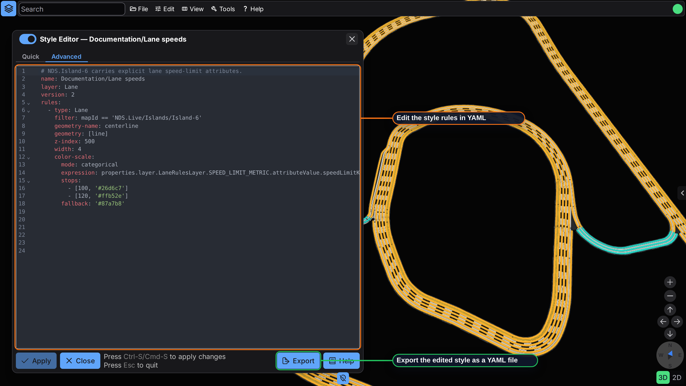
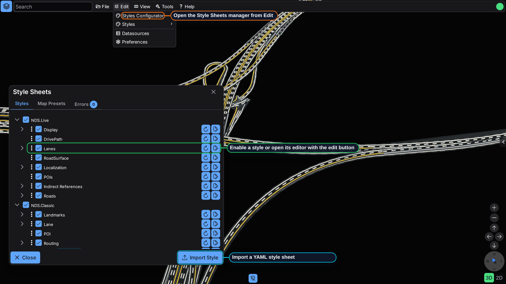
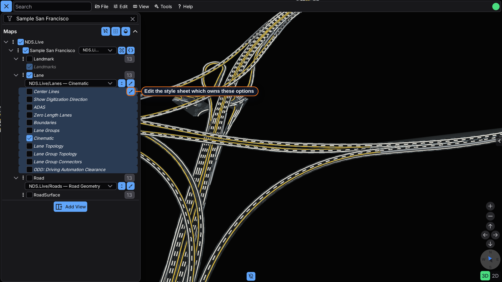
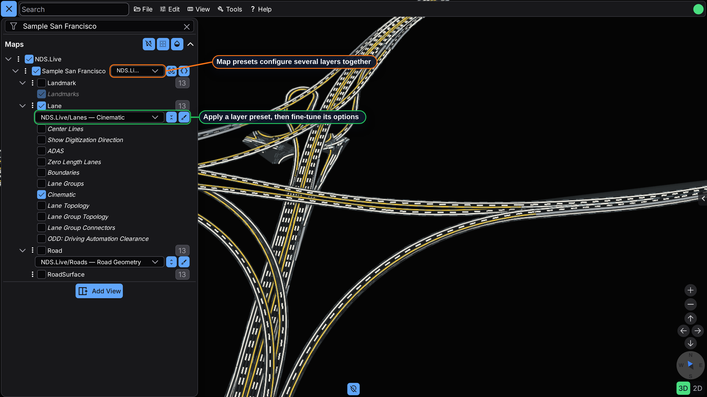
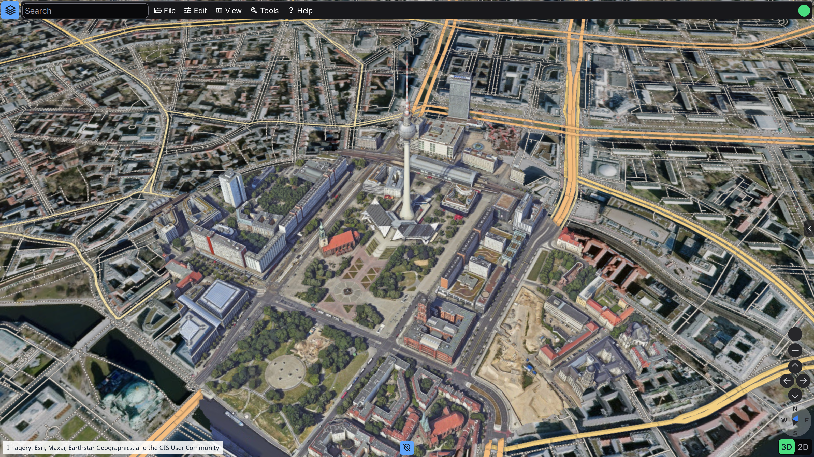

# Erdblick Style System

Erdblick stylesheets are YAML presentation programs. Schema version 2 is
planned into mapget `/filter` channels and rendered from immutable
`PartitionSubsetLayer` values.

Styles authored for MapViewer 2026.3.1 use a breaking older contract. See the
[Style 2.0 Migration Guide](erdblick-style-2.0-migration-guide.md) before
updating those files.



This example colors NDS.Island-6 lane centerlines by their speed-limit
attribute: teal for 100 km/h and amber for 120 km/h. The Advanced tab exposes
the YAML rules; **Export** saves the sheet for reuse in another session.

## Managing Styles in the UI

Most day-to-day style work happens directly inside the Styles dialog, where
you can toggle, edit, and reset style sheets without touching files on disk:

1. Open the Styles dialog via **Edit -> Styles Configurator**.
2. Activate or deactivate style sheets to control which rules run.
3. Use the pencil button for Quick rule editing or Advanced YAML editing,
   validation, completion, and export.
4. Reset browser-stored versions from Preferences when required.

Built-in styles edited locally show a **Modified** tag whose comparison dialog
shows the shipped version. Styles supplied through `additionalStyles` show an
**Additional** tag and can be compared with an overridden base style.

The **Maps & Layers** panel also exposes per-layer style options. Hovering or
focusing an option highlights the contiguous group supplied by the same style
sheet. The first visible row in that group has a brush button which opens the
sheet in the editor.

Open **Edit -> Styles Configurator** to manage loaded sheets, enable style
groups and import additional YAML styles. The **Edit -> Styles** submenu also
provides a direct path to an individual loaded sheet.



Use the edit button beside a style to open its rules.

From **Maps & Layers**, hover or focus an option group and use the brush on its
first row to edit the owning sheet directly:



The **brush** opens the sheet that owns this group of lane options.

## Pre-defined Styles

MapViewer ships styles for NDS.Live, NDS.Classic, and generic geometry.
Their options and named **layer presets** appear in **Maps & Layers**.
Choose a preset for a useful starting point, then expand it to adjust its
options. After an option edit, the selector shows the most specific matching
preset, or **Custom options** if there is no unambiguous match.

### NDS.Live lanes

Use **Cinematic** to view lane surfaces and markings, or **Lane Topology**
to inspect how lane groups connect. Expanding the selected preset exposes
the individual options:




### NDS.Live Display

The Display style renders vector geometry and textured meshes. The examples
show the local NDS.Island-3D filestore with textured meshes and 3D boxes.
Textures come from the dataset, rather than a stylesheet color rule.




### NDS.Classic

The BMD **All** preset displays the supported background-map feature
families together:


Use **Lane Group Topology** for lane connections and **Travel Direction**
for routing-link directions:


### Grid and generic geometry

Grid buildings offer typed and uniform presets; intersections have a
separate visibility option. The generic geometry sheet provides separate
presets for lines, points, surfaces, and all geometry together.

### NDS.Live point clouds

The MapViewer **NDS.Live/Point Clouds** style displays point-cloud objects.
Enable **Point clouds**, then choose a layer preset:

| Preset | Appearance |
| --- | --- |
| Clean (default) | Opaque teal points, 2 pixels in diameter. |
| Objects | The same size with a repeating eight-colour palette based on the object ID. All clusters in an object share its colour. |
| Overlay | Smaller points, 1.5 pixels in diameter at 35% opacity, for viewing alongside other layers. |

**Colour by object** and **Subtle overlay** can also be combined in the
layer's style options. All presets retain depth occlusion and object picking.
Overlay changes appearance, not the point count or memory requirements.

## YAML Styles and Search Result Styles

YAML style sheets are persistent project-wide rules loaded from the bundle,
deployment configuration, additional style locations, or browser-imported
YAML. A root `category` may be `base` or `search`; omission means `base`.
Category is metadata independent of whether a style is built in, additional,
modified, imported, or visible.

Feature Search saves reusable search-result rules as ordinary imported YAML
with `category: search`, a checked-by-default **Enable this style upon save** choice, and optional exact
layer-ID affinity. Empty affinity applies to any layer. The source is added directly to
the Styles tree, marked with a **Search** tag, persisted through the normal
imported-style mechanism, and exported through the normal style action. Its
canonical source contains flat rules, plus one `showSearchStyle` Boolean option
that defaults on and gates every generated rule. This produces a real per-layer
**Show &lt;stylesheet name&gt;** control in Maps & Layers. The option gate is plumbing: it
is kept out of Quick rule controls and removed when a saved style is copied
back into detached Feature Search rules. The source contains no query, search
scope, map ID, or separate JSON-library identity. Its optional `layer` metadata
affects ordinary rendering but is not copied into a detached Feature Search
rule template.

The root `default` and the generated Boolean option are deliberately distinct.
Root `default` determines whether the whole stylesheet is enabled when first
saved or loaded; `options[].default` seeds the per-layer control once that
stylesheet is active.

The Style Editor has **Quick** and **Advanced** tabs for every loaded base or
search style. Its header switch controls the loaded style's current visible
state directly and intentionally does not rewrite the YAML `default`. Quick
opens all rules initially and exposes the root name, exact layer-affinity IDs, and the rule properties
supported by the current controls, updating the authoritative Advanced YAML on
every change. No selected affinity means Any. A noncanonical regular expression
is presented as Custom and is preserved until the user explicitly replaces it
with exact IDs or clears it. Unsupported properties and rules remain in the
YAML; rule-local help icons explain what Quick preserves or leaves Advanced-only.
Applying either view updates the same stylesheet source.

## Document shape

At the top level, a style sheet contains rendering `rules`, optional `options`,
and optional layer-affine `presets` that name useful combinations of the
owning sheet's Boolean options.

```yaml
name: Roads
category: base
version: 2

options:
  - id: showRoads
    label: Show roads
    type: bool
    default: true

presets:
  - id: roads-only
    name: Roads only
    values:
      - {optionId: showRoads, value: true}

rules:
  - type: Road
    filter: "showRoads and properties.frc <= 4"
    geometry: line
    geometry-name: centerline
    color: "#4f81bd"
    width: 2
```

`version: 2` is required. `category` accepts only `base` or `search` and
defaults to `base` when absent. The removed `aspect`, `stage`, and scalar `lod`
fields are validation errors. Use `scope`, semantic `geometry-name`, explicit
attribute filters, and the stylesheet LOD fields described below.

Options become typed SIMFIL bindings. They can participate in filters and
presentation expressions without rewriting the stylesheet.

## Options and layer presets

Options declared in the sheet become controls in **Maps & Layers**. Values
are stored per map, layer, and style, so changing an option on one layer does
not require a copy of the whole stylesheet.

A layer preset names a partial combination of the sheet's Boolean options.
It is available on layers matched by the sheet's `layer` affinity:

```yaml
presets:
  - id: lane-topology
    name: Lane Topology
    values:
      - {optionId: showCenterLines, value: true}
      - {optionId: showDigitizationDir, value: true}
```

Preset IDs and names must be unique within the sheet. Each `optionId` must
identify an editable Boolean option in that sheet. A preset changes only the
listed options; it does not enable a different sheet or change another
sheet's options. Invalid presets produce validation warnings without
disabling valid sibling presets or rendering rules.

Edit layer preset definitions in the Advanced YAML editor. The **Map Presets**
tab manages higher-level compositions that refer to these named layer
presets. A map preset applies to the component layers present on the current
map, with at least one matching component required. If a present layer lacks
the referenced preset, that composition cannot be applied to the map.
Selecting a map preset leaves unrelated layers and options alone.

## One top-level rule, one channel

Each applicable top-level rule becomes exactly one ordered `/filter` channel.
Channels are not combined for compression. The channel transports only the
geometry and projected scalar expressions needed to evaluate that rule tree.

The planner separates:

- `featureFilter`: root-feature admission;
- `entryFilter`: attribute/relation terminal admission;
- `featureFields`: expressions evaluated on the feature;
- `entryFields`: expressions evaluated on the terminal context.

Mapget schema-compiles all four lists in their real contexts. Styles do not use
search-query normalization.

## Scopes

`scope` belongs to the top-level rule:

- `feature` (default);
- `attribute`;
- `relation`.

Nested `first-of`/`all-of` rules may not change scope. A single channel never
mixes feature and attribute terminal rows.

A top-level relation rule may not contain `first-of` or `all-of`; its
`relation-source-style` and `relation-target-style` are feature-style trees and
may use branches.

## Matching fields

Common admission fields:

| Field | Meaning |
|---|---|
| `type` | Feature type name or accepted type pattern. |
| `filter` | SIMFIL feature-root filter. |
| `mode` | One pass, or a list of passes: `none`, `hover`, and `selection`. |
| `lod-range` | Inclusive `[minimum, maximum]` stylesheet LOD range from 0 through 7. |
| `fidelity` | Optional shorthand: `low` means `[0, 2]`, `high` means `[3, 7]`, and `any` means `[0, 7]`. |
| `geometry` | One type or list: point, line, polygon, mesh, etc. |
| `geometry-name` | Exact semantic name, or `*`/omission for wildcard. |
| `selectable` | Whether generated primitives participate in selection. |

Geometry type and name are independent selectors.

```yaml
- type: Road
  geometry: line
  geometry-name: topology
  lod-range: [0, 2]
  filter: "any(properties.layer.**.FUNCTIONAL_ROAD_CLASS.** <= 4)"
```

Mapget does not interpret `topology` as an LOD. Erdblick activates this rule at
LOD 0 through 2; the channel simply asks for a semantic geometry and an
ordinary feature predicate. `fidelity` and `lod-range` are alternative
authoring forms and cannot occur on the same rule. Both gates belong only to a
top-level rule.

## Branches

`first-of` selects the first matching child for rendering:

```yaml
- type: Road
  geometry: line
  first-of:
    - filter: "properties.frc <= 2"
      width: 4
    - filter: "properties.frc <= 5"
      width: 2
```

`all-of` emits every matching child:

```yaml
- type: Boundary
  geometry: line
  all-of:
    - color: white
      width: 5
    - color: black
      width: 2
      dashed: true
```

For server admission, both trees need the union of possible leaves. The
planner recursively builds:

```text
own-filter AND (child-1-eligibility OR child-2-eligibility OR ...)
```

The renderer retains the different first/all semantics using projected fields.
This avoids one channel per flattened leaf while still excluding features
which no descendant could render.

One rule cannot define both branch kinds.

## Presentation fields

Presentation fields control the appearance of geometry selected by a rule.
The table links to the field descriptions and examples below. Expression
fields are SIMFIL expressions evaluated for the feature, attribute, or
relation selected by the rule's scope.

| Fields | Purpose |
| --- | --- |
| [`color`, `color-expression`, `color-scale`](#color-modes) | Fixed colors, expression-derived colors, or categorical/numeric palettes. |
| [`opacity`](#opacity) | Geometry transparency. |
| [`width`, `width-scale`](#width-scales) | Line thickness and point diameter. |
| [`polygon-height`, `polygon-height-expression`](#polygon-height) | Extruded polygon or mesh height in metres. |
| [`surface-shading`](#surface-shading) | Matte lighting on surface triangles in 3D. |
| [`label-*`](#labels) | Label text, font, layout, backgrounds, and collision handling. |
| [`offset`, `offset-increment`, `lateral-offset`, `vertical-offset`, `lateral-offset-unit`](#offsets) | Physical or screen-space displacement. |
| [`z-index`, `z-index-expression`](#drawing-order) | Drawing order for coplanar geometry. |
| [`glow`](#glow) | An exterior shadow or halo. |
| [`flat`, `billboard`, `depth-test`](#orientation-and-depth) | Flattening, camera-facing presentation, and depth occlusion. |
| [`dashed`, `dash-length`, `dash-gap`, `dash-unit`](#dashed-lines) | Repeating line strokes and gaps. |
| [`arrow`, `arrow-expression`](#arrows) | Forward, backward, or double line arrows. |
| [`icon-url`, `icon-url-expression`](#icons) | Image markers. |
| [`min-lod-expression`](#per-entry-visibility) | Per-entry visibility as the view zooms out. |

### Color modes

Exactly one of these may be present:

#### Literal color

```yaml
color: orange
```

#### Expression color

```yaml
color-expression: "selected and '#ff0000' or '#808080'"
```

Use this for genuinely dynamic color strings, such as the internal selection
color binding.

#### Typed color scale

```yaml
color-scale:
  mode: categorical
  expression: "properties.category"
  stops:
    - ["motorway", "#e41a1c"]
    - ["primary", "#377eb8"]
    - ["secondary", "#4daf4a"]
  fallback: gray
```

Stops are `[value, color]` pairs, not a YAML map. This preserves boolean,
numeric, and string key types.

Categorical scales use exact typed equality. Duplicate typed keys are invalid.

```yaml
color-scale:
  mode: linear
  expression: "properties.score"
  stops:
    - [0, blue]
    - [50, yellow]
    - [100, red]
  fallback: gray
```

Linear keys must be finite, numeric, and strictly increasing. Colors are
interpolated between adjacent stops. `fallback` handles null, unsupported
types, and values which cannot be mapped.

Use one scale instead of a palette-only `first-of` chain. Structural
`first-of`/`all-of` trees remain appropriate for geometry, dash composition,
or other compound presentation changes.

### Opacity

`opacity` sets the geometry alpha from `0` (transparent) to `1` (opaque).
Use `label-opacity` separately for labels.

### Width scales

`width` sets line thickness or point diameter in pixels.
`width-scale` maps one projected scalar to that width
without creating a `first-of` branch for every category. It uses the same
typed keys and categorical/linear modes as `color-scale`; stop values and the
fallback are finite non-negative numbers. A literal `width` remains the
fallback when `width-scale.fallback` is omitted.

```yaml
width: 1
width-scale:
  mode: categorical
  expression: "properties.roadClass"
  stops:
    - [0, 5]
    - [1, 3]
    - [2, 2]
  fallback: 1
```

When color and width depend on the same expression, use identical expression
text. The style planner then projects one value for both scales.

### Polygon height

`polygon-height` extrudes polygon and triangle-mesh surface geometry vertically
in metres. The renderer raises the triangulated roof and materializes walls for
every polygon ring or mesh boundary edge; internal mesh diagonals remain
hidden. `polygon-height-expression` resolves the height per emitted feature,
attribute, or relation and falls back to the literal value when the expression
is undefined. Both forms require finite, non-negative values:

```yaml
geometry: polygon
polygon-height: 3
polygon-height-expression: attributes.layer.BMD.BUILDING_HEIGHT.buildingHeight
```

### Surface shading

`surface-shading: true` derives one flat normal from each existing surface
triangle and applies a low-contrast ambient/directional light in 3D. It does
not add geometry, cast shadows, or alter alpha. Flattened 2D rendering and GPU
identity-mask passes retain the exact authored color. The property is opt-in so
diagnostic surfaces and interaction materials remain visually literal:

```yaml
geometry: [polygon, mesh]
surface-shading: true
```

### Labels

Use `label-text` for fixed text or `label-text-expression` for text derived
from each entry. The remaining `label-*` fields control its appearance.

`label-collision: true` lets Deck hide lower-priority labels that overlap
inside one rendered style layer. `label-collision-priority` is an integer from
`-1000` to `1000`; larger values win. Collision filtering is intentionally
opt-in because diagnostic labels often need to remain visible even when they
overlap.

Label presentation maps directly to Deck's `TextLayer` vocabulary, with a
`label-` prefix to keep it separate from geometry presentation:

| Style field | Deck `TextLayer` property |
|---|---|
| `label-text`, `label-text-expression` | `getText` |
| `label-color` | `getColor` |
| `label-size` | `getSize` |
| `label-angle` | `getAngle` |
| `label-text-anchor` | `getTextAnchor` (`start`, `middle`, `end`) |
| `label-alignment-baseline` | `getAlignmentBaseline` (`top`, `center`, `bottom`) |
| `label-pixel-offset` | `getPixelOffset` |
| `label-background-color` | `getBackgroundColor` |
| `label-border-color`, `label-border-width` | `getBorderColor`, `getBorderWidth` |
| `label-font-family`, `label-font-weight` | `fontFamily`, `fontWeight` |
| `label-size-scale`, `label-size-units` | `sizeScale`, `sizeUnits` |
| `label-size-min-pixels`, `label-size-max-pixels` | `sizeMinPixels`, `sizeMaxPixels` |
| `label-background` | `background` |
| `label-background-padding` | `backgroundPadding` |
| `label-background-border-radius` | `backgroundBorderRadius` |
| `label-outline-color`, `label-outline-width` | `outlineColor`, `outlineWidth` |
| `label-line-height` | `lineHeight` |
| `label-word-break`, `label-max-width` | `wordBreak`, `maxWidth` |

`label-background-padding` accepts Deck's two-value `[x, y]` and four-value
`[left, top, right, bottom]` forms. `label-background-border-radius` accepts
one value or Deck's four-corner array. Background color alone does not enable
the rectangle; set `label-background: true`. `label-outline-width` is relative
to text size, as in Deck, and automatically enables its signed-distance-field
font rendering path.

```yaml
label-text-expression: displayName
label-font-family: Noto Sans
label-font-weight: 700
label-size: 16
label-size-units: pixels
label-text-anchor: start
label-alignment-baseline: bottom
label-background: true
label-background-color: "#14202d"
label-background-padding: [5, 3]
label-background-border-radius: 3
```

`label-opacity` remains an erdblick convenience multiplier over label fill,
outline, background, and border alpha. `billboard` and `depth-test` are shared
presentation fields that map to the corresponding Deck layer behavior. Text is
presented in a final overlay after scene compositors such as contact shading.
That pass preserves scene color but resets scene depth, so map geometry cannot
occlude or post-process labels; `depth-test` only orders labels within the text
overlay.
`characterSet` stays automatic so streamed labels can introduce characters
without requiring stylesheet maintenance. Atlas tuning and TextLayer content
boxes are renderer-internal and are not part of the style contract.

Styles using the old Cesium-shaped label fields must migrate explicitly:
split `label-font` into family, numeric weight, and size; replace horizontal
and vertical origins with `label-text-anchor` and
`label-alignment-baseline`; and replace `label-scale` with
`label-size-scale`. `label-style` is replaced by the outline fields.
Eye offsets and height references have no TextLayer equivalent and are
rejected; use `label-pixel-offset` for a screen displacement or `offset` for a
physical displacement.

### Offsets

`offset: [lateral, longitudinal, vertical]` moves geometry relative to its
local direction. Positive lateral values move ordinary lines to the right
of their digitization direction. `lateral-offset` and `vertical-offset`
are shortcuts for the first and third components; an explicit `offset`
takes precedence.

`offset-increment` uses the same three components to separate entries
sharing a geometry, such as several attributes applying to one road.

`lateral-offset-unit` accepts `meter`, `meters`, or `m` (the default),
and `pixel`, `pixels`, or `px`. Pixel offsets keep the lateral spacing
readable on screen as the view zooms. Longitudinal and vertical offsets
remain in metres.

```yaml
offset: [6, 0, 0]
offset-increment: [3, 0, 0]
lateral-offset-unit: pixels
```

For feature-transition validities, the renderer places turns on the
corresponding side of the junction and reserves incoming and outgoing slots
independently. Offset values specify distances; their sign breaks ties for
straight transitions. A transition returning to the same connected end of
the same road forms a left-side U-turn. At distant zoom levels, pixel offsets
contract together where necessary to keep tight turns from folding over.
Arrowheads and picking follow the displaced line.

Use vertical offsets for actual height differences. For overlapping geometry
that should remain at the same height, use drawing order instead.

### Drawing order

`z-index` separates coplanar vector geometry without moving it in world
space. Higher values are drawn in front of lower values. An optional
`z-index-expression` supplies the value per emitted feature, attribute, or
relation. The literal `z-index` is its optional fallback when evaluation does
not produce a finite number. If no literal is configured, an undefined
expression leaves that geometry on Deck's stock depth path:

```yaml
z-index-expression: >
  properties.effectiveRenderOrder
```

The renderer treats values as ordinal rather than as metres. It retains them as
64-bit values until each compatible render-buffer arena rank-compresses them,
and retains first-emitted order through bounded same-rank tie buckets. It sends
only a tiny clip-space depth bias to the GPU. The shader applies the bias after
projection as `bias * clip.w`, so its effect does not grow or shrink with camera
distance. Shared arenas recompute the ranks after tile contributions are
merged, which keeps overlapping features from adjacent render blocks in the
same order. Values in unrelated primitive/depth/billboard buckets do not
establish a global scene graph; the normal Deck layer order remains the outer
ordering boundary.

NDS.Classic sources expose `properties.effectiveRenderOrder` on every eligible
BMD and Routing feature. Classicsource resolves predecessor inheritance from
the sparse `DRAWING_ORDER`, then adds a bounded fractional tie-breaker for
family and physical source-list order. Styles can therefore consume the value
directly; the original flexible Attribute remains available for inspection.

NDS.Live Display2D conversion likewise exposes
`properties.effectiveRenderOrder`. It starts with the type-specific default
from `Display2DLayerMetadata`, then applies `DRAWING_ORDER` and `Z_LEVEL`.
When one DisplayLine has different effective orders along its length, the
converter emits disjoint `DisplayRenderOrder/EFFECTIVE_RENDER_ORDER`
attributes with validity geometry instead of publishing one misleading
feature-wide value. Such ranges are styled with `scope: attribute` and
`attribute-validity-geom: required`; lines with a uniform order use the direct
feature property.

Omitting both fields leaves Deck's stock depth behavior untouched. Use the Z
component of `offset` only for a real geometric displacement; do not use it to
resolve z-fighting. Drawing order covers points, paths, arrows,
polygons, mapget meshes/AABBs, and labels. GLTF nodes retain their physical
transform and do not consume `z-index`.

### Glow

`glow` adds a shadow or halo to emitted vector geometry without changing its
authored color or width:

```yaml
glow: {color: black, radius: 5, opacity: 0.28}
```

`radius` is required and measured in screen pixels (`0..12`); `color` defaults
to black and `opacity` defaults to one. The material uses literal values. It applies to paths (including their generated
arrowheads), points, polygons, meshes, and AABBs through the shared GPU mask
compositor. Labels, arbitrary style icons, and GLTF attachments do not
participate. One union identity per material removes internal overlaps,
triangle seams, and render-block seams. Unlike an interaction halo, authored
glow is strictly exterior and can never darken the primitive's own fill.

### Orientation and depth

`flat: true` flattens geometry to zero altitude before applying offsets.
Use it for a planar presentation rather than preserving source elevations.

Paths extrude in the map plane by default. `billboard: true` makes their
width face the camera; it also controls camera-facing points and labels.
`depth-test` controls whether nearer geometry occludes a primitive.
Labels are drawn in a separate overlay, so their depth test orders labels
within that overlay rather than hiding them behind map geometry.

### Dashed lines

Set `dashed: true` to draw repeating strokes. `dash-length` sets the
stroke length and `dash-gap` the empty interval; when omitted, the gap
matches the stroke length. `dash-unit` defaults to pixels and accepts the
same metre/pixel aliases as `lateral-offset-unit`.

```yaml
dashed: true
dash-length: 8
dash-gap: 4
dash-unit: pixels
```

### Arrows

`arrow` accepts `none`, `forward`, `backward`, or `double`, relative
to the line's digitization direction. `arrow-expression` chooses one of
these strings per entry, with the literal `arrow` as its fallback.

### Icons

`icon-url` supplies an image URL for an icon marker.
`icon-url-expression` chooses the URL per entry, falling back to the
literal URL if it does not return a string.

### Per-entry visibility

`min-lod-expression` sets a minimum display LOD per emitted entry within
an active rule. Use it to hide less important entries when zooming out
without creating a separate rule for each threshold. See
[Level of detail](#level-of-detail) for its relationship to rule activation
and geometry detail.

## Interaction effects

Routine feature hover and selection use a constrained, style-owned material
instead of another server filter when the picked typed entry is already
rendered:

```yaml
interaction-effects:
  hover:
    tint: yellow
    tint-mix: 1
    edge-width: 1
    halo: {color: black, radius: 5, opacity: 0.22}
    stripe:
      spacing: 24
      width: 12
      opacity: 0.02
      angle: 45
      offset: 0
      softness: 0.9
  selection:
    tint: {option: selectableFeatureHighlightColor}
    tint-mix: 1
    edge-width: 2
    halo: {color: black, radius: 6, opacity: 0.28}
    stripe: {spacing: 24, width: 12, opacity: 0.05, angle: 45, offset: 0, softness: 0.9}
```

`tint`, `halo.color`, and optional `stripe.color` accept a literal color or
`{option: id}`. A stripe without a color uses the tint. Numeric values must be
finite; mix and opacity are in `[0, 1]`, while widths, radius, and spacing are
non-negative. `stripe.spacing`, `stripe.width` (the visible stripe thickness),
and `stripe.softness` are screen pixels;
`stripe.angle` is the visible clockwise direction in screen degrees;
`stripe.offset` shifts the repeating pattern along its perpendicular axis; and
`stripe.softness` controls its edge transition. Stripe spacing remains in
screen pixels, but its phase is pinned to a projected world anchor so panning
does not slide the pattern across the selected geometry. Effects alter only
material already emitted for a feature, validity, relation, or group. They do
not select geometry, evaluate SIMFIL, or traverse relations.

Existing `mode: hover|selection` rules remain the semantic materializer for
data absent from active subsets—for example an attribute-panel validity or a
recursive topology request. That exact-root `/filter` result is already an
interaction visualization and is rendered exactly as authored; it is not fed
back into `interaction-effects` a second time.
Bundled routine feature-highlight rules are therefore unnecessary, while
attribute and relation highlight rules remain expressive fallbacks.
Selection dominates hover for the same inspection target and for a direct
parent/child target pair (feature/attribute/validity); sibling attribute or
relation targets remain independently hoverable.

Paths, points, polygons, and mapget meshes all enter one view-owned identity
mask system and one shader compositor. Both interaction materials and the
rule-level `glow` field reuse it. Three full-resolution Gaussian fields are
derived from it: union coverage, a semantic edge field sized only by
`edge-width`, and an independent semantic halo field sized only by
`halo.radius`. The same edge contour is used at the outer silhouette and at a
boundary between nested selected objects, so enabling or widening a halo
cannot thicken or soften the tint edge. The shader classifies shape locally,
not by primitive tag: a narrow object has no stable interior and is tinted
solid, while a wide line or area keeps its authored core and receives the edge
and subtle hatch. The behavior therefore changes continuously with on-screen
width and zoom.

Stable semantic-feature mask IDs suppress triangle and render-block seams;
adjacent distinct objects retain a semantic identity boundary and a closed
mesh naturally produces its screen-space silhouette. The fields are bounded
to 12 screen pixels and evaluated only while an interaction or authored glow
group is active.
The halo field is spatially excluded from the crisp edge core. The compositor
emits only tint, stripe, and halo deltas over the
already-rendered map; it never redraws an area's authored fill. No CPU edge
extraction, duplicated widened path, or wireframe fallback is involved. GLTF
nodes initially retain their separate flat-tint/opacity path.
This constrained material contract intentionally does not synthesize missing
geometry or emulate arbitrary style rules.

## Point grouping and `$mergeCount`

Feature-scope point rules can request server grouping:

```yaml
- type: Sign
  geometry: point
  geometry-name: position
  point-merge-grid-cell: [0.000000084, 0.000000084, 0.01]
  color-scale:
    mode: categorical
    expression: "$mergeCount > 1"
    stops:
      - [false, moccasin]
      - [true, red]
    fallback: moccasin
  label-text-expression: "$mergeCount > 1 and ($mergeCount as string) or ''"
```

The planner rewrites `$mergeCount` in projected fields to
`count($features.*)`. Group membership includes feature type, point geometry
type/name, existence of a qualifying point, and the recursively assembled
feature filter.

Initial restrictions:

- feature scope only;
- every concrete leaf must be grouped;
- every leaf must be point-only;
- one identical cell size and compatible geometry-name selector;
- `$mergeCount` cannot influence membership;
- no attribute-validity or multi-input grouping.

A mismatch rejects the plan rather than returning a wrong merge count.

## Attribute rules

```yaml
- type: Road
  scope: attribute
  attribute-type: "SPEED_LIMIT"
  attribute-layer-type: "speedProfile"
  attribute-filter: "valueKph > 50"
  attribute-validity-geom: required
  geometry: line
  geometry-name: centerline
  color: red
  width: 4
```

`filter` still applies to the host feature.
`attribute-filter` applies to the expanded attribute context.

Attribute fields:

| Field | Meaning |
|---|---|
| `attribute-type` | Attribute-name/type pattern. |
| `attribute-layer-type` | Attribute-layer pattern. |
| `attribute-filter` | Entry-context SIMFIL predicate. |
| `attribute-validity-geom` | `any`, `required`, or `none`. |

Expression context adds `$feature`, `$layer`, `$name`, `$attributeIndex`,
`$hasValidity`, `$validityIndex`, and `$validityCount`.

The renderer consumes explicit `GeometryCollection` values. Validity-required
rules receive effective validity geometry; a one-element collection is still
a collection.

Feature-transition validities additionally preserve their from/to feature
IDs, connected ends, and a pivot index. Their one line contains the real
incoming ten-metre road slice, an explicit intersection pivot, and the real
outgoing ten-metre slice. A genuinely shorter complete road is extended only
along its outer endpoint tangent. The renderer allocates stack slots per
`(rule, road ID, connected end, canonical physical side)`. It derives the
visible side from the incoming/outgoing headings, converts it through each
connected end, reserves each leg independently, and joins the resulting
distances with a tangent-continuous variable-offset fillet while retaining one
pick identity and terminal arrow. Returning to the same connected end of the
same road uses the compact left-side U-turn hairpin described above;
opposite-heading cross-road legs retain the ordinary fillet.

## Relation rules

```yaml
- type: LaneGroup
  scope: relation
  mode: [hover, selection]
  filter: "showTopology"
  relation-type: "nextLaneGroup|prevLaneGroup"
  relation-recursive: true
  relation-merge-twoway: true
  geometry: line
  color-scale:
    mode: categorical
    expression: "(($source.tileId != $target.tileId) as int) * 2 + ($twoway as int)"
    stops:
      - [0, red]
      - [1, green]
      - [2, blue]
      - [3, orange]
    fallback: red
  relation-source-style:
    geometry: line
    opacity: 0
    label-text-expression: "$source.laneGroupId"
  relation-target-style:
    geometry: line
    opacity: 0
    label-text-expression: "$target.laneGroupId"
```

Relation fields:

- `relation-type`: stored relation-name regex;
- `relation-recursive`: local recursion plus at most one hop across a tile;
- `relation-merge-twoway`: pair reverse descriptors;
- `relation-line-height-offset`;
- `relation-line-geometry`: `centers` (default) or `connection-stubs`; the
  latter draws a short directed segment through the
  physical connection from relation and feature geometry already available to
  the subset renderer, then preserves a minimum projected size for overview
  zooms. If both selected endpoints are coincident point geometries and neither
  feature provides a line tangent, it draws a screen-facing ring around the
  connection because no direction can be derived;
- `relation-line-end-markers`;
- `relation-source-style`;
- `relation-target-style`.

Relation expressions can use the relation root plus `$source`, `$target`, and
`$twoway`. Endpoint styles may independently select semantic geometry.
`RelationEntry` carries source/target feature entries and explicit source and
target geometry collections.

Use a mode list when hover and selection intentionally share identical
relation geometry. The planner emits the same authored channel independently
for each interaction pass. Interaction planning admits a relation channel only
for an exact relation-row target and adds that row's restriction; selecting its
host feature does not activate sibling relation rules. If that exact target is
already present in a regular or search presentation, the local interaction
compositor highlights it instead. Authored relation geometry is requested only
as a fallback while the target is absent, and this choice is reconciled again
when style changes materialize or remove regular geometry.

Generic bidirectional display uses permanent south-west ownership. If that
owner is outside current coverage, the pair is not rendered. Selection
traversal is root-owned.

## Level of detail

Each style uses an integer level of detail (LOD) from 0 through 7. LOD 0 is the
coarsest presentation for a dense viewport; LOD 7 is the most detailed. The
visible tile count at the layer's tile level determines the current LOD. It is
a presentation decision and does not change mapget geometry names or source
data semantics.

By default, the **LOD 3 Tile Threshold** preference supplies a boundary `T`
between LOD 2 and LOD 3. Its default is 128 visible tiles. The seven descending
boundaries for LOD 0 through 6 are derived as
`[4T, 2T, T, T/2, T/4, T/8, T/16]`; a count below the last boundary selects
LOD 7. A stylesheet can replace those boundaries with exactly seven strictly
descending positive counts:

```yaml
lod-thresholds: [512, 256, 128, 64, 32, 16, 8]
```

Use `lod-range` on a top-level rule when the complete rule, including its
backend filter channel, should exist only within part of the ladder:

```yaml
- type: Road
  lod-range: [0, 3]
  geometry: line
  geometry-name: centerline
```

Crossing a boundary which changes the active rule set replaces the affected
filter plan. Moving between adjacent LODs with the same rule set keeps the
existing subset and only updates presentation state.

Use `min-lod-expression` when individual emitted entries should disappear as
the viewport gets denser without replacing the filter plan or rerendering the
tile. The expression is projected with the rule's other fields, rounded up,
and clamped to 0 through 7. The GPU draws the entry only while the current LOD
is at least that minimum:

```yaml
- type: Road
  geometry: line
  min-lod-expression: attributes.minimumDisplayLod
```

Explicit hover and selection masks remain visible even when the corresponding
base entry is hidden by `min-lod-expression`. Ordinary retained entries fade
through the continuous interval before their minimum integer LOD instead of
switching opacity at one hard threshold.

`fidelity` is parser shorthand only: `low`, `high`, and `any` become
`lod-range: [0, 2]`, `[3, 7]`, and `[0, 7]`, respectively. There is no separate
low/high-fidelity render pass.

## Validation and planner failures

Style validation reports source rule index, property, message, and YAML
location. Important hard failures include:

- schema version other than 2;
- removed `aspect`, `stage`, or `lod`;
- malformed `lod-thresholds` or `lod-range` declarations;
- combining `fidelity` with `lod-range`, or putting either gate on a nested rule;
- descendant scope changes;
- branches on a top-level relation rule;
- invalid/mixed color modes;
- malformed color-scale stops;
- incompatible point-group leaves;
- invalid relation/attribute regexes.

Planner issues are also rule-indexed. A syntactically valid style can still be
unplannable against a concrete layer—for example when a point-group rule has
no compatible feature types.

## Picking identity

Presentation choices such as highlight mode, active LOD rule plan, options, style
identity/order, and rule tree participate in the render signature. Backend
transport identity is only `filterId + generation + output tile`.

Deck picks store `(channel ordinal, typed-entry ordinal)` against the exact
subset retained by the visualization. Nested render-rule and primitive details
stay renderer-local.
