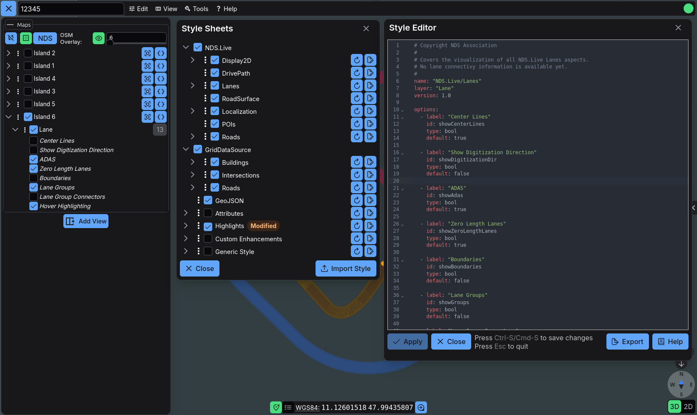

# Erdblick Style System

Erdblick stylesheets are YAML presentation programs. Schema version 2 is
planned into mapget `/filter` channels and rendered from immutable
`TileSubsetLayer` values.



## Managing Styles in the UI

Most day-to-day style work happens directly inside the Styles dialog, where
you can toggle, edit, and reset style sheets without touching files on disk:

1. Open the Styles dialog via **Edit -> Styles Configurator**.
2. Activate or deactivate style sheets to control which rules run.
3. Use the pencil button for Quick rule editing or Advanced YAML editing,
   validation, completion, and export.
4. Reset browser-stored versions from Preferences when required.

Built-in styles edited locally show a **Modified** tag whose comparison dialog
shows the shipped version. Styles supplied through `additionalStyles` show an
**Additional** tag and can be compared with an overridden base style.

The **Maps & Layers** panel also exposes per-layer style options. Hovering or
focusing an option highlights the contiguous group supplied by the same style
sheet. The first visible row in that group has a brush button which opens the
sheet in the editor.

## YAML Styles and Search Result Styles

YAML style sheets are persistent project-wide rules loaded from the bundle,
deployment configuration, additional style locations, or browser-imported
YAML. A root `category` may be `base` or `search`; omission means `base`.
Category is metadata independent of whether a style is built in, additional,
modified, imported, or visible.

Feature Search saves reusable high-fidelity rules as ordinary imported YAML
with `category: search` and `default: false`. The source is added directly to
the Styles tree, marked with a **Search** tag, persisted through the normal
imported-style mechanism, and exported through the normal style action. Its
canonical source contains flat, generally applicable rules and no query,
scope, map ID, layer ID, or separate JSON-library identity.

The Style Editor has **Quick** and **Advanced** tabs for every loaded base or
search style. Quick exposes exactly the rule properties supported by the
current controls and updates the authoritative Advanced YAML on every change.
Unsupported properties and rules are preserved and listed below Quick; use
Advanced for constructs that cannot be represented safely. Applying either
view updates the same stylesheet source.

## Document shape

```yaml
name: Roads
category: base
version: 2

options:
  - id: showRoads
    label: Show roads
    type: boolean
    default: true

rules:
  - type: Road
    filter: "showRoads and properties.frc <= 4"
    geometry: line
    geometry-name: centerline
    color: "#4f81bd"
    width: 2
```

`version: 2` is required. `category` accepts only `base` or `search` and
defaults to `base` when absent. The removed `aspect`, `stage`, and `lod` fields
are validation errors. Use `scope`, semantic `geometry-name`, and explicit
attribute filters.

Options become typed SIMFIL bindings. They can participate in filters and
presentation expressions without rewriting the stylesheet.

## One top-level rule, one channel

Each applicable top-level rule becomes exactly one ordered `/filter` channel.
Channels are not combined for compression. The channel transports only the
geometry and projected scalar expressions needed to evaluate that rule tree.

The planner separates:

- `featureFilter`: root-feature admission;
- `entryFilter`: attribute/relation terminal admission;
- `featureFields`: expressions evaluated on the feature;
- `entryFields`: expressions evaluated on the terminal context.

Mapget schema-compiles all four lists in their real contexts. Styles do not use
search-query normalization.

## Scopes

`scope` belongs to the top-level rule:

- `feature` (default);
- `attribute`;
- `relation`.

Nested `first-of`/`all-of` rules may not change scope. A single channel never
mixes feature and attribute terminal rows.

A top-level relation rule may not contain `first-of` or `all-of`; its
`relation-source-style` and `relation-target-style` are feature-style trees and
may use branches.

## Matching fields

Common admission fields:

| Field | Meaning |
|---|---|
| `type` | Feature type name or accepted type pattern. |
| `filter` | SIMFIL feature-root filter. |
| `mode` | Regular, `hover`, or `selection` pass. |
| `fidelity` | `low`, `high`, or any presentation fidelity. |
| `geometry` | One type or list: point, line, polygon, mesh, etc. |
| `geometry-name` | Exact semantic name, or `*`/omission for wildcard. |
| `selectable` | Whether generated primitives participate in selection. |

Geometry type and name are independent selectors.

```yaml
- type: Road
  geometry: line
  geometry-name: topology
  fidelity: low
  filter: "any(properties.layer.**.FUNCTIONAL_ROAD_CLASS.** <= 4)"
```

Mapget does not interpret `topology` as low fidelity. Erdblick chose the
low-fidelity rule; the channel simply asks for a semantic geometry and an
ordinary feature predicate.

## Branches

`first-of` selects the first matching child for rendering:

```yaml
- type: Road
  geometry: line
  first-of:
    - filter: "properties.frc <= 2"
      width: 4
    - filter: "properties.frc <= 5"
      width: 2
```

`all-of` emits every matching child:

```yaml
- type: Boundary
  geometry: line
  all-of:
    - color: white
      width: 5
    - color: black
      width: 2
      dashed: true
```

For server admission, both trees need the union of possible leaves. The
planner recursively builds:

```text
own-filter AND (child-1-eligibility OR child-2-eligibility OR ...)
```

The renderer retains the different first/all semantics using projected fields.
This avoids one channel per flattened leaf while still excluding features
which no descendant could render.

One rule cannot define both branch kinds.

## Presentation fields

Common primitive fields include:

- `color`, `color-expression`, or `color-scale`;
- `opacity`;
- `width` and optional `width-scale`;
- `offset` and `offset-increment`;
- `lateral-offset-unit`: `meter`, `meters`, `m`, `pixel`, `pixels`, or `px`;
- literal screen-space `glow` material;
- `flat`, `billboard`, and `depth-test`;
- `dashed`, `dash-length`, `dash-pattern`, and `gap-color`;
- `arrow` / `arrow-expression`;
- outline color/width;
- icon URL/expression;
- label text/expression, font, color, `label-opacity`, outline, background, padding, origin,
  pixel offset, and height reference.

Literal values are resolved without projection. Every expression-backed field
is collected by the planner and transported in the appropriate field list.

`lateral-offset-unit` changes only the first (lateral) component of `offset`
and `offset-increment`. Meter offsets are baked into projected geometry.
Pixel offsets remain absolute pixels in native renderer buffers. The Deck
adapter divides constant offsets by authored width only at the stock
PathStyleExtension boundary. Generated transitions additionally carry an
explicit local-map XY pixel vector per vertex. Adjacent vectors are packed as
one segment `uvec4`: its four words encode the exact
left/start/end/right vectors as signed 12-bit fixed-point pairs plus a compact
adaptive-scale threshold.
`DeckVariableOffsetPathLayer` displaces the projected
previous/current/next centerline positions before Deck computes extrusion and
joins. Both segments touching a joint therefore see the same three displaced
points instead of extrapolating different neighbours. At far zooms, an inside
offset can consume or reverse the bend's projected forward motion—the cusp of
an inside parallel curve. The native renderer derives a metres-per-pixel
safety threshold from the exact sampled centerline and offset-vector motion.
Sharp and almost-reversing cross-road turns therefore contract sooner than
gentle turns instead of relying on one trim-radius estimate. Every maneuver of
the same host/rule, including a U-turn, uses that common threshold, so the
shader contracts the complete displacement uniformly and preserves the
relative lane stack instead of locally wrinkling or collapsing lanes. Authored
stroke, picking mask, glow mask, and terminal arrow share the same displacement
vector and scale.

A transition geometry is already ordered from the incoming road through the
junction to the outgoing road. The renderer derives its visible side from the
local maneuver: a right turn is right-of-traversal, a left turn is
left-of-traversal, and a transition returning to the same connected end of the
same road is a conventional left-side U-turn. An acute or almost-reversing
transition between different roads remains an ordinary turn. The lateral
`offset` and `offset-increment` values are distances for transition rules;
their YAML sign is only the stable tie-breaker for a straight maneuver.
Connected-end metadata converts the visible path side into each road's
digitization-relative physical side for stack ownership.

Incoming and outgoing physical road sides reserve their slots independently.
The line stays at the incoming distance along that road, rotates its offset
normal while interpolating the lane radius through the junction fillet, and
stays at the outgoing distance thereafter. Interpolating the XY components
directly is incorrect: it shrinks a constant-radius corner and collapses an
opposing-direction U-turn through zero.
This is why generated transitions, unlike constant-offset ordinary paths, use
the packed variable-offset extension. Bend sampling is refined by turn angle,
so sharp joins do not expose a coarse terminal chord. Straight transitions
choose the least occupied compatible pair of sides. A pixel-offset U-turn
keeps a compact, non-overshooting undisplaced bridge; its normal rotates in the
winding that advances with both road legs and produces the visible hairpin
before Deck calculates the join. It inherits the host/rule scale without
contributing the compact bridge's old trim-radius estimate. Arrowheads use the
same terminal vertex and exact local XY pixel vector as their owning leg
through `DeckLocalPixelOffsetExtension`.
The icon shader transforms the local direction directly (without subtracting
two large projected positions), so arrow anchors retain the terminal lateral
offset at Web-Mercator float precision.
Longitudinal and vertical components remain world-space and follow the
respective leg slot.

`glow` adds a shadow or halo to emitted vector geometry without changing its
authored color or width:

```yaml
glow: {color: black, radius: 5, opacity: 0.28}
```

`radius` is required and measured in screen pixels (`0..12`); `color` defaults
to black and `opacity` defaults to one. The material is intentionally literal
in the first version. It applies to paths (including their generated
arrowheads), points, polygons, meshes, and AABBs through the shared GPU mask
compositor. Labels, arbitrary style icons, and GLTF attachments do not yet
participate. One union identity per material removes internal overlaps,
triangle seams, and render-block seams. Unlike an interaction halo, authored
glow is strictly exterior and can never darken the primitive's own fill.

## Interaction effects

Routine feature hover and selection use a constrained, style-owned material
instead of another server filter when the picked typed entry is already
rendered:

```yaml
interaction-effects:
  hover:
    tint: yellow
    tint-mix: 1
    edge-width: 1
    halo: {color: black, radius: 5, opacity: 0.22}
    stripe:
      spacing: 24
      width: 12
      opacity: 0.02
      angle: 45
      offset: 0
      softness: 0.9
  selection:
    tint: {option: selectableFeatureHighlightColor}
    tint-mix: 1
    edge-width: 2
    halo: {color: black, radius: 6, opacity: 0.28}
    stripe: {spacing: 24, width: 12, opacity: 0.05, angle: 45, offset: 0, softness: 0.9}
```

`tint`, `halo.color`, and optional `stripe.color` accept a literal color or
`{option: id}`. A stripe without a color uses the tint. Numeric values must be
finite; mix and opacity are in `[0, 1]`, while widths, radius, and spacing are
non-negative. `stripe.spacing`, `stripe.width` (the visible stripe thickness),
and `stripe.softness` are screen pixels;
`stripe.angle` is the visible clockwise direction in screen degrees;
`stripe.offset` shifts the repeating pattern along its perpendicular axis; and
`stripe.softness` controls its edge transition. Stripe spacing remains in
screen pixels, but its phase is pinned to a projected world anchor so panning
does not slide the pattern across the selected geometry. Effects alter only
material already emitted for a feature, validity, relation, or group. They do
not select geometry, evaluate SIMFIL, or traverse relations.

Existing `mode: hover|selection` rules remain the semantic materializer for
data absent from active subsets—for example an attribute-panel validity or a
recursive topology request. That exact-root `/filter` result is already an
interaction visualization and is rendered exactly as authored; it is not fed
back into `interaction-effects` a second time.
Bundled routine feature-highlight rules are therefore unnecessary, while
attribute and relation highlight rules remain expressive fallbacks.
Selection dominates hover for the same inspection target and for a direct
parent/child target pair (feature/attribute/validity); sibling attribute or
relation targets remain independently hoverable.

Paths, points, polygons, and mapget meshes all enter one view-owned identity
mask system and one shader compositor. Both interaction materials and the
rule-level `glow` field reuse it. Three full-resolution Gaussian fields are
derived from it: union coverage, a semantic edge field sized only by
`edge-width`, and an independent semantic halo field sized only by
`halo.radius`. The same edge contour is used at the outer silhouette and at a
boundary between nested selected objects, so enabling or widening a halo
cannot thicken or soften the tint edge. The shader classifies shape locally,
not by primitive tag: a narrow object has no stable interior and is tinted
solid, while a wide line or area keeps its authored core and receives the edge
and subtle hatch. The behavior therefore changes continuously with on-screen
width and zoom.

Stable semantic-feature mask IDs suppress triangle and render-block seams;
adjacent distinct objects retain a semantic identity boundary and a closed
mesh naturally produces its screen-space silhouette. The fields are bounded
to 12 screen pixels and evaluated only while an interaction or authored glow
group is active.
The halo field is spatially excluded from the crisp edge core. The compositor
emits only tint, stripe, and halo deltas over the
already-rendered map; it never redraws an area's authored fill. No CPU edge
extraction, duplicated widened path, or wireframe fallback is involved. GLTF
nodes initially retain their separate flat-tint/opacity path.
This constrained material contract intentionally does not synthesize missing
geometry or emulate arbitrary style rules.

## Color modes

Exactly one of these may be present:

### Literal color

```yaml
color: orange
```

### Expression color

```yaml
color-expression: "selected and '#ff0000' or '#808080'"
```

Use this for genuinely dynamic color strings, such as the internal selection
color binding.

### Typed color scale

```yaml
color-scale:
  mode: categorical
  expression: "properties.category"
  stops:
    - ["motorway", "#e41a1c"]
    - ["primary", "#377eb8"]
    - ["secondary", "#4daf4a"]
  fallback: gray
```

Stops are `[value, color]` pairs, not a YAML map. This preserves boolean,
numeric, and string key types.

Categorical scales use exact typed equality. Duplicate typed keys are invalid.

```yaml
color-scale:
  mode: linear
  expression: "properties.score"
  stops:
    - [0, blue]
    - [50, yellow]
    - [100, red]
  fallback: gray
```

Linear keys must be finite, numeric, and strictly increasing. Colors are
interpolated between adjacent stops. `fallback` handles null, unsupported
types, and values which cannot be mapped.

Use one scale instead of a palette-only `first-of` chain. Structural
`first-of`/`all-of` trees remain appropriate for geometry, dash composition,
or other compound presentation changes.

## Width scales

`width-scale` maps one projected scalar to a line width or point-radius basis
without creating a `first-of` branch for every category. It uses the same
typed keys and categorical/linear modes as `color-scale`; stop values and the
fallback are finite non-negative numbers. A literal `width` remains the
fallback when `width-scale.fallback` is omitted.

```yaml
width: 1
width-scale:
  mode: categorical
  expression: "properties.roadClass"
  stops:
    - [0, 5]
    - [1, 3]
    - [2, 2]
  fallback: 1
```

When color and width depend on the same expression, use identical expression
text. The style planner then projects one value for both scales.

Per-layer overrides in the Maps & Layers panel map directly to these options. Behind the scenes, erdblick stores the values per `mapId/layerId/styleId` combination, which lets you run different variants across split views or specific layers without cloning the entire style file.
Options from the same style are grouped and highlighted together on hover. Use the brush button on the first visible option in a group to open the owning style sheet.

## Point grouping and `$mergeCount`

Feature-scope point rules can request server grouping:

```yaml
- type: Sign
  geometry: point
  geometry-name: position
  point-merge-grid-cell: [0.000000084, 0.000000084, 0.01]
  color-scale:
    mode: categorical
    expression: "$mergeCount > 1"
    stops:
      - [false, moccasin]
      - [true, red]
    fallback: moccasin
  label-text-expression: "$mergeCount > 1 and ($mergeCount as string) or ''"
```

The planner rewrites `$mergeCount` in projected fields to
`count($features.*)`. Group membership includes feature type, point geometry
type/name, existence of a qualifying point, and the recursively assembled
feature filter.

Initial restrictions:

- feature scope only;
- every concrete leaf must be grouped;
- every leaf must be point-only;
- one identical cell size and compatible geometry-name selector;
- `$mergeCount` cannot influence membership;
- no attribute-validity or multi-input grouping.

A mismatch rejects the plan rather than returning a wrong merge count.

## Attribute rules

```yaml
- type: Road
  scope: attribute
  attribute-type: "SPEED_LIMIT"
  attribute-layer-type: "speedProfile"
  attribute-filter: "valueKph > 50"
  attribute-validity-geom: required
  geometry: line
  geometry-name: centerline
  color: red
  width: 4
```

`filter` still applies to the host feature.
`attribute-filter` applies to the expanded attribute context.

Attribute fields:

| Field | Meaning |
|---|---|
| `attribute-type` | Attribute-name/type pattern. |
| `attribute-layer-type` | Attribute-layer pattern. |
| `attribute-filter` | Entry-context SIMFIL predicate. |
| `attribute-validity-geom` | `any`, `required`, or `none`. |

Expression context adds `$feature`, `$layer`, `$name`, `$attributeIndex`,
`$hasValidity`, `$validityIndex`, and `$validityCount`.

The renderer consumes explicit `GeometryCollection` values. Validity-required
rules receive effective validity geometry; a one-element collection is still
a collection.

Feature-transition validities additionally preserve their from/to feature
IDs, connected ends, and a pivot index. Their one line contains the real
incoming ten-metre road slice, an explicit intersection pivot, and the real
outgoing ten-metre slice. A genuinely shorter complete road is extended only
along its outer endpoint tangent. The renderer allocates stack slots per
`(rule, road ID, connected end, canonical physical side)`. It derives the
visible side from the incoming/outgoing headings, converts it through each
connected end, reserves each leg independently, and joins the resulting
distances with a tangent-continuous variable-offset fillet while retaining one
pick identity and terminal arrow. Returning to the same connected end of the
same road uses the compact left-side U-turn hairpin described above;
opposite-heading cross-road legs retain the ordinary fillet.

## Relation rules

```yaml
- type: LaneGroup
  scope: relation
  mode: selection
  filter: "showTopology"
  relation-type: "nextLaneGroup|prevLaneGroup"
  relation-recursive: true
  relation-merge-twoway: true
  geometry: line
  color-scale:
    mode: categorical
    expression: "(($source.tileId != $target.tileId) as int) * 2 + ($twoway as int)"
    stops:
      - [0, red]
      - [1, green]
      - [2, blue]
      - [3, orange]
    fallback: red
  relation-source-style:
    geometry: line
    opacity: 0
    label-text-expression: "$source.laneGroupId"
  relation-target-style:
    geometry: line
    opacity: 0
    label-text-expression: "$target.laneGroupId"
```

Relation fields:

- `relation-type`: stored relation-name regex;
- `relation-recursive`: local recursion plus at most one hop across a tile;
- `relation-merge-twoway`: pair reverse descriptors;
- `relation-line-height-offset`;
- `relation-line-end-markers`;
- `relation-source-style`;
- `relation-target-style`.

Relation expressions can use the relation root plus `$source`, `$target`, and
`$twoway`. Endpoint styles may independently select semantic geometry.
`RelationEntry` carries source/target feature entries and explicit source and
target geometry collections.

Generic bidirectional display uses permanent south-west ownership. If that
owner is outside current coverage, the pair is not rendered. Selection
traversal is root-owned.

## Fidelity

`fidelity: low|high` remains a presentation-only rule gate. The current view
density chooses which set applies. Both use the same complete backend source
tile and `/filter` evaluator.

Do not encode fidelity into mapget geometry names. Choose the semantic
geometry each rule needs, and use explicit source attributes when a
presentation should include fewer features.

## Validation and planner failures

Style validation reports source rule index, property, message, and YAML
location. Important hard failures include:

- schema version other than 2;
- removed `aspect`, `stage`, or `lod`;
- descendant scope changes;
- branches on a top-level relation rule;
- invalid/mixed color modes;
- malformed color-scale stops;
- incompatible point-group leaves;
- invalid relation/attribute regexes.

Planner issues are also rule-indexed. A syntactically valid style can still be
unplannable against a concrete layer—for example when a point-group rule has
no compatible feature types.

## Picking identity

Presentation choices such as highlight mode, fidelity, options, style
identity/order, and rule tree participate in the render signature. Backend
transport identity is only `filterId + generation + output tile`.

Deck picks store `(channel ordinal, typed-entry ordinal)` against the exact
subset retained by the visualization. Nested render-rule and primitive details
stay renderer-local.
