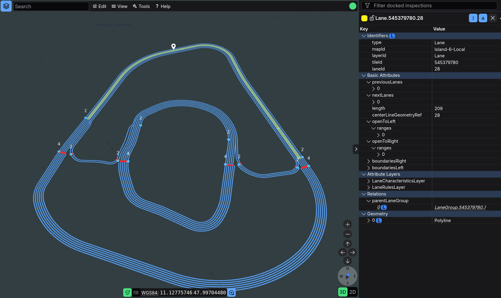
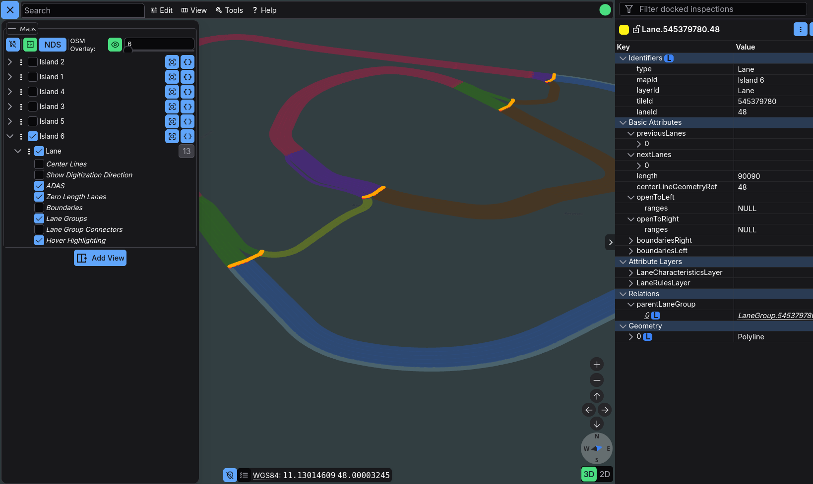
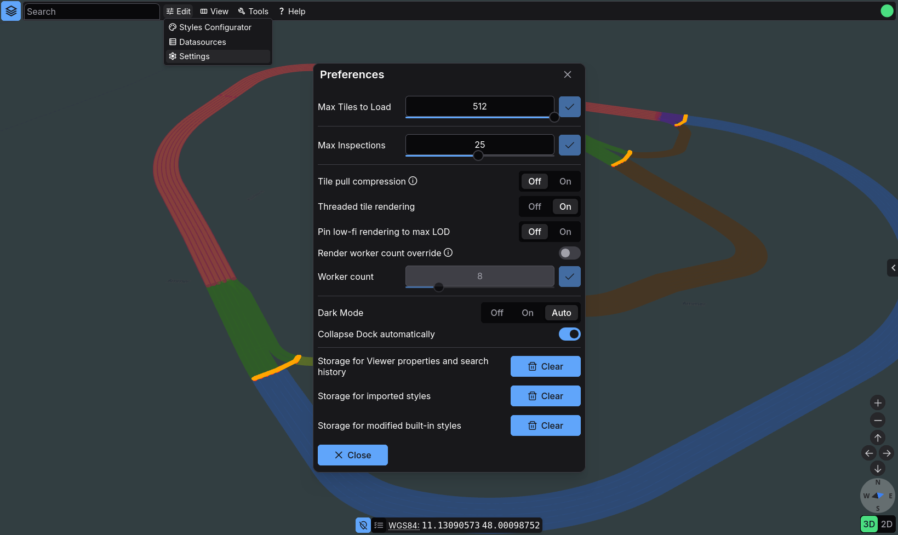

# UI Basics

Erdblick centers its UI around a deck.gl map canvas, a top menu bar, a left-hand Maps & Layers panel, and a dock that can host inspection or SourceData panels. This guide explains the controls most users touch first.

!!! note "Focus on the layout before advanced features"
    If you are new to the viewer, get comfortable with the shell, map navigation, and Maps & Layers first. Search, inspection, SourceData, and diagnostics all build on those basics.

## Layout at a Glance

1. **Maps button** – the floating `stacks` button opens or closes the **Maps & Layers** panel.
2. **Main bar** – the top menu bar contains the search panel plus the main entry points for editing, view management, tools, and help.
3. **Map view** – one or two active views, depending on whether split view is enabled.
4. **Maps & Layers panel** – shows maps, feature layers, metadata actions, per-layer style options, and per-view layer controls.
5. **Inspection dock** – hosts feature panels and SourceData panels. Panels can stay docked or be undocked into separate dialogs.
6. **Diagnostics indicator** – summarizes tile progress, backend connectivity, and error presence.
7. **Coordinate readout** – shows cursor coordinates and tile IDs and lets you place a shared marker.

## Navigating the Map

You can move around the map using a mix of mouse gestures, keyboard shortcuts, and on-screen controls:

- **Mouse**: left drag pans, right drag tilts, scroll zooms.
- **Keyboard**: `WASD` pans, `Q/E` zoom, `Ctrl+K` focuses search, `Ctrl+J` zooms to the selected feature, and `M` toggles the Maps & Layers panel.
- **Compass widget**: click to reset heading or drag to rotate.
- **Camera control buttons**: use the arrow and plus/minus buttons near the compass for simple pan/zoom actions.
- **2D / 3D toggle**: switch between flat Web Mercator-style rendering and the full 3D view.
- **Focus buttons**: use the target icon in **Maps & Layers** to jump to a map or layer coverage area advertised by the backend.

In [split view](erdblick-split.md), navigation targets the currently focused pane. The focused view is outlined in blue. Use `Ctrl+Left` / `Ctrl+Right` to move focus explicitly.

## Main Bar

The main bar replaces the older quick-menu workflow. Its top-level entries are:

- **Edit** – open the **Styles Configurator**, **Datasources**, or **Settings** dialog.
- **View** – open or close split view and control **Sync Views** for position, movement, projection, and layers.
- **Tools** – open **Performance Statistics**, **Export Diagnostics**, or **Logs**.
- **Help** – open the controls reference, external help, or the about dialog.

On narrower screens, the main bar collapses into a more compact mobile layout. In that mode, the **Maps** action also appears in the menu bar itself.

## Maps, Layers, and Base Content

Use the **Maps & Layers** panel to:

- turn maps and layers on or off
- focus a map or layer using the target icon
- open map-level metadata from the **`[{}]`** button
- choose the loaded tile level for each feature layer
- enable **AUTO** per layer so erdblick chooses the level automatically
- adjust **per-layer style options** exposed by active styles
- copy one view’s visibility and style-option state with **Sync visualization options**
- toggle tile borders per view
- switch the tile grid  mode between **NDS** and **XYZ**
- control the OSM overlay and its opacity per view
- add the right-hand split view for side-by-side comparison

!!! note "Map grouping is controlled by map IDs"
    Slash-separated `mapId` values create group nodes in the layer tree. For example, `NDS.Live/Europe` places `Europe` under the parent group `NDS.Live`.

## Loading and Status Indicators

Erdblick exposes loading state both on the map and in the main bar:

- The **diagnostics indicator** shows whether tiles are still loading, whether the backend is connected, and whether errors have occurred.
- Tile-state overlays are only visible when tile borders are enabled.

Tile overlays use these states:

- **Empty** – translucent gray fill
- **Error** – translucent red fill

Click the diagnostics indicator to open its progress popover. From there you can jump into the full statistics, log, and export tools. For the detailed workflow, see the [Diagnostics and Status Guide](erdblick-diagnostics.md).

## Coordinate Panel and Marker

- The coordinate panel shows the current cursor position plus derived tile IDs. Click any value to copy it.
- The dropdown lets you enable additional coordinate systems provided by extension modules.
- The marker button turns the next click into a shared bookmark position.
- Once a marker exists, a second button focuses the active view on that stored marker.

Marker state is shared across views, so split-view comparisons can reference the same point.

## Styles in the UI

Open **Edit -> Styles Configurator** to manage style sheets:

- enable or disable styles
- open the style editor
- reset built-in styles
- import or remove styles

## Inspection Dock

Selecting a feature opens it in the inspection dock:

- Hold `Ctrl` while clicking to open additional panels and lock them immediately.
- Locked panels keep their content; unlocked panels are reused by the next selection.
- Panels can be undocked into separate dialogs.
- Feature panels and SourceData panels are only reused for features or source data, respectively.
- The panel action menu can open the side-by-side comparison dialog.

For the feature workflow, continue with the [Feature Inspection Guide](erdblick-inspection.md). For raw payload inspection, see the [SourceData Inspection Guide](erdblick-sourcedata.md).

## Search, Jump, and History

`Ctrl+K` focuses the search panel. It combines:

- jump actions for coordinates, tiles, feature IDs, and SourceData
- feature search using Simfil expressions
- search history and inline validation

The dedicated [Search Guide](erdblick-search.md) covers the available targets and query language in detail.

## Preferences and Resets

Open **Edit -> Settings** to access the main viewer preferences:

- **Max Tiles to Load** limits how much data the current view may page in
- **Max Inspections** controls how many locked inspection panels can stay open
- **Tile pull compression** toggles compressed tile downloads
- **Threaded tile rendering** and **Render worker count override** control deck.gl-side rendering parallelism
- **Pin low-fi rendering to max LOD** changes the low-fidelity culling policy
- **Dark Mode** switches between on, off, and automatic
- **Collapse Dock automatically** controls the inspection dock behavior
- the **Clear** actions reset viewer/search state, imported styles, or modified built-in styles

