# UI Basics

Erdblick centers its UI around a deck.gl map canvas, a top menu bar, a left-hand Maps & Layers panel, and a dock that can host Search, inspection, or SourceData panels. This guide explains the controls most users touch first.

!!! note "Focus on the layout before advanced features"
    If you are new to the viewer, get comfortable with the shell, map navigation, and Maps & Layers first. Search, inspection, SourceData, and diagnostics all build on those basics.

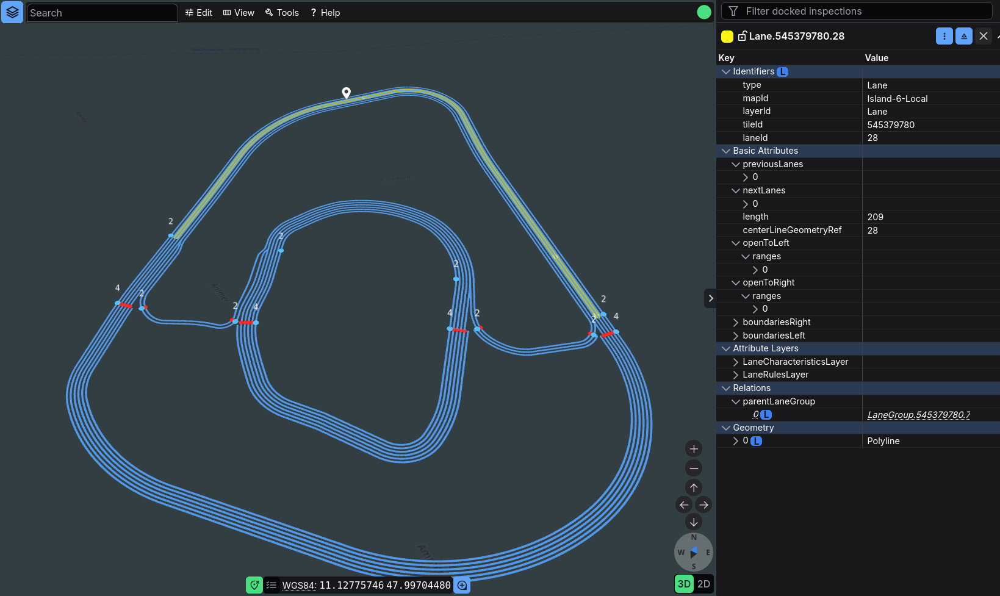

## Layout at a Glance

1. **Maps button** – the floating `stacks` button opens or closes the **Maps & Layers** panel.
2. **Main bar** – the top menu bar contains the search panel plus the main entry points for editing, view management, tools, and help.
3. **Map view** – one or two active views, depending on whether split view is enabled.
4. **Maps & Layers panel** – shows maps, feature layers, metadata actions, per-layer style options, and per-view layer controls.
5. **Dock** – hosts Search panels, feature panels, and SourceData panels. Panels can stay docked or be undocked into separate dialogs.
6. **Diagnostics indicator** – summarizes tile progress, backend connectivity, and error presence.
7. **Coordinate readout** – shows cursor coordinates and tile IDs and lets you place a shared marker.

The workspace can keep the Search area, a modal tool, and several inspections
visible at the same time:

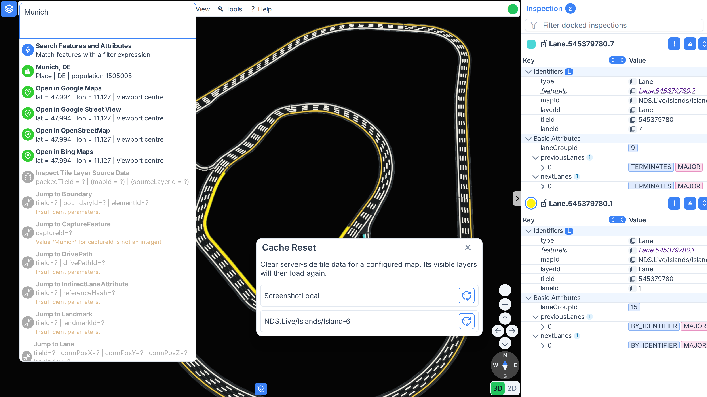

Individual workspace surfaces can be resized without leaving the desktop
viewport:

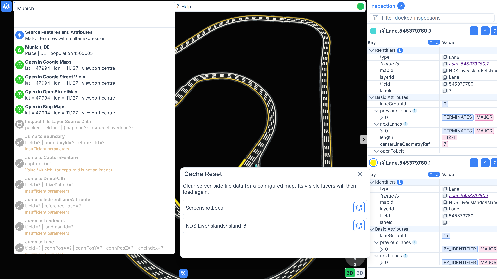

## Navigating the Map

You can move around the map using a mix of mouse gestures, keyboard shortcuts, and on-screen controls:

- **Mouse**: left drag translates the camera parallel to the map plane, right drag rotates around the acquired point under the gesture origin, and scroll zooms.
- **Keyboard**: `WASD` pans, `Q/E` zoom, `Ctrl+K` focuses search, `Ctrl+J` zooms to the focused inspection panel, and `M` toggles the Maps & Layers panel.
- **Compass widget**: click to reset heading and pitch.
- **Camera control buttons**: use the arrow and plus/minus buttons near the compass for simple pan/zoom actions.
- **2D / 3D toggle**: switch between flat Web Mercator-style rendering and the full 3D view.
- **Focus buttons**: use the target icon in **Maps & Layers** to jump to a map or layer coverage area advertised by the backend.

In 3D mode, panning is a world-parallel translation: bearing, pitch, zoom, and the camera's Web Mercator height remain unchanged instead of orbiting around the grabbed point. `WASD` and the arrow buttons use the same screen-local motion on the ground plane. Right drag and Deck's modifier-assisted pointer rotation acquire a fresh eligible physical point—or the ground intersection—at the gesture origin and keep that point's projected pixel fixed. A valid acquired target takes precedence over the legacy centre/2D/3D rotation-pivot setting.

The cyan ring and centre dot show a navigation target while it is available or active. Path anchors may snap to the source centreline, so the ring marks the acquired point rather than fabricating the raw pointer pixel. Point anchors use the feature position rather than a billboard surface, and GLTF content uses its interaction proxy. At high pitch, an empty-sky pixel may have neither a physical point nor a forward ground intersection; that mathematically undefined case uses Deck's configured fallback pivot rather than inventing a hidden focal distance.

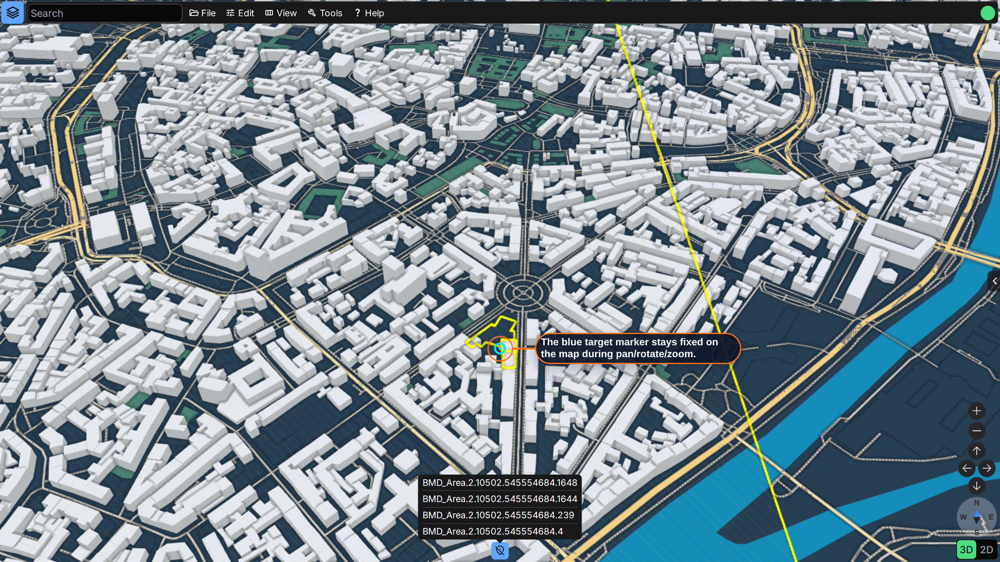

First-person view replaces the ordinary navigation widgets with a map-level
perspective and a dedicated exit action:

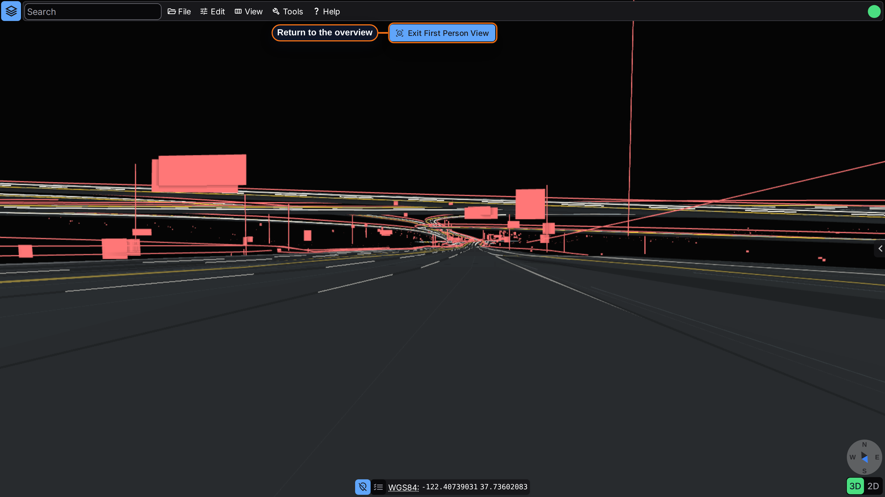

In [split view](erdblick-split.md), navigation targets the currently focused pane. The focused view is outlined in blue. Use `Ctrl+Left` / `Ctrl+Right` to move focus explicitly.

## Main Bar

The main bar provides these top-level entries:

- **Edit** – open the **Styles Configurator**, **Datasources**, or **Settings** dialog.
- **View** – open or close split view and control **Sync Views** for position, movement, projection, and layers.
- **Tools** – open **Cache Reset**, **Performance Statistics**, **Export Diagnostics**, or **Logs**.
- **Help** – open the controls reference, external help, or the about dialog.

On narrower screens, the main bar collapses into a more compact mobile layout. In that mode, the **Maps** action also appears in the menu bar itself.

### Cache Reset

When enabled for your authenticated session, **Tools -> Cache Reset** lists the
ready primary maps visible to you. Use the cycle button beside one map to clear
that map's server-side tile cache. The current browser tears down only that
map's active presentation and requests its visible coverage again through the
normal tile-loading path; the page, camera, visibility, styles, searches, and
other maps stay in place.

The entry remains visible when the server feature is unavailable, but its map
buttons are disabled. A reset affects only the connected mapget process and
does not clear caches inside a datasource or refresh other browser sessions.

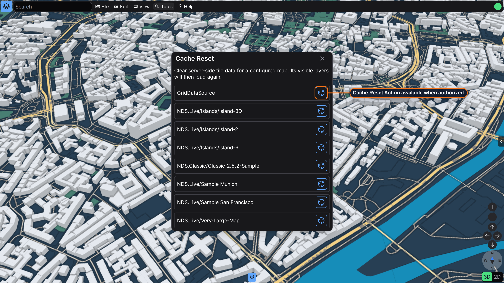

## Maps, Layers, and Base Content

Use the **Maps & Layers** panel to:

- turn maps and layers on or off
- filter the tree while preserving the matching map and layer hierarchy
- focus a map or layer using the target icon
- open map-level metadata from the **`[{}]`** button
- choose the loaded tile level for each feature layer
- enable **AUTO** per layer so erdblick chooses the level automatically
- adjust **per-layer style options** exposed by active styles; hovering one highlights all options from that style sheet, and the brush button on the first highlighted row opens that sheet in the style editor
- copy one view’s visibility and style-option state with **Sync visualization options**
- toggle tile borders per view
- configure tile-grid mode, level, colour, and opacity independently from the feature-layer levels
- control the OSM overlay and its opacity per view
- add the right-hand split view for side-by-side comparison

On desktop, the panel grows to accommodate wider control rows and can also be resized. Its width is capped by the viewport; horizontal scrolling is retained only as the narrow-screen or exceptionally-wide-content fallback.

!!! note "Map grouping is controlled by map IDs"
    Slash-separated `mapId` values create group nodes in the layer tree. For example, `NDS.Live/Europe` places `Europe` under the parent group `NDS.Live`.

Filtering for a style or layer keeps its owning ancestors visible, so the
result still has enough context to operate safely:

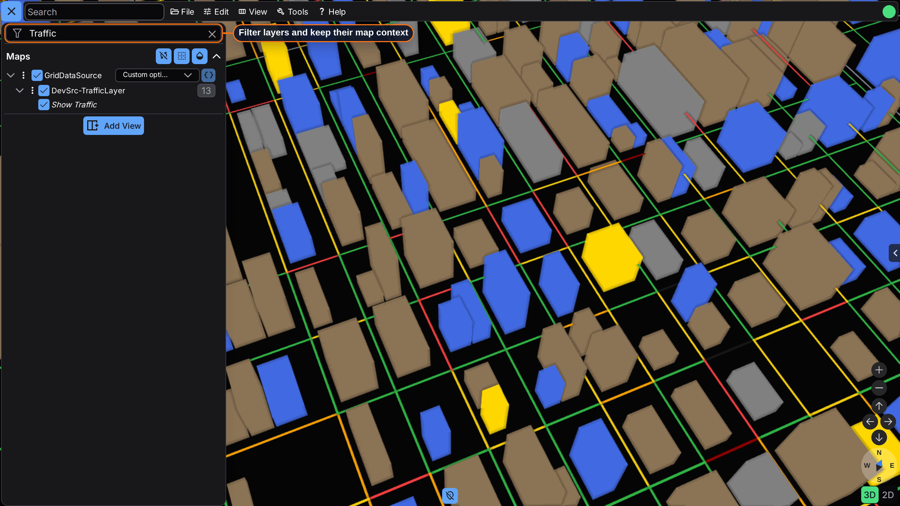

The tile-grid popover controls mode, automatic or manual level selection,
colour, and opacity independently for each view:

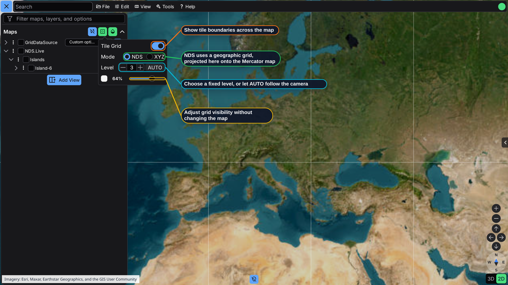

## Loading and Status Indicators

Erdblick exposes loading state both on the map and in the main bar:

- The **diagnostics indicator** shows whether tiles are still loading, whether the backend is connected, and whether errors have occurred.
- Tile-state overlays are only visible when tile borders are enabled.

Tile overlays use these states:

- **Empty** – translucent gray fill
- **Error** – translucent red fill

Click the diagnostics indicator to open its progress popover. From there you can jump into the full statistics, log, and export tools. For the detailed workflow, see the [Diagnostics and Status Guide](erdblick-diagnostics.md).

## Coordinate Panel and Marker

- The coordinate panel shows the current cursor position plus derived tile IDs. Click any value to copy it.
- The dropdown lets you enable additional coordinate systems provided by extension modules.
- The marker button turns the next click into a shared bookmark position.
- Once a marker exists, a second button focuses the active view on that stored marker.

Marker state is shared across views, so split-view comparisons can reference the same point.

Use **Edit -> Preferences -> Show coordinates** to hide or show the complete coordinate readout. The marker enable/reset and focus buttons remain available even when that readout is disabled by a preference, deployment default, or unaccepted legal terms. The preference stays in browser-local state and is not added to shared URLs or exported snapshots. A deployment may require coordinate-display terms; the first enable attempt then opens **Accept Legal Terms**. Accepting remembers consent and enables the readout. Refusing leaves it disabled and asks again on a later enable attempt.

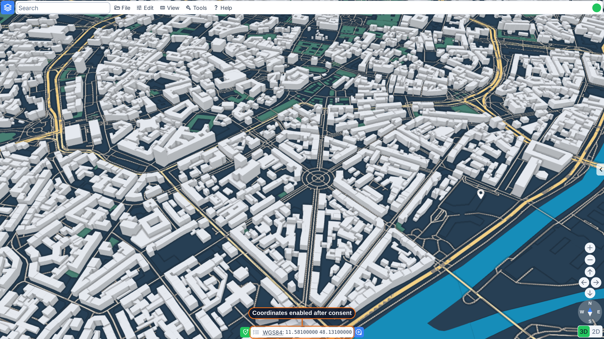

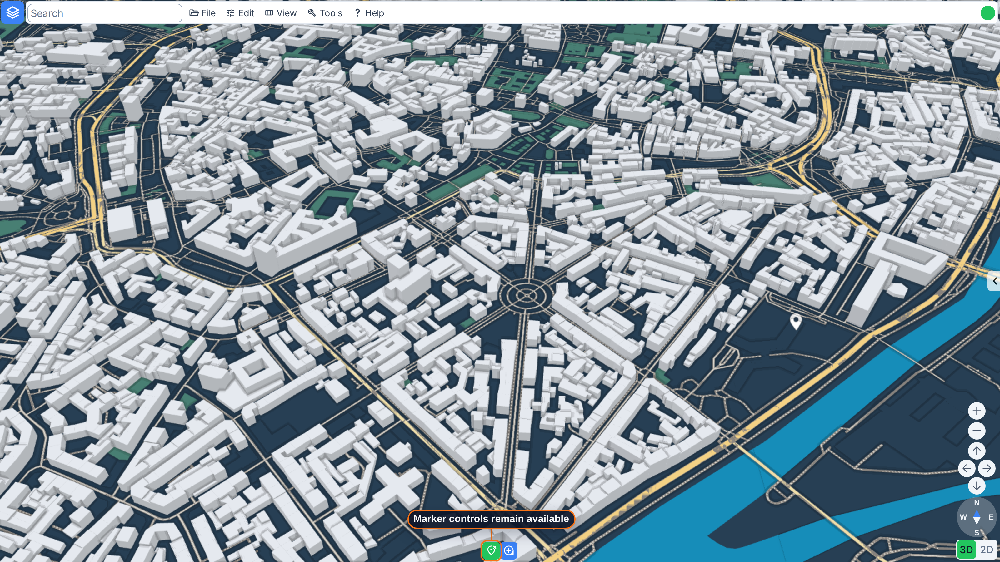

## Styles in the UI

Open **Edit -> Styles Configurator** to manage style sheets:

- enable or disable styles
- open the style editor
- reset built-in styles
- import or remove styles

## Inspection Dock

Selecting a feature opens it in the inspection dock:

- Hold `Ctrl` while clicking to open additional panels and lock them immediately.
- Locked panels keep their content; unlocked panels are reused by the next selection.
- Panels can be undocked into separate dialogs.
- Feature panels and SourceData panels are only reused for features or source data, respectively.
- The panel action menu can open the side-by-side comparison dialog.

For the feature workflow, continue with the [Feature Inspection Guide](erdblick-inspection.md). For raw payload inspection, see the [SourceData Inspection Guide](erdblick-sourcedata.md).

## Search, Jump, and History

`Ctrl+K` focuses the search panel. It combines:

- jump actions for coordinates, tiles, feature IDs, and SourceData
- feature search using Simfil expressions
- persistent Search panels for results, visualization, and diagnostics
- search history and inline validation

The dedicated [Search and Jump](../../../docs/mv-search.md) guide covers targets, persistent feature-search panels, result visualization, diagnostics, and the query language.

## Preferences and Resets

Open **Edit -> Preferences** to access the main viewer preferences:

- **Max Tiles to Load** limits how much data the current view may page in
- **Max Inspections** controls how many locked inspection panels can stay open
- **Location Matches** controls how many place-name search results the palette requests and displays; the default is 10 and the supported range is 1 to 50
- **Show coordinates** controls whether the coordinate readout is present and, when configured by the deployment, requests acceptance of its legal terms; it does not hide the marker controls
- **Hover Labels** controls which feature fields appear above the coordinate readout; each value can use a short display key, which defaults to the final segment of its field expression, and its joined key/value pill follows the inspection value-bubble color, outline, and striping preferences
- **Tile pull compression** toggles compressed tile downloads
- **WebGL antialiasing** controls multisample rendering when the browser/device supports it
- **Contact shading** uses final scene depth to darken nearby lower surfaces and can be disabled on slower GPUs
- **LOD 3 Tile Threshold** controls the default visible-tile-count boundary between stylesheet LOD 2 and LOD 3; styles can override the full LOD ladder
- **Dark Mode** switches between on, off, and automatic
- **Collapse Dock automatically** controls the inspection dock behavior
- the **Clear** actions reset viewer/search state, imported styles, or modified built-in styles

Preferences are grouped by purpose so navigation defaults, inspection and
search behavior, and rendering controls remain easy to scan:

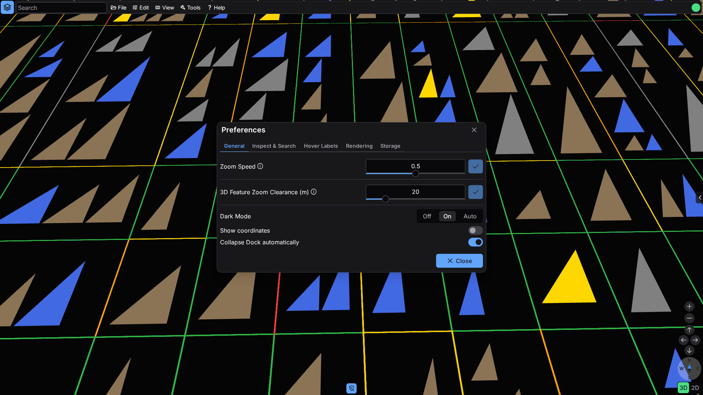

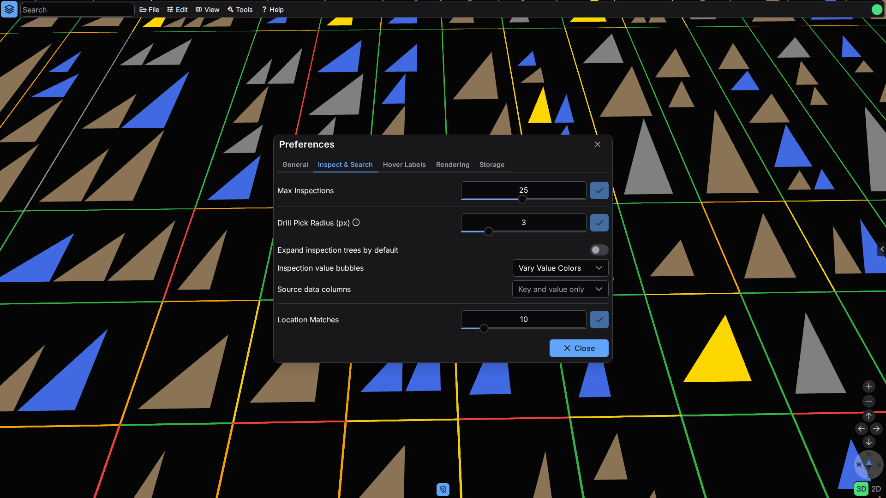

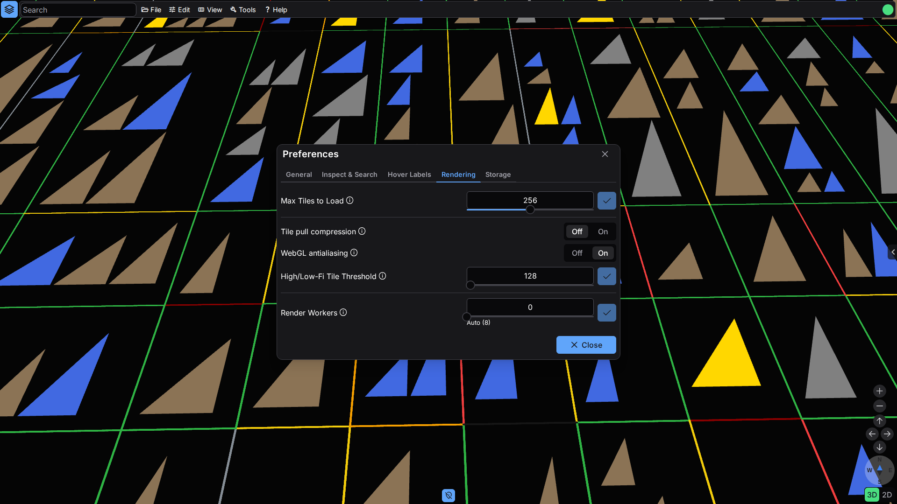

### Hover Labels

The **Hover Labels** tab builds the compact HUD shown while pointing at a map
feature. Select known fields or enter a custom Simfil expression, and give each
value an optional short display key. The feature data is already available to
the renderer, so hovering does not trigger an extra data request.

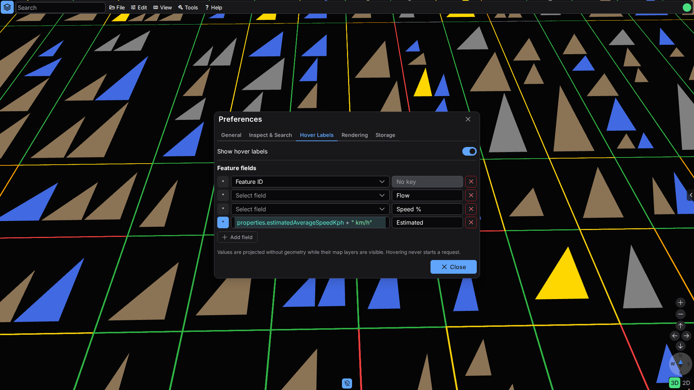

The resulting HUD identifies the hovered feature and shows the configured
field labels beside the coordinate readout:

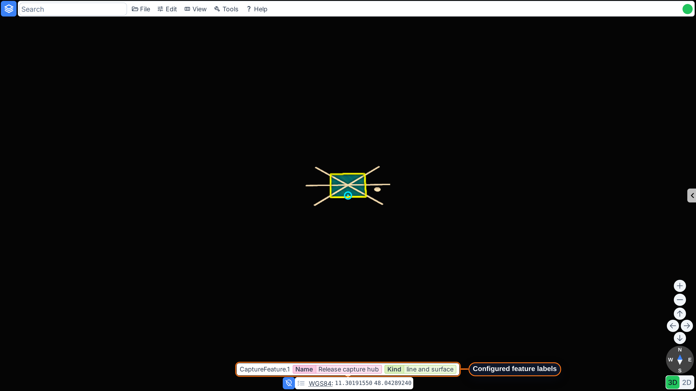
